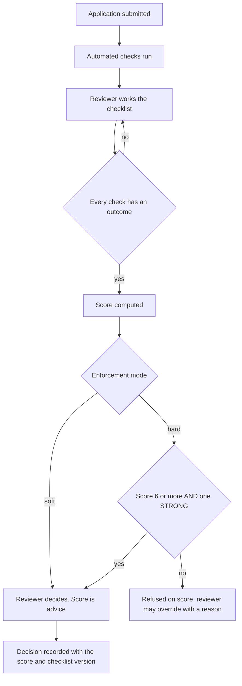

# Identity strength — design

**Status: proposed, 21 August 2026. Not built.**
Decisions taken: scoring is **soft** (captured, not enforced); target threshold
**6 points and at least one STRONG check**; two dashboards.

⚠ Regulatory and licensing points marked ⚠ need verifying before anything
commercial rests on them.

---

## 1. The rule everything else follows from

> **Points attach to VERIFIED CHECKS. Never to entered data.**

Typing an HPI-O scores nothing. An HPI-O confirmed with Services Australia
scores three. If entering a credential earned a point, a fraudster would type
ten invented ones and clear any threshold — the score would measure *effort at
the keyboard*, which is exactly what we are trying not to reward.

Two consequences:

**Weight by who verified it.** A third party who has already done organisation
verification — the ABR, Services Australia, a certificate authority, an
accrediting body — is worth far more than us reading something.

**Independence beats count.** Five facts taken from one submitted document are
one fact. The score must reward *independent corroboration*, which is why the
gate is two-part rather than a single number:

```
ADMIT  ⇔  total ≥ 6  AND  at least one STRONG check passed
```

Without the second clause, eight trivial signals clear a threshold of six.

**The applicant never sees the score, the weights, or the threshold.** "You
need 6 points, here is what scores" is a fraud playbook. They see what is
missing in plain terms — *"we could not confirm your HPI-O"* — never where
they sit.

---

## 2. Soft enforcement, precisely

Every check is performed, recorded and scored **from day one**. Nothing is
refused on score alone. The reviewer sees the score and the failures; the
decision stays theirs.

This is not timidity, it is the only way to end up with a defensible threshold:

**You cannot calibrate a threshold you are already enforcing.** Once we reject
everything under 6, we never learn what would have happened to the 4s and 5s —
so we can never tell whether 6 was right, generous or paranoid. Statisticians
call this reject inference, and it is why credit models are so hard to improve
once deployed. Running soft for a period gives us the one dataset that can
answer the question honestly: *of the practices that later turned out to be a
problem, what did they score, and which checks had they failed?*

Mechanically:

| | Soft (now) | Hard (later) |
|---|---|---|
| Checks performed | ✅ | ✅ |
| Score computed and stored | ✅ | ✅ |
| Shown to the reviewer | ✅ | ✅ |
| **Blocks approval** | ❌ | ✅ |
| Threshold configurable | ✅ | ✅ |

`IDENTITY_ENFORCEMENT=soft|hard` — one setting, same staging discipline as
`AUTH_ENFORCE`. Flipping it is a release gate with a recorded decision, not a
config tweak.

**The score is stored AND recomputed.** Stored with its scoring version at
decision time, because that is evidence of what the reviewer saw. Recomputed
live, because that is current risk. Changing the weights must never silently
rewrite history.

---

## 3. The check framework

A checklist, versioned like every other piece of content in this system (rule
sets, the Basic Service Description mapping, public holidays, renderers,
G-NAF). A check performed under v3 must read as v3 forever — adding a check
later must not make yesterday's approvals look incomplete.

### Four outcomes, not two

| Outcome | Means | Scores |
|---|---|---|
| `passed` | Verified | Full weight |
| `failed` | Verified as wrong | 0, and may be negative |
| `not_applicable` | Cannot apply here | 0, **excluded from the denominator** |
| `could_not_complete` | We tried and could not | 0, requires a reason |

A sole trader has no manager to call. That is `not_applicable`, not `failed`.
Collapsing the two corrupts the score and, worse, punishes small practices for
being small.

`could_not_complete` also needs a reason — "the ABR was down" and "they
refused to provide it" are very different facts about an applicant.

### One check, recorded

```
checkKey            which check, from the versioned catalogue
checklistVersion    so it can be re-read as it was
outcome             passed | failed | not_applicable | could_not_complete
weight              STRONG | MODERATE | WEAK | NEGATIVE, at the time
performedByName     a named human, or the automated source
performedAt
reasonCode          required on failed / could_not_complete
note                free text, always allowed
artefactIds[]       evidence, hashed — see §4
```

**Append-only.** A check is never edited; a new one supersedes it. Same
discipline as the enrolment ceremony, for the same reason: if the facts were
wrong, you perform the check again and both records survive.

### The flow



---

## 4. Artefacts

Screenshots, PDFs, emails, letterheads. Three rules:

**Hash on upload; the hash goes to the vault, the bytes go to object storage.**
Exactly the pattern already used for rendered agreements
(`renderedArtefactHash`). immudb holds hashes and events, never blobs.

**Treat every upload as hostile.** An artefact is attacker-supplied content. An
SVG or HTML "screenshot" can carry script. Store as opaque bytes, serve with
`Content-Disposition: attachment`, never render inline, never trust the
declared content type.

**They contain personal information.** Australian residency, encrypted at rest,
reads logged (REQ-LOG-07), retention-bound with everything else. An uploaded
letterhead with three names in it is health-adjacent personal data, not a file.

---

## 5. PracticeIdentity strength

| Check | Weight | Notes |
|---|---|---|
| HPI-O verified with the Healthcare Identifiers Service | **STRONG** | The Commonwealth already verified the organisation |
| NASH certificate validated | **STRONG** | PKI issued to an entity that passed Commonwealth verification |
| RACGP accreditation confirmed **with the accrediting body** | **STRONG** | Practice-level, and commercially near-mandatory so most real practices have it |
| Callback answered by the **second** named contact on an independently-sourced number | **STRONG** | The applicant chose neither the number nor the person |
| Domain control proven by email round-trip | MODERATE | Proves control of the domain's mail — what CAs use for domain validation |
| ABN ACTIVE **and** exact legal-name match | MODERATE | Already built |
| Address validates against G-NAF **and** agrees with the ABR locality | MODERATE | Two independent sources agreeing |
| **AHPRA principal place of practice matches the practice address** | MODERATE | See below — the best free check we are not yet doing |
| OV/EV TLS certificate naming the entity | MODERATE | A CA verified the organisation to issue it |
| ABN age beyond N years | WEAK | Free from the ABR. A fifteen-year-old ABN is hard to fake |
| Website live and naming the practice | WEAK | Anyone can host a page. Corroboration, not proof |
| Public directory listing matching name **and** address | WEAK | |
| GST registered | WEAK | |
| Applicant email on a disposable domain | **NEGATIVE** | |
| Same admin email / phone / IP across several applications | **NEGATIVE** | |
| Entity type inconsistent with the credential offered | **NEGATIVE** | |

### The check worth adding most

**Compare the AHPRA principal place of practice against the practice address.**
The register publishes suburb and postcode. If the applicant offers a
responsible practitioner's AHPRA number, and that practitioner's principal
place is Perth while the practice is in Bondi, that is a flag.

It is free, automatable, and it ties **a person to a place** — which is exactly
the entitlement gap (ORG-MODEL-PROPOSAL.md §11) that nothing else we hold
closes. Every other check verifies a person *or* an entity; this one connects
them.

### The website fetch

⚠ **A runtime network dependency (CLAUDE.md §7) and an SSRF risk.** Fetching a
URL the applicant supplies is the classic route into cloud metadata endpoints
and internal hosts. Non-negotiable controls: https only, private and
link-local ranges blocked *including after redirects*, redirect depth capped,
timeouts, response size capped, and the resolved IP checked rather than the
hostname.

What to record: timestamp, final URL, HTTP status, **the TLS certificate
subject, issuer and validity**, and a hash of the response. The certificate is
the valuable part; the page content is nearly worthless as evidence.

---

## 6. PractitionerIdentity strength

| Check | Weight | Notes |
|---|---|---|
| AHPRA status *Registered*, verified and recent | **STRONG** | The only thing that decides whether they may practise |
| REQ-PKI-01 ceremony by a named attester who is not them | **STRONG** | |
| Passkey enrolled | **STRONG** | Device-bound, and rule 15 means there is no password path to weaken it |
| AHPRA suburb/postcode matches the affiliating location | MODERATE | |
| Register name matches the name given, normalised | MODERATE | |
| Practitioner-owned email proven by round-trip | MODERATE | |
| Provider-number format valid for that location | WEAK | Format only. **We cannot verify a provider number at all** — no public lookup exists |
| Conditions, undertakings or reprimands on the register | **NEGATIVE** | Registered and restricted are different things |
| Deregistered, suspended or cancelled anywhere | **BLOCKING** | Not a score — REQ-XFER-08, immediate |
| Affiliation velocity anomalous (REQ-ANOM-01) | **NEGATIVE** | Surfaced, never auto-blocking |
| Register sighting stale beyond the recheck window | **NEGATIVE** | Decays over time — see below |

**Practitioner strength decays.** A registration verified in January says little
in December. Unlike practice identity, which is mostly stable facts, this score
has a half-life and the dashboard should show it dropping rather than sitting
at its original value.

---

## 7. The two dashboards

Filters common to both: name, practice, location, state, score band, weakest
failing check, last verified date, enforcement outcome (would this have passed
under hard mode?).

**PracticeIdentity dashboard** — every practice, current score, band, which
checks failed or could not be completed, artefact count, time in queue. The
operational question it answers: *which applications are stuck, and on what?*

**PractitionerIdentity dashboard** — every practitioner, current score, days
since the register was last sighted, restrictions present, affiliation count
and velocity. The question: *whose verification is going stale, and who is
moving unusually?*

**The "would have failed" column is the point of soft mode.** It shows, live,
what hard enforcement would have cost — how many real practices we would be
turning away today. That is the number that should decide when to flip the
switch, and it is invisible unless we run soft first.

---

## 8. Non-repudiation for the AHPRA sighting

Both layers, because they answer different questions:

**Row hash.** Each sighting carries `rowHash = SHA-256(canonical fields ‖
previousRowHash)`, chained per practitioner. Self-verifying without the vault,
and it makes an altered row detectable in place.

**Vault event.** The same hash is published to the evidence chain, giving
cross-record tamper evidence.

The hash must be over a **canonical serialisation** — sorted keys, explicit
nulls, ISO-8601 dates, fixed number formatting — or it will not reproduce. We
have already been bitten by this once; `prune()` in the agreements service
exists for exactly this reason.

Sightings are **append-only and supersede**. That matches what the register
actually is: a snapshot of a moment, not a current-state field.

---

## 9. What this data could become

Genuinely interesting, and worth thinking about before rather than after.

### Things only a cross-practice platform can do

**Provider-number conflict detection.** We hold (practitioner × location ×
provider number). If one provider number appears at two locations that are not
the same place, or two practitioners claim the same number, that is
structurally impossible. **No single practice can see this. We can.** Given
that the provider number is the artefact we cannot verify and the one fraud
turns on, this may be the single most valuable thing in the dataset.

**Deregistration propagation.** Learn once that a practitioner is suspended;
stop them at every affiliated practice within the hour. Today each practice
finds out separately, or does not.

**Geographically impossible practice.** Affiliations and capture patterns that
cannot be one human's week.

### Productivity

**Verify once, work anywhere.** A practitioner verified to strength N does not
need re-verifying at their next practice. Today every practice repeats the same
checks on the same doctor. The model already supports it — a practitioner is
one human across the platform — and it is the clearest commercial proposition
in here.

**Onboarding friction data.** Which checks fail most, which take longest, which
are never applicable. Tells us where to invest and lets us tell an applicant
what to have ready.

**Threshold calibration.** Covered in §2 — the real prize, and the reason for
soft mode.

### Sector-level, aggregate only

Time-to-onboard, accreditation coverage, regional distribution, practitioner
mobility patterns. Australia has real GP maldistribution problems and almost no
current data on locum movement. This could genuinely inform workforce planning
— **aggregate and non-re-identifiable, or not at all.**

### What we must not do

**No risk score about an individual practitioner shared with practices.** That
is a credit score for doctors, with every accuracy and fairness problem credit
scoring has, applied to people's livelihoods. It would also be the fastest way
to destroy the trust the platform depends on.

**No selling practitioner-level data.** Obviously.

⚠ **Secondary use is the real constraint, and it is decided now.** This data is
collected to verify identity for consent capture. Workforce analytics, sector
reporting and commercial products are a *secondary purpose* under APP 6, and
retrofitting consent for data you already hold is far harder than collecting it
with the right notice in the first place.

**So: decide the permitted uses before the first application is taken, and put
them in the collection notice.** That costs nothing today and preserves every
option. Getting it wrong closes doors quietly and permanently.

---

## 10. Needs a decision before building

1. **⚠ The PIE data usage agreement** — does it permit pooled lookups on behalf
   of practices? Using it for our own compliance and operating a lookup bureau
   are different things. This gates the reselling idea entirely.
2. **§7 sign-off** for the website fetch and the domain-verification email.
3. **The collection notice** — see §9. Cheap now, expensive later.
4. **Retention** — the practitioner dashboard is only as deep as what we keep.
   Seven years conflicts with the 2-year consent retention (REQ-OFF-07).
5. **The `not_applicable` policy** — should a sole trader be able to reach 6
   points at all? If the strong checks all assume an organisation, we have
   designed small practices out without meaning to.

## 11. Build order

1. Structured addresses (line 1, line 2, suburb, state, postcode, country) —
   unblocks the AHPRA locality comparison and every matching check
2. Check catalogue + versioning + the four outcomes, append-only
3. Artefact store with hashing — before the checks that produce evidence
4. Scoring engine, soft mode, stored-and-recomputed
5. AHPRA row hashing and chain
6. The two dashboards
7. Step 4 restructure — search, invite, stub, practitioner self-onboards
8. Domain-control email, then the guarded website fetch
9. Practitioner cross-practice AoB dashboard, worded precisely

## Related

- [ORG-MODEL-PROPOSAL.md](ORG-MODEL-PROPOSAL.md) — §11 is the entitlement
  problem this scoring exists to measure
- [practice_legals.md](practice_legals.md) — which credentials are worth
  chasing and which are noise
- `packages/domain/src/ahpra.ts` — status blocks, expiry only warns
