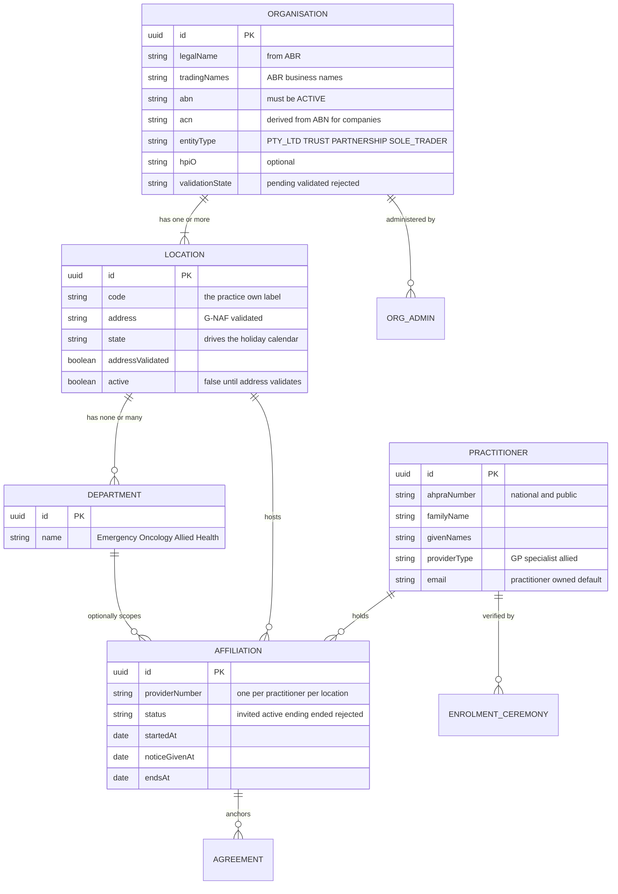
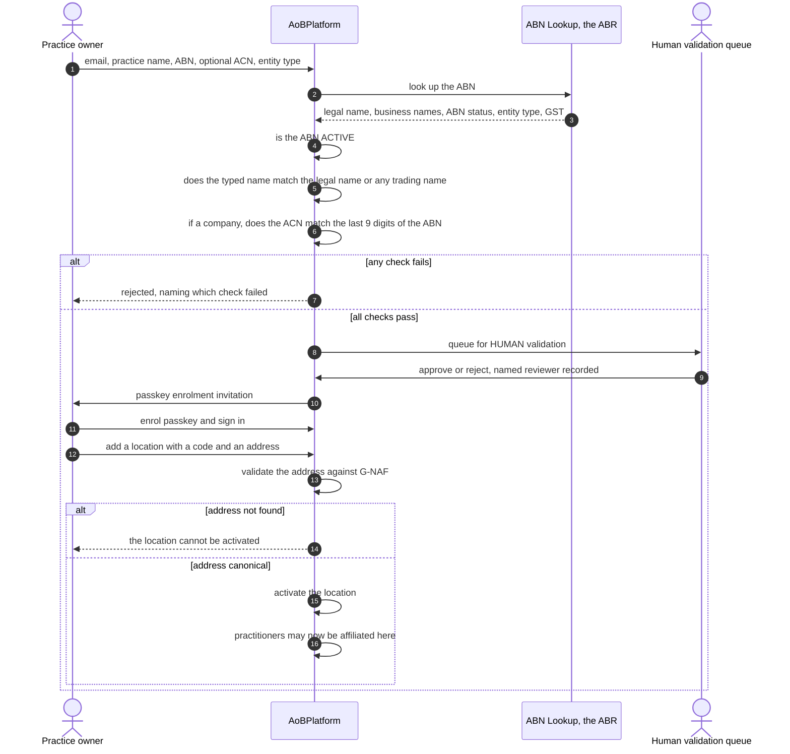
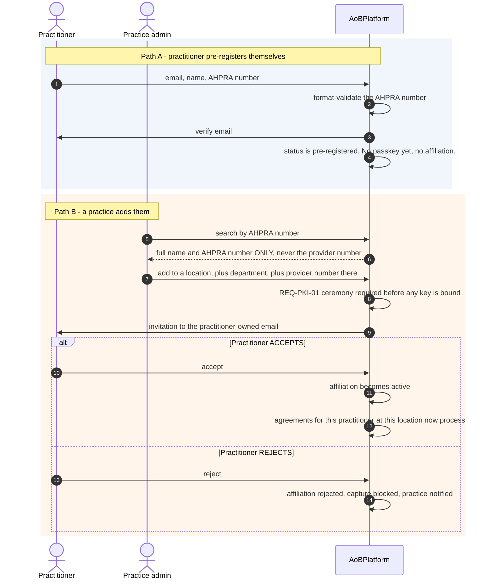
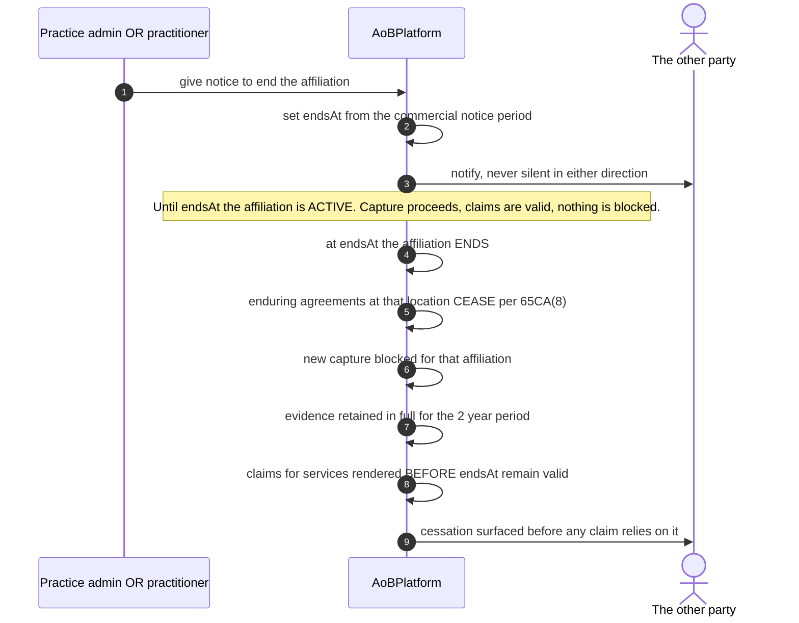

# Organisation / location / practitioner model

### 21 August 2026 · **Signed off by Carl — BUILT**

All four proposed changes accepted. Banking: **never held.** Migration: done.

**Status: implemented and tested.** 46 e2e tests over the flows below, plus 61
domain tests. See §10 for what is built, what is deferred, and the one naming
decision taken during the build.

---

## 1. Decisions, settled

| Decision | Outcome |
|---|---|
| ABN name matching | ✅ Match legal name **or any registered business name**; store both. ABN must be ACTIVE. |
| Employment-status flag | ✅ **Never collected.** Payroll-tax liability, no functional need. |
| Practice cap | ✅ **No cap.** Anomaly-detect instead (REQ-ANOM-01). |
| Directory identifier | ✅ **AHPRA number only.** The Medicare provider number never appears in a directory. |
| Offboarding | ✅ Notice runs **before** the end date. At the end date the affiliation ends and agreements cease. No post-departure processing. |
| **Banking details** | ✅ **NEVER HELD — see §8.** |
| Address validation | ✅ **G-NAF, self-hosted** — see §9. |
| Migration | ✅ Approved. `Provider` becomes `Practitioner` + `Affiliation`. |

---

## 2. The one structural fact everything hangs off

> **FR-1.8** — "provider number **per location** (a practitioner has one per
> place of practice)"
>
> **REQ-REG-02** — provider identification is name **+ address of the place of
> practice**, OR the provider number **for that place of practice**

A Medicare provider number is not a property of a doctor. It is a property of
**a doctor at a place**. That forces the model: practitioner and location are
separate entities, and the provider number lives on the **edge between them**.

This is also why "a practitioner can work at two practices" is not a feature
request — it is the default state of Australian medicine, and any model that
puts `providerNumber` on the practitioner is already wrong.

### The limitation being fixed

Today `Provider` is really "practitioner as known by this one practice". A
doctor at three practices is **three unrelated rows** with no way to know they
are the same human — which breaks anomaly detection, deregistration
hard-stops, and the practitioner's own view of what has been signed in their
name.

---

## 3. The model

### Why the agreement anchors to the **affiliation**

`REQ-XFER-01` says the agreement's practitioner is **immutable** — no transfer
path exists, by design, enforced by a DB trigger. Anchoring to the affiliation
makes that fall out for free:

- The affiliation *is* the (practitioner × location) pair holding the provider
  number — exactly what s 65C(5) asks you to record.
- Practitioner moves location ⇒ **new affiliation ⇒ new agreement.** Not an
  edit. Which is the rule.
- Practitioner leaves ⇒ affiliation ends ⇒ enduring agreements at that
  location cease under 65CA(8), with no transfer.

---

## 4. Practice (organisation) onboarding

**Name matching.** ABR returns the *legal entity name*. Practices trade under
a different one constantly — legal entity *"Smith Medical Pty Ltd"* trading as
*"Sampletown Family Practice"*. We match the typed name against the legal name
**or any registered business name**, store both, and show the operator which
one matched. ABN-ACTIVE stays strict; that one is binary.

**ACN is derived, not asked.** For a company the ABN is the ACN with two check
digits prefixed, so the last nine digits of the ABN *are* the ACN. If an
operator supplies one that disagrees, that is a hard fail worth surfacing.
*(Verify against ABR documentation before relying on it.)*

### Organisation fields

Extends FR-1.1 rather than replacing it.

| Field | Why |
|---|---|
| Legal name + trading names | See above |
| ABN (ACTIVE) | Gate |
| ACN (derived for companies) | Cross-check |
| Entity type from ABR | Drives who can sign — a trust signs differently from a Pty Ltd |
| GST registration | Our own invoicing; bulk billing itself is GST-free |
| **State, per location** | Already built — drives the 2-business-day holiday calendar |
| HPI-O | Already in FR-1.1, optional, supports future rails |
| BBPIP participation | All-or-nothing across the practice; one privately-billed item forfeits the quarter |
| MyMedicare registration | Gates the enduring MyMedicare pathway entirely |
| ~~Banking~~ | **Never. See §8.** |

---

## 5. Practitioner onboarding and affiliation

**The directory shows the AHPRA number, never the provider number.** AHPRA
registration is national and genuinely public — AHPRA publishes a searchable
register with name, profession, status and conditions. The Medicare provider
number is **not** public and is the exact artefact the PKI family protects
(Addendum v5 PART C cites a $7.5m prosecution involving impersonation of twenty
doctors).

Search is **exact-match on AHPRA number**, not fuzzy name browse. Even against
a public register, letting any admin enumerate everyone on our platform tells
an attacker who our customers are. Rate-limited and logged.

**No employment-status question.** The system supports N affiliations because
the provider-number model forces it; nothing in the AoB workflow branches on
whether someone is an employee or a contractor. Asking would create a
discoverable record in a live payroll-tax controversy for our customers, for
no functional benefit.

**No cap on affiliations.** An arbitrary limit generates support tickets and
stops nothing (an attacker stops at 9). A practitioner going from 2 to 30
affiliations in a week is a signal to surface under REQ-ANOM-01, not a
threshold to block at.

### Sole practitioners

A solo GP is simultaneously the organisation and the only practitioner. The
ABR entity type gives this away — `Individual/Sole Trader` — so the flow
collapses: one identity, one ceremony, organisation and first affiliation
created together. No emailing yourself an invitation.

---

## 6. Offboarding — notice **before** the end date

**Why not a cool-off after departure.** Under 65CA(8) an enduring agreement
ceases when *"the practitioner leaves the nominated practice location"* — on
that event, not ten days later. Processing AoBs during a post-departure
cool-off would produce claims against agreements that have already ceased: the
silent-invalidation failure mode the design docs warn about repeatedly.

A ten-day notice period is perfectly sensible **commercially** — it belongs in
the practice's service agreement with the practitioner, and the platform
records the agreed end date. What the platform must not do is keep processing
after the practitioner has actually gone.

**"Blocked" is the wrong verb.** Agreements **cease**; they are not blocked,
and the record survives the full 2-year retention (REQ-OFF-07).

**Deregistration bypasses all of it.** REQ-XFER-08: immediate hard stop, no
notice period, *"Do not wait for the practice to tell you."*

---

## 7. Migration plan

No production data, so this is free now and expensive later.

| Step | Change |
|---|---|
| 1 | New tables: `Organisation`, `Location`, `Department`, `Practitioner`, `Affiliation` |
| 2 | `Practice` becomes `Organisation` + its first `Location` |
| 3 | `Provider` splits: identity → `Practitioner`, provider number + practice link → `Affiliation` |
| 4 | `Agreement.providerId` → `Agreement.affiliationId`, anchor trigger updated (HARD-01 still immutable) |
| 5 | ABN validation + human validation queue |
| 6 | G-NAF address validation gating location activation |
| 7 | Invitation / accept / reject for affiliations |
| 8 | Offboarding with notice-before-end, wired to the existing 65CA(8) cessation |
| 9 | Enrolment ceremony re-pointed at `Practitioner` (it is practitioner-level, not affiliation-level — you verify a person once, not once per practice) |

Point 9 is worth stating plainly: **the REQ-PKI-01 ceremony verifies a human,
so it belongs on the practitioner.** A doctor verified by video for practice A
does not need re-verifying for practice B — but each *affiliation* still needs
its own provider-number check, which is the part that is location-specific.

---

## 8. Banking: never held ✅

**Decision: AoBPlatform never stores banking details, for anyone, ever.**

This is a good decision and it simplifies several things:

- **REQ-PKI-02** lists "changing a practice's banking or contact
  configuration" among the high-risk actions needing a practitioner signature.
  With no banking fields, that clause reduces to contact configuration only.
- It removes an entire category from every security questionnaire and pen
  test.
- It reinforces the product's actual claim: we hold the **consent record**, not
  the money. Payment flows are the PMS's and the rails' problem — and the
  architecture doc already puts claim lodgement and payments "out of frame by
  design".

The legal position it rests on: the AoB assigns the benefit to the
**practitioner**; Medicare separately supports a payee arrangement so funds
reach the practice. That arrangement is registered directly with Services
Australia (the HW027/029/052 forms in the glossary) — **between the practice
and Services Australia, with us not in the path.** Confirm the specifics before
any customer-facing claim, but nothing about it requires us to hold an account
number.

---

## 9. Address validation: G-NAF, self-hosted ✅

**Recommendation: ingest the Geocoded National Address File and validate
locally. No runtime network dependency.**

G-NAF is the authoritative Australian address dataset, published by Geoscape
and distributed through data.gov.au under an open licence. *(Verify current
licence terms and publication cadence before relying on it.)*

**Why self-hosted rather than an API:**

1. **CLAUDE.md §7** requires your sign-off for a runtime network dependency.
   Self-hosting sidesteps it — location activation never depends on a third
   party being up.
2. **Address is one of the six approved patient identifiers** (REQ-VER-02).
   Whatever validator we build for practice locations, someone will eventually
   point at patient addresses. At that moment, "we send addresses to a US
   API" becomes a data-residency breach of REQ-NFR-01 (*"Australian data
   residency, no offshore processing"*). Setting the posture now costs nothing;
   retrofitting it costs a rebuild.
3. **It fits the pattern already used three times** — rule sets, the Basic
   Service Description mapping, and public holidays are all versioned content
   with a refresh job and a human-reviewed diff. G-NAF is the fourth.

**Cost:** a large dataset (millions of records) needing ingest, indexing and a
quarterly refresh. It does canonical-match well and fuzzy "did you mean"
less well than a commercial API — acceptable, because the gate is *"does this
address exist and canonicalise"*, not autocomplete.

**Alternatives considered and rejected:** Australia Post PAF (licensed,
commercial); Geoscape's own API (commercial, runtime dependency); Google
Address Validation (offshore processing — disqualifying for the patient-address
case); Nominatim/OSM (not authoritative for Australian addresses, and its usage
policy prohibits this kind of use).

**What validation means here:** G-NAF tells you an address exists and gives you
its canonical form. It does not tell you the practice is actually at it. For
gating location activation, "exists and canonicalises" is the right bar — the
human validation queue in §4 is what covers the rest.

---

## 10. Build notes — what was actually implemented

### One naming decision, taken during the build

**`Practice` keeps its name and plays the ORGANISATION role.** It is the
ABN-bearing registered entity that owns locations — structurally exactly the
ORGANISATION of §3 — and it gained every field that model calls for.

It was not renamed because `practiceId` is the RLS tenant key on **sixteen
tables**, each with its own `practice_isolation` policy. Renaming it would
have meant rewriting all sixteen policies for a cosmetic gain, in the one part
of the system where a mistake is a cross-tenant data leak rather than a bug.
The functional model is unchanged; only the label is.

### A bug worth recording

Several operations here are legitimately **outside any one tenant**:
registering an organisation (the tenant does not exist yet), the validation
queue, a practitioner answering an invitation, and the sweep that ends due
affiliations.

Written the obvious way, **RLS does not reject those — it filters them to zero
rows.** The sweep would have reported "0 ended" indefinitely while
affiliations quietly outlived their end dates, and deregistration would have
reported "0 affiliations ended" while the practitioner kept working. Silent
invalidation, arriving through the mechanism meant to prevent it.

Each is now a narrow, individually justified `SECURITY DEFINER` function, and
the **writes still go through `withPractice()`** — the escape hatch finds out
*which* tenant to scope to; it never writes across tenants.

### Built

| Area | State |
|---|---|
| ABN checksum, ACN derivation, name matching | ✅ offline, no network |
| ABR lookup | ✅ behind an interface; **offline fixtures by default** |
| Human validation queue | ✅ named reviewer, rejection needs a reason, no re-deciding |
| Locations, `active` gated on address | ✅ inactive until confirmed |
| Departments | ✅ |
| Practitioner pre-registration | ✅ |
| AHPRA-only directory | ✅ exact match, no provider number, no email |
| Affiliation invite / accept / reject | ✅ only the practitioner can accept |
| Notice before end date | ✅ CHECK constraint + trigger + service + sweep |
| Deregistration hard stop | ✅ immediate, across every affiliation |
| Affiliation velocity | ✅ surfaced in logs, never blocks |
| `Agreement.affiliationId` | ✅ added, immutable under HARD-01 |

### The onboarding sequence (agreed 21 Aug 2026, not yet built)

1. **Practice admin applies** — practice name, ABN, **head-office address**,
   **admin email**. The last two do not exist yet.
2. **Human approval** — ABN valid and ACTIVE, address valid, *and the applicant
   is entitled to act for that entity* (see §11). On approval, an email invites
   the admin to enrol a passkey; on rejection, an email carries the reason.
3. **Practice admin enrols a passkey and signs in.**
4. **Only then** do locations, departments and practitioners become reachable.

### TODO — auto-rejection rules

Spam applications should be auto-rejected and cleaned up rather than filling a
human queue. Worth noting *what* the spam actually is: the ABN gate already
makes junk expensive, because an ABN must be real, ACTIVE, and match a
registered name. So the realistic abuse is **valid ABNs harvested from the
public register** and applied for by someone with no connection to them — which
is the same problem as §11 entitlement, seen from the other end. Rules should
therefore key on applicant behaviour (velocity per IP/email, disposable email
domains, repeated failures, an email domain unrelated to the entity), not on
ABN validity, which is already checked.

### Deferred, deliberately

- **G-NAF ingest.** `ADDRESS_VALIDATION_MODE=manual` until the dataset lands;
  the G-NAF validator **throws on construction** rather than marking every
  address validated. A validator that always says yes is worse than none.
- **Cutting the capture path over from `Provider` to `Affiliation`.**
  `Provider` still anchors existing agreements. Both anchors are immutable
  meanwhile, so nothing can drift.
- **The live ABR client** is written but unexercised — its response shape is a
  hypothesis until someone runs it with a real GUID.
- **Invitation emails.** The affiliation invite records the intent; dispatch
  lands with the notification work (CLAUDE.md §7 — nothing sends a real
  email without sign-off).

---

## 11. The question the approver is really answering

The ABN gate proves an entity **exists**. It does not prove the applicant
**represents it** — and the ABN, the legal name and the trading names are all
public. Anyone can read XLEVELUP's ABN off the register and apply as XLEVELUP
with their own email address. If the reviewer approves it, they have handed a
stranger the admin account of somebody else's practice: the ability to add
practitioners, attach provider numbers, and have consent captured in that
practice's name.

**So entitlement, not ABN validity, is the real security boundary of
onboarding**, and it deserves to be named on the reviewer's screen rather than
left implicit behind "check the ABN is valid". Candidate checks, none of which
are free:

| Check | Strength | Cost |
|---|---|---|
| Call the practice on a number obtained independently (not from the application) | Strong | A phone call |
| Require the admin email domain to match the practice's own domain | Medium | Excludes gmail-using small practices |
| Require an HPI-O, cross-checked | Strong for those who have one | Not every practice does |
| Sight a document tying the person to the entity (letterhead, ASIC extract) | Medium | Manual, forgeable |
| Approve on ABN + address alone | **Weak — this is what we have today** | Free |

⚠ **Unresolved, and it gates GA rather than the next sprint.** With one design
partner the answer can be "Carl phones them", and that is genuinely sufficient
at this scale — but it must be a recorded decision with a named caller, not an
accident of low volume.
