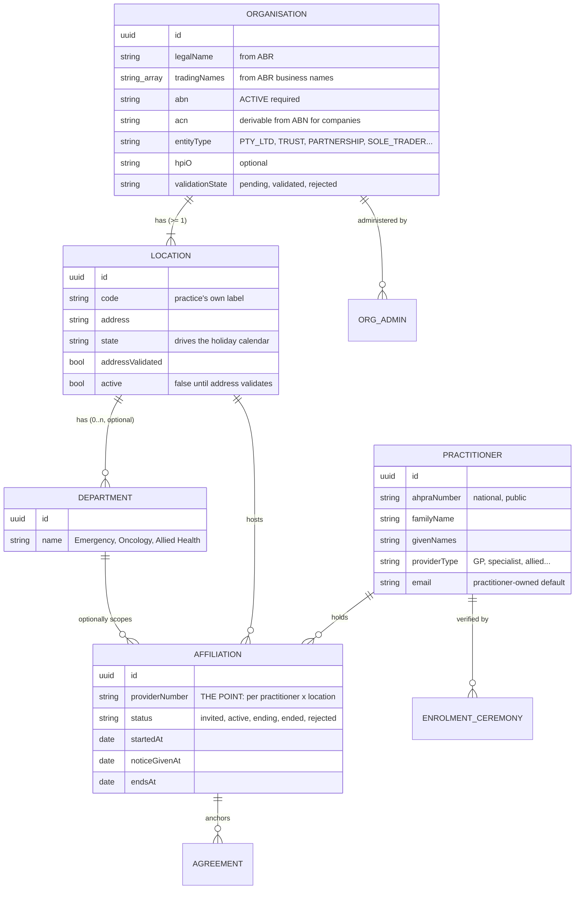
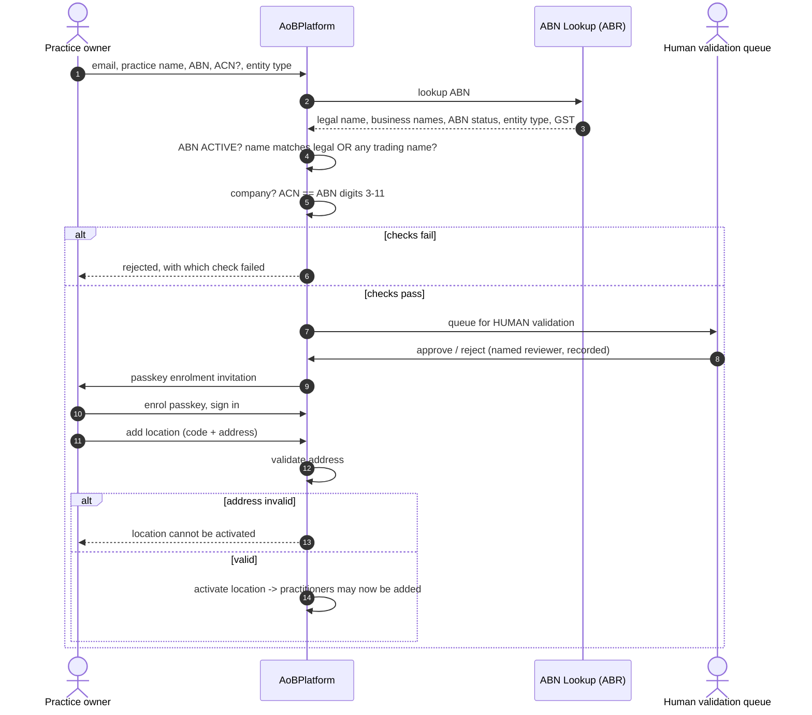

# Organisation / location / practitioner model — proposal and assessment

### 21 August 2026 · Response to Carl's on/offboarding design · **Not built — decisions needed first**

Diagrams below render on GitHub.

---

## 1. Verdict up front

**The core structure is right**, and it matches every relevant Australian
precedent. Four changes I'd make, one of which is a genuine liability rather
than a design preference.

| Your proposal | Verdict |
|---|---|
| Org → Location → Department (dept optional) | ✅ **Keep.** Matches HPI-O's seed/network organisation shape and PRODA's org model. |
| Practitioner is an independent entity who pre-registers | ✅ **Keep.** This is how AHPRA, HPI-I and PRODA all work — identity is national and practitioner-level. |
| Practice must exist before a practitioner can be added | ✅ **Keep**, with a sole-trader path (see §6). |
| Practice invites → practitioner accepts/rejects | ✅ **Keep.** Matches REQ-XFER-05 "both-sides approval". |
| Practitioner can work at multiple practices | ✅ **Keep** — and it's not optional, it's how the provider-number system works. |
| ABN lookup, must be ACTIVE | ✅ **Keep.** |
| Org name must match ABN lookup **exactly** | ⚠️ **Change** — this will reject most legitimate practices (§4). |
| 5–10 practice cap | ⚠️ **Change** — no cap; anomaly-detect instead (§5). |
| "Do you contract to many practices?" flag | 🛑 **Don't build.** Payroll-tax liability (§5). |
| 10-business-day cool-off, then block | 🛑 **Change the mechanism.** As described it would manufacture invalid claims (§7). |

---

## 2. The one structural fact everything hangs off

> **FR-1.8** — "provider number **per location** (a practitioner has one per
> place of practice)"
>
> **REQ-REG-02** — provider identification is name **+ address of the place of
> practice**, OR the provider number **for that place of practice**

A Medicare provider number is not a property of a doctor. It is a property of
**a doctor at a place**. That single fact forces the model: the practitioner
and the location are separate entities, and the provider number lives on the
**edge between them**.

This is also why "a practitioner can work at two practices" isn't a feature
request — it's the default state of Australian medicine, and any model that
puts `providerNumber` on the practitioner is already wrong.

### What we have today (the honest limitation)

```
Practice ──< Provider { name, providerNumber, placeOfPracticeAddress }
```

`Provider` is really "practitioner as known by this one practice". A doctor at
three practices is **three unrelated rows**, with no way to know they're the
same human. That's the thing your proposal fixes.

---

## 3. Proposed model



### Why the agreement anchors to the **affiliation**, not the practitioner

`REQ-XFER-01` says the agreement's practitioner is **immutable** — there is no
transfer path, by design (and I've enforced that with a DB trigger). Anchoring
to the affiliation makes that fall out for free:

- The affiliation *is* the (practitioner × location) pair that owns the
  provider number — which is exactly what s 65C(5) asks you to record.
- Practitioner moves to a new location ⇒ **new affiliation ⇒ new agreement**.
  Not an edit. Which is the rule.
- Practitioner leaves ⇒ the affiliation ends ⇒ their enduring agreements at
  that location cease under 65CA(8), automatically, with no transfer.

---

## 4. Practice (organisation) onboarding



### Change 1 — exact name match will reject most real practices

An ABR lookup returns the **legal entity name**. Practices trade under a
different name constantly: legal entity *"Smith Medical Pty Ltd"* trading as
*"Sampletown Family Practice"*. Requiring the typed name to equal the ABR
entity name exactly fails that — legitimately, and often.

**Instead:** accept a match against the legal entity name **or any registered
business name** on the ABN, store both, and show the operator what matched.
Keep the ABN-ACTIVE check strict — that one is binary and worth being rigid
about.

### Change 2 — ACN is free

For a company, the ABN is the ACN with two check digits prefixed, so the last
nine digits of the ABN *are* the ACN. Don't ask for it separately and hope
they match — derive it, and if the operator supplies one that disagrees, that
is a hard fail worth surfacing. *(Verify this relationship before relying on
it; I'm confident but it should be checked against the ABR's own
documentation.)*

### What else to collect for an organisation

FR-1.1 already specifies most of it. Additions worth making:

| Field | Why |
|---|---|
| Entity type from ABR | Drives who can sign — a trust signs differently from a Pty Ltd |
| Trading/business names | See Change 1 |
| GST registration | Our own invoicing, not AoB (bulk billing is GST-free) |
| **State per location** | Already built — drives the public-holiday calendar for 2-business-day terminations |
| HPI-O | Already in FR-1.1 (optional; supports future rails) |
| BBPIP participation | All-or-nothing across the practice; a single privately-billed item forfeits the quarter |
| MyMedicare registration | Gates the enduring MyMedicare pathway entirely |
| **Payee arrangement** | ⚠️ Open question — see §8 |

---

## 5. Practitioner onboarding and affiliation

```mermaid
sequenceDiagram
    autonumber
    actor Doc as Practitioner
    actor Admin as Practice admin
    participant P as AoBPlatform

    rect rgb(240, 246, 252)
    note over Doc,P: Path A - practitioner pre-registers themselves
    Doc->>P: email, name, AHPRA number
    P->>P: format-validate AHPRA number
    P->>Doc: verify email
    P->>P: status = pre-registered (NO passkey yet, NO affiliation)
    end

    rect rgb(240, 246, 252)
    note over Admin,Doc: Path B - practice adds them
    Admin->>P: search by AHPRA number
    P-->>Admin: full name + AHPRA number ONLY (never provider number)
    Admin->>P: add to location (+ department?), provider number at that location
    P->>P: REQ-PKI-01 ceremony required before any key is bound
    P->>Doc: invitation to the practitioner-owned email
    alt Practitioner ACCEPTS
        Doc->>P: accept
        P->>P: affiliation = active
        P->>P: agreements for this practitioner AT THIS LOCATION now process
    else Practitioner REJECTS
        Doc->>P: reject
        P->>P: affiliation = rejected; capture blocked; practice notified
    end
    end
```

### Change 3 — show the AHPRA number, never the provider number

You asked which ID the health department provides. It's the **AHPRA
registration number**: national, practitioner-level, and genuinely public —
AHPRA publishes a searchable register showing name, profession, registration
status and conditions.

The **Medicare provider number is not public and must never appear in a
directory.** Provider-number misuse is the documented fraud vector this whole
PKI family exists to close (Addendum v5 PART C cites a $7.5m prosecution
involving impersonation of twenty doctors). A directory that exposes provider
numbers hands an attacker the exact artefact.

Also worth adding: the search should be **exact-match on AHPRA number**, not
fuzzy name browse. Even though the AHPRA register is public, letting any
practice admin enumerate everyone on our platform tells an attacker who our
customers are. Rate-limit and log it.

### Change 4 — do not ask "do you contract to many practices?" 🛑

This is the one I'd push back on hardest, and it's not a design objection.

Whether Australian practitioners are employees or contractors of their
practice is a **live payroll-tax controversy**. State revenue offices have
pursued medical practices over exactly this question, several states have run
amnesty programs, and the leading case (*Thomas and Naaz*, NSW) turned on
whether service agreements between a practice and its doctors were "relevant
contracts". *(Verify current state-by-state status before acting — this moves.)*

A platform that asks a practice to declare its doctors' engagement status, and
stores the answer with a timestamp, has created a **discoverable record in a
live tax dispute**. That's a liability we'd be manufacturing for our customers,
for no functional benefit.

**We don't need the answer.** The system must support N affiliations regardless
— that's forced by the provider-number model. Nothing in the AoB workflow
branches on employment status.

**And drop the 5–10 cap.** Arbitrary caps generate support tickets and don't
stop fraud (an attacker stops at 9). What you actually want is already
specified: `REQ-ANOM-01` anomaly detection. A practitioner going from 2 to 30
affiliations in a week is a *signal to surface*, not a threshold to block at.

---

## 6. Sole practitioners — don't make the common case awkward

A solo GP is simultaneously the organisation and the only practitioner. If
onboarding demands a separate "practice owner" who invites a "practitioner",
the most common small-practice shape becomes a confusing two-step where one
person emails themselves.

The ABR entity type gives you this for free — `Individual/Sole Trader`. Detect
it and collapse the flow: one identity, one ceremony, org + first affiliation
created together.

---

## 7. Offboarding — the change that matters most 🛑

Your proposal: notice → 10 business days cool-off → practitioner removed →
AoBs blocked.

**Two problems.**

**(a) There is no cool-off in the regulation, and a delay may manufacture
invalid claims.** Under 65CA(8) an enduring agreement ceases when *"the
practitioner leaves the nominated practice location"*. It ceases **on that
event**, not ten days later. If we keep processing AoBs for a departed
practitioner during a cool-off, we are producing claims against agreements
that have already ceased — the exact silent-invalidation failure mode the
design docs call out. `REQ-XFER-08` is even blunter about the deregistration
case: *"immediately cease all that practitioner's agreements… Do not wait for
the practice to tell you."*

**(b) "Blocked" is the wrong verb.** Agreements don't get blocked, they
**cease** — and the evidence is retained for the full 2-year period.
Termination ends an agreement; it does not delete the record (`REQ-OFF-07`).

### What I'd build instead

```mermaid
sequenceDiagram
    autonumber
    participant Any as Practice admin OR practitioner
    participant P as AoBPlatform
    actor Other as The other party

    Any->>P: give notice to end the affiliation
    P->>P: set endsAt (commercial notice period, per THEIR contract)
    P->>Other: notify (never silent, either direction)
    note over P: Between now and endsAt: affiliation still ACTIVE.<br/>Capture proceeds. Claims are valid. Nothing is blocked.
    P->>P: at endsAt -> affiliation ENDED
    P->>P: enduring agreements at that location CEASE (65CA(8))
    P->>P: new capture blocked for that affiliation
    P->>P: evidence retained in full; in-flight claims for services<br/>rendered BEFORE endsAt remain valid
    P->>Other: cessation surfaced before a claim relies on it
```

The distinction: the notice period is **before** the end date, not after it.
Your ten days is a perfectly reasonable *commercial* notice period — it just
belongs in the practice's service agreement with the practitioner, with the
platform recording the agreed end date. What the platform must not do is keep
processing after the practitioner has actually gone.

**And deregistration bypasses all of it** — `REQ-XFER-08`, immediate hard stop,
no notice period, don't wait to be told.

---

## 8. Open questions I can't answer from the docs

1. **Who is the payee?** You said "the Practice does all the billing on behalf
   of the practitioner." Legally the AoB assigns the benefit to the
   **practitioner**; Medicare separately supports a payee arrangement so the
   money lands with the practice. We should confirm how that's registered
   (Services Australia banking forms HW027/029/052 are in the glossary) and
   whether we need to hold it. **This affects whether Organisation needs
   banking fields at all** — and I'd rather it didn't (`REQ-PKI-02` treats
   changing banking configuration as a high-risk action requiring a
   practitioner signature, which implies we hold it; worth confirming).
2. **Address validation service.** You said "any free webservice". Candidates
   need checking for licence terms and whether they're a runtime network
   dependency (which needs your sign-off per CLAUDE.md §7). The ABR's own data
   isn't an address validator.
3. **Notice period.** Whatever the practice's service agreement says — is
   there a house default we impose, or is it per-organisation config?
4. **Department semantics for billing.** Does a hospital department ever change
   the provider number, or is that always location-level? If location-level,
   Department is purely organisational and never touches an agreement.

---

## 9. Is this good industry practice? — the honest answer

**Yes, and it's the shape the Australian ecosystem already uses.** Three
precedents, all pointing the same way *(verify specifics before customer-facing
claims — this is my knowledge, not sourced from the project docs)*:

- **PRODA** (Services Australia): individuals register once and own their
  identity; organisations register separately against an ABN; individuals are
  then *linked* to organisations with delegated roles. Organisations support a
  hierarchy.
- **HPI-O** (Healthcare Identifiers Service): a **seed** organisation (the
  legal entity, ABN-anchored) with **network** organisations beneath it for
  sites and departments. That is your Org → Location → Department, already
  standardised.
- **AHPRA / HPI-I**: practitioner identity is national, public, and completely
  independent of who currently employs them.

The consistent pattern: **identity is practitioner-level and national;
affiliation is a separate, revocable, time-bounded edge.** Your instinct to let
a practitioner pre-register independently and carry that identity between
practices is not just good practice — it's the only model that interoperates
with the systems we'll eventually have to talk to.

Where your design is *better* than the common implementation: most PMS and
engagement products model the practitioner as a child of the practice (which is
what we do today, and it's wrong). Duplicating a doctor across three practices
loses the fact that they're one person — which matters enormously for anomaly
detection, for deregistration hard-stops, and for the practitioner's own view
of what's been signed in their name.

---

## 10. What I need from you before building

1. **Sign off the four changes** (§4 name matching, §5 no contractor flag / no
   cap, §5 AHPRA-number-only directory, §7 notice-before-end).
2. **Answer the payee question** (§8.1) — it decides whether we hold banking
   details at all.
3. **Pick an address validation service**, or confirm you're happy with a
   runtime network dependency and I'll propose one.
4. **Confirm the migration appetite.** This restructures `Provider` into
   `Practitioner` + `Affiliation` and re-anchors agreements. There's no
   production data, so now is free; in six months it isn't.
