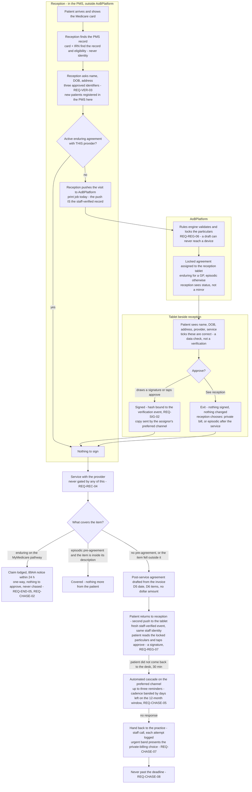

# To-do

Things agreed but not built. Not a backlog of ideas — everything here has been
decided, and is written down so it does not get re-decided.

Convention: each entry says what it is, WHY it was deferred rather than done,
and what it depends on. An entry with no "why deferred" is just an unfinished
task and belongs in the code as a TODO comment instead.

---

## Contact details on locations and departments

Asked 23 Aug 2026, while adding the practice page a practitioner sees. At least
`phone1`, `phone2`, `email1`, `email2` on **both** `practice_locations` and
`departments`, shown on that page under each site.

### Why two of each, and not one

A site has a number people ring and a number that is answered when the first is
not — reception and the back office, or the rooms and the after-hours service.
Modelling one and letting practices cram both into a single field produces
`"9555 1234 / 9555 5678 (after hours)"`, which nothing can dial, nothing can
validate, and every screen has to render as free text.

The same for addresses: the one the practice publishes, and the one that
actually reaches somebody.

### The decision to make first

**These are PUBLIC, like `practices.businessPhone` and `businessEmail`.** That
is the whole reason they are new columns rather than a reuse of something
existing — every address already on a location's practice belongs to a person
(`adminEmail` holds a credential) or to us (`groupEmail` is an internal notices
mailbox), and showing either to answer "how do I contact this site" publishes
somebody's personal details.

So they need the same treatment as the practice ones:

- [ ] Added to `reporting.outbound_messages`? **No.** They are contact details,
      not volumes, and the reporting surface stays free of anything that
      identifies a way to reach a person.
- [ ] Returned by `practice_places_for_practitioner`, which already exists and
      already carries the affiliation check.
- [ ] Shown on `/practitioner/practices/[id]` under each location, and later on
      the patient-facing equivalent.
- [ ] Editable by the practice on `/practice/locations`, with the same
      review-task treatment as other contact changes? **Probably not.** A
      location's phone number is not a credential and redirecting it does not
      let anybody receive a sign-in link — the review task on `adminEmail`
      exists because that address holds an account, and copying it here would
      be ceremony without a reason.

### Worth deciding at the same time

- **Should a department inherit its location's numbers when it has none?**
  Inheriting is friendlier and hides whether anybody actually set them. I would
  show the location's and say it is the location's, rather than silently
  presenting it as the department's own.
- **Validation.** An Australian number has a shape; an obviously malformed one
  should be refused at entry rather than discovered by a patient who cannot get
  through.

## A patient or carer terminating an agreement

Asked 23 Aug 2026. A practitioner can now end their own affiliation
unilaterally, and the reasoning applies at least as strongly one level down:
**the person who gave consent should be able to withdraw it without asking the
party who benefits from it.**

If a practice had to agree, a practice could keep an agreement alive after the
patient wanted it gone — which is the same shape as a practice keeping a
departed practitioner listed, and the same fraud.

### The blocker is the definition, not the mechanism

**Get the Health department's definition of a carer before building this.** Not
a detail to fill in later: it decides who may end somebody else's agreement,
and getting it wrong means either a carer who cannot act for the person they
care for, or a stranger who can.

The statutory ground already in play is reg 65CB(5) — an assignor acting for
another person, self-declared. Whether "carer" there is the same set as the
department's carer definition is exactly what needs establishing, and it is a
question for somebody who can read the instrument, not for us to infer.

### What is already decided by things we have built

- **Termination is a fact, not a negotiation.** Same as a practitioner leaving:
  recorded, the other side told, nobody asked.
- **It cannot be retroactive.** Consent captured before the withdrawal stands —
  the agreement ceases, it is not erased. `enduring.ts` already holds this for
  reg 65CA(8) cessation.
- **Evidence is retained in full.** Withdrawing consent does not delete the
  record that it was given; that record is what protects the practice against a
  later claim that it never was.

### What is genuinely open

- [ ] **Whose act is it when a carer does it?** Recorded as the carer's, on the
      patient's behalf — never as the patient's own. A record that cannot
      distinguish them cannot answer "did the patient know".
- [ ] **Is the patient told when a carer acts for them?** Almost certainly yes,
      and the exception (a patient who cannot be told) is the hard case.
- [ ] **Can a patient reverse a carer's termination, and vice versa?** Related to
      the assignor revocation question already open.
- [ ] **What reaches the practice, and how fast?** A terminated agreement changes
      what can be billed, so a practice learning late is a practice billing
      wrongly in the meantime.

**Blocked on the same relationship model as patient and assignor reporting.** An
assignor's authority is per-patient and expires; a role cannot say which patient
or until when, and neither can a termination endpoint that trusts a role.

## Family reporting

Asked 22 Aug 2026, flagged as a selling point rather than a requirement.

Once patient and assignor reporting exists, an assignor who acts for several
people — a parent, a carer, an adult child — should be able to see them
together rather than one at a time. "What has been assigned in my family this
year" is a question no practice can answer and we can.

**It cannot be built before the relationship model is settled.** An assignor's
authority is per-patient and must expire; a family view is that authority
plotted over time, so it inherits every question the relationship has and adds
one more — whether somebody may still see a period they were authorised for
AFTER the authority ends. Probably yes for what they could see at the time, and
certainly not for anything after it, but that is a decision rather than an
obvious answer.

Also worth stating plainly before anybody builds it: a family view makes one
person's records visible to another. That is a feature the patient must be able
to see and revoke, not a convenience granted by whoever set it up.

## Onboarding

### AI chat bot for application status
**Status:** not started.
**Decided:** 2026-08-22, Carl.

An applicant waiting on a decision should be able to ask "where is my
application" without ringing anyone. The acknowledgement email will offer three
routes — call us, check the status page, or ask the bot — and the third does not
exist yet.

**Why deferred:** the status page has to exist before a bot has anything to
answer from, and the bot's scope needs a boundary drawn before it is built. It
must be able to say what stage an application is at and what is outstanding. It
must NOT be able to say why a reviewer is hesitating, disclose whether an ABN is
already registered here (that turns a status query into a way to enumerate
customers — the same rule already enforced on rejection reasons), or give any
impression of deciding. A bot that sounds like it is approving something is
worse than no bot.

**Depends on:** the public status page.

### Public application-status page
**Status:** not started.
**Decided:** 2026-08-22, Carl.

`/status/<token>` — the same three-row gate ledger the applicant saw when they
submitted, showing where the application has got to.

**Why deferred:** needs a bearer token that is NOT the practice id. The id is a
primary key: it ends up in logs, referrer headers and support tickets, and a
primary key that doubles as a credential is a credential that leaks. A separate
random token, revocable independently, is a column and a migration.

**Depends on:** nothing else.

---

## Access

### ~~Platform-admin sign-in~~ — BUILT, 2026-08-22
**Status:** done. Passkey-only, via Keycloak, on the `console` client.

A platform administrator is minted by CLI invitation
(`infra/keycloak/invite-platform-admin.mjs`), enrols a passkey at a link, and
the reviewer screens take the name from the session. The typed-name fallback is
gone from those screens.

**What it cost, and what was learnt:** most of an afternoon and six wrong
theories, all of them recorded in PASSKEYS.md. Read that first next time; the
decision tree at the bottom is the useful part.

**Still open, and tracked in CRITICAL-ISSUES.md:**

- **§2 — the Windows Password Manager trap.** DECIDED 2026-08-22: leave the
  rules as they are, revisit later. `userVerification` stays `required`, no
  password fallback, and the enrolment-time AAGUID check is not being built
  yet. Reasonable while the affected population is two administrators who both
  know about it; **stops being reasonable the moment practitioner sign-in is
  built**, because Windows makes the wrong provider the default and every
  practitioner would meet it alone, at first sign-in, with nobody to ask.
- ~~**Nothing backs up the `keycloak` database.**~~ — `backup-keycloak.mjs`,
  2026-08-22. Dumps it, prunes to the last fourteen, and will restore-test the
  file into a throwaway database on request. The verify checks the USER count
  rather than whether the file loaded, because realms and clients come back
  from the realm import on every start — a backup holding only those looks
  healthy and contains nobody, which is exactly how the H2 store was lost.
  **Still to decide:** where the files go. On the same disk as the database
  they survive a mistake and not a disk, and they name every administrator.
- **`admin/admin` is still in `docker-compose.yml`,** and is now the most
  valuable credential in the system: it is the last resort for admin recovery.

### Practitioner sign-in, and what an acceptance is worth
**Status:** not started. **The affiliation flow is built and works without it.**
**Found:** 2026-08-22, while building the invitation.

A practitioner accepts an affiliation today by opening a link emailed to their
own address and typing a six-digit code from the same message. That is recorded
honestly — `acceptanceMethod = 'email_link_and_code'`, and the evidence says in
words that it proves access to an inbox and not who was at the keyboard.

**What it is good enough for.** The ordinary failure it prevents is not fraud:
it is a practice adding a doctor who never agreed, through haste or a locum
arrangement that fell through, and then capturing consent in that doctor's
name. It stops that completely.

**What it is not good enough for.** It is one factor, and the practice chose
which address to invite. A practice willing to commit fraud can invite an
address it controls — what makes that expensive is CONVENTIONS.md §8b (creating
a practitioner at all requires a validated practice), not this ceremony.

**The fix is the practitioner passkey (FR-1.9),** and the pieces are already
there: `Practitioner` carries `keycloakUserId`, `invitedAt` and
`passkeyEnrolledAt`, and the platform-admin work proved the ceremony on real
hardware. `ACCEPTANCE_STRENGTH` in the domain already ranks passkey above an
emailed code above the practice's own word, so both can coexist and stay
distinguishable in evidence for ever.

**Do NOT retrofit the strength of the old records when it lands.** An
affiliation accepted by email was accepted by email. Upgrading the label later
would be rewriting evidence.

**Depends on:** re-opening the §2 decision, which was deliberately deferred on
2026-08-22 on the grounds that only two administrators were affected. Building
practitioner sign-in is precisely the event that invalidates that reasoning, so
the two have to be picked up together.

---

## Capture

### Telehealth: the call IS the acceptance
**Status:** not started.
**Decided:** 2026-08-22, Carl.

For a telehealth consultation the practitioner calls the patient through the
app, the patient accepts the call, and that acceptance is the consent
ceremony — no separate link, no SMS, no second device.

**Why this is attractive:** it removes the weakest step in remote capture. A
link sent to a phone proves somebody holds that phone; a patient answering a
call they were expecting, in a consultation they booked, with a practitioner
they can see, is a materially stronger act — and it happens inside the
appointment rather than beside it.

**What has to be worked out before it is built,** because each of these
changes what the record means:

- **What exactly is captured.** Accepting a call is consent to the CALL. The
  s 65C data set and the assignment of benefit are a different agreement, and
  the ceremony has to present them, not assume them. A patient who thinks they
  answered the phone has not assigned a benefit.
- **What the evidence is.** A signature is an artefact; an accepted call is an
  event. The record needs something durable — the call metadata, the
  timestamps, what was displayed and read, and whether the patient was told
  what they were agreeing to. Whether that includes a recording is a separate
  decision with its own consent question.
- **Identity.** The call proves the patient answered, not who they are. The
  identifier check (FR-1.4, minimum three, never Medicare) still has to happen
  and probably has to happen visually, on the call.
- **Failure modes.** Dropped calls, the patient handing the phone to somebody
  else, a call accepted while the patient is driving. A ceremony that cannot
  be safely abandoned mid-way is not safe.

**Depends on:** the capture channel work, and a decision on whether telehealth
calls run in our app at all or through a PMS-provided channel.

---

## Testing

### ~~The e2e suite is flaky across suites~~ — SOLVED, and it was not flakiness
**Diagnosed 2026-08-22.**

`org-model.e2e-spec.ts` failed four tests in a full run and passed all
fifty-five alone, which read exactly like fixture interference. It was not.

**The cause: `localhost` resolves to `::1` first on Windows.** Docker Desktop
publishes a port on both stacks, but its IPv6 forwarding accepts the TCP
connection and then fails the protocol handshake. So:

- a raw socket test reports the port **OPEN**
- Prisma reports **"can't reach database server"**
- an SMTP send **hangs** until it times out rather than refusing

The intermittency came from whichever address the resolver returned first,
which is why it looked like a race between suites. It got dramatically worse
the moment registration started sending an acknowledgement email — a second
protocol, over a second port, with the same fault.

**The fix: 127.0.0.1 everywhere in `apps/core/.env`, never `localhost`.** All
150 e2e tests pass.

**The lesson worth keeping:** the symptom is the worst kind — everything looks
up, and only the things that speak a protocol fail. When a connection test
passes and a client says "cannot reach", suspect the address family before
suspecting the service.

---

## Identity

### ~~The two identity-strength dashboards~~ — BUILT, 2026-08-22
**Status:** done. `/review/identity`, platform-admin only, linked from the
review queue.

Two tabs, each answering one operational question, because a dashboard without
a question is a report nobody opens twice:

- **Practices** — which applications are stuck, and on what. Score, the checks
  behind it, time in queue, and the weakest link stated in words rather than
  left for the reader to infer from a number.
- **Practitioners** — whose verification is going stale, and who is moving
  unusually. Blocked first, then weakest, then stalest.

**Practitioner strength DECAYS**, which is the part that needed a new domain
module (`practitioner-strength.ts`). Practice identity is mostly stable facts;
a registration is a snapshot, and "Registered, verified in January" says very
little in December. Each row also shows what one fresh check would restore.

**The "would fail" count is the point of soft mode.** It is on the page: how
many real practices hard enforcement would be turning away today. That is the
number that decides when the threshold is safe to switch on, and it cannot be
seen once you are already enforcing it.

**Still open from §10 of the design**, unchanged and still needing Carl: the
PIE data-usage question, the §7 sign-off for the website fetch, the collection
notice, the retention conflict, and whether a sole trader can reach six points
at all.

---

## Rostering — a practitioner who works at more than one practice

Raised 22 Aug 2026: *"Some practitioners may work 2 days at practice A and 2
at practice B."* Recorded rather than built, per that instruction.

### What already works

**The identity and affiliation model already handles this**, and it was
designed to. A practitioner is one person on the platform; an affiliation is
per practice AND per location, and FR-1.8 refuses a second affiliation at the
same location rather than at the same practice. A provider number belongs to
a place, not a person, which is exactly the multi-site shape.

So Dr X at Practice A on Mondays and Practice B on Thursdays is already two
affiliations, each with its own provider number, each accepted by the
practitioner themselves.

### The one thing that is NOT solved

**Keycloak enforces one email address per realm.** We already hit this in the
e2e logs: the same person at a second practice cannot get a second account on
the same address. It needs either a different address or the existing account
linked rather than duplicated — and linking is the right answer, since it is
one person. Unresolved, and it is the real blocker, not rostering.

### The rostering idea

Also raised: build a simple roster — *"which Dr is working when"* — offered
free or at minimal fee as a sweetener for small practices.

**Worth taking seriously for a reason beyond goodwill.** A roster would let
the platform answer a question it currently cannot: *was this practitioner
actually at this location on the day that consent was captured?* Today an
affiliation says they work there in general. A roster says they were there on
the Tuesday. That is a genuine strengthening of the consent record, and it
would feed the same strength scoring as every other check.

**But note the risk before building it.** A roster is operational data that
changes constantly, and this platform is an evidence store where things are
append-only and retained for two years. If a roster becomes evidence, every
shift swap becomes a record we cannot delete. That is not a reason to refuse
— it is a reason to decide up front which it is:

| If the roster is… | Then |
|---|---|
| **A convenience feature** | Keep it out of the evidence chain entirely. Mutable, deletable, no vault events |
| **Evidence of presence** | Append-only like everything else, and a shift correction is a new record rather than an edit |

Deciding that late would be expensive, because the storage shape follows from
it. Deciding it early costs nothing.

### If it gets built

- [ ] Decide the question above FIRST — convenience or evidence
- [ ] Resolve the one-email-per-realm constraint; account linking, not a second account
- [ ] Roster entries per affiliation, not per practitioner — the affiliation is what carries the location
- [ ] A capture-time check: is this practitioner rostered here today? Warning, not a block, until it is trusted
- [ ] Keep it optional. A practice that does not roster must not be worse off
## Outbound queue — when to reach for a broker

Asked 22 Aug 2026: should we use BullMQ, RabbitMQ or Pulsar instead of the
Postgres queue?

### Decision: no external tracker (ServiceNow / Jira / Zammad) for review tasks

Asked 22 Aug 2026: at a 100-500/day spike, is there an open-source ServiceNow
or Jira we could hold outstanding tasks in, assign to different platform
users, and click through one at a time?

### Why we did not, and what would change that

They exist and they are good. Closest to ServiceNow: **iTop** or **GLPI**
(both ITSM, both GPL/AGPL). Closest to Jira: **Plane** or **Redmine**. For a
general operations desk any of them would beat writing our own.

Three things stop it being right HERE:

1. **The task carries the practice’s data.** A review task is not a pointer —
   it holds the before and after values of what changed, including admin
   contact details. Today that sits behind RLS and a practice can only ever be
   seen by somebody scoped to it. In every tracker listed, everyone with
   access to the project sees every ticket. That is not a configuration we
   would be tightening; it is the absence of a tenancy model.

2. **The resolution IS the evidence.** "A named person looked at this change
   and accepted it" is the compliance record — that is the whole reason the
   queue exists rather than the change just applying. It has to be in the
   vault chain and retained with everything else. Recorded in Zammad instead,
   our evidence chain has a hole at exactly the point a human decided.

3. **Two systems would disagree.** Closed there, open here; and our own
   automated checks resolve tasks from this side, so the sync is
   bidirectional, not a feed.

### The volume argument points the other way

If 500 tasks a day are reaching a person, the AI check has failed, and a
tracker would be organising work that should not exist. The mix matters:
`practice_amended` and `recertification_due` are low-stakes and already
`autoResolvable`. The other three — admin contact changed, address changed
after confirmation, acting-as occurred — are high-stakes and a person MUST
decide them. That is deliberate: they are the anti-fraud controls, and no
amount of queue tooling should make them cheaper to wave through.

So the lever against a spike is the checker, which nothing calls yet.

### What to build here instead (~1 day)

- [ ] Assign a task to a named platform user (claim already exists; this is
      claim-on-behalf, plus an "assigned to me" filter)
- [ ] Focus mode — one task at a time, decide, advance to the next in the
      filtered set. This is the click-through Carl described and it is a route,
      not a system.
- [ ] Accept-many for low-stakes kinds, with each decision still recorded
      individually against the person
- [ ] Age on the card, and oldest-first ordering

**Reconsider an external tracker when any of these becomes true:**

- [ ] Platform operations grows past ~8 people, or runs shifts needing handover
- [ ] Work arrives from sources we do not own (support email, phone) and needs
      to sit in one place with these
- [ ] Somebody needs SLA reporting we would otherwise build

**If it comes to that, mirror — do not move.** Push a task STUB out (id, kind,
practice name, age; no changed values) and treat the tracker as the worklist,
while the decision is still made and recorded here. That keeps both the
tenancy boundary and the evidence chain intact, and it is the same shape as
the outbox decision above.

## Why we did not, and what would change that

All three are out-of-process brokers, which means the enqueue cannot be in
the same transaction as the evidence write. That gives two failure modes we
cannot accept: a notice with no send, and a send with no notice. The standard
fix is a transactional outbox — so **we build this table either way**, and
the only real question is whether a broker is needed IN ADDITION.

At the modelled 750,000 notices/day (~21/second average) it is not. Verified:
two workers claiming concurrently through `FOR UPDATE SKIP LOCKED`, zero
overlap, no coordinator.

**Adopt RabbitMQ when any of these becomes true:**

- [ ] Sustained throughput above ~100/second, or peaks the database feels
- [ ] Cross-region fan-out, where a single Postgres is the wrong hub
- [ ] Non-Node consumers that would otherwise need their own claim logic
- [ ] A second product needs the same messages, and polling our table is worse than subscribing

**RabbitMQ over the other two, if it comes to that.** BullMQ needs Redis, and
Redis as a durability-critical store for "must not lose this" makes AOF and
fsync tuning a compliance question — the wrong shape for evidence. Pulsar’s
tenancy sounds like a fit and is not: our tenant boundary is Postgres RLS
(CONVENTIONS.md §6), and moving notice CONTENT into a broker takes it outside
that boundary and re-implements isolation in a second system.

**The migration is cheap because the outbox exists.** The relay changes
destination; nothing else moves. That is the point of building it this way,
not an accident.

## "What was sent to me" — a separate screen from the queue

Raised 22 Aug 2026 alongside the queue viewer: practitioners should see
notices for their practices, and patients/carers should see their own.

**Agreed on the need. Not from the queue table, though**, and the reason is
not fussiness:

| | Queue (`outbound_items`) | Evidence (`Notice`) |
|---|---|---|
| Retention | **Pruned after ~30 days** | Full statutory period |
| Question it answers | "Did this leave? Is it stuck?" | "What was sent, and what happened to it" |
| Audience | Operators, practice admins | Practitioners, patients, regulators |

A patient looking at the queue would watch their own records vanish. The
queue is transport and is deliberately disposable.

**And patients have no accounts, by design.** REQ-PORT-08: a patient signs
from a single-use link and must never need one. A patient-facing history
screen means building patient authentication — a large new surface, and one
that reverses an existing decision rather than extending it. Worth doing
deliberately if we want it, not as a side effect of a queue viewer.

### If it gets built

- [ ] Source it from `Notice` + `NoticeDeliveryEvent`, never `outbound_items`
- [ ] Decide the patient auth question FIRST — token-scoped view, or real accounts
- [ ] A practitioner spanning practices needs a deliberate cross-tenant read; RLS forbids it by default and every exception is individually justified (CONVENTIONS.md §6)
- [ ] A carer selecting a patient is an authority question, not a filter — who may act for whom has to be recorded before it can be offered
## View-only view of a practice, cascading

Carl: from `/practice` we may just want to LOOK at a practice and its
relationships without acting as it — the same seven-card hub, read-only, and the
read-only must cascade into practitioners, locations and everything below.

Worth doing, and the cascade is the hard half: a read-only hub that links to
editable children is worse than no read-only mode, because it looks safe and is
not.

- [ ] One flag carried in the URL is NOT enough — a page reached directly is
      then editable. The scope has to be decided per request, not per link
- [ ] Simplest honest shape: an operator with no acting-as session gets read-only
      by construction, because every mutating endpoint already needs a practice
      claim they do not have. The UI then reflects what the server would do
      rather than inventing a second rule
- [ ] Which means the work is mostly: let an operator READ a practice's pages,
      and hide every control that would fail. Not a new permission — a truthful
      rendering of one that exists
- [ ] Cascade by rendering from the same "may I act" answer on every page,
      sourced once (`effectivePractice.ts` is the natural home)
- [ ] A banner saying plainly: viewing, not acting. With the way to start acting
      if that is what they meant
- [ ] Nothing read-only may show provider numbers or anything else that must not
      cross a practice boundary — read-only is not a licence to read MORE

## Practitioners working a long way from the practice

Carl's question: if a practitioner is affiliated to a practice a long way from
where they appear to work, flag it quietly? Or does that read as big-brother?

**Both, and the resolution is in WHO it is shown to.**

The signal is real. A practice adding practitioners who have no plausible
connection to it is one of the clearest shapes of the fraud this platform
exists to stop — provider identities collected to bill under, rather than
people who actually see patients there. Ignoring geography throws away one of
the few signals available before anything is billed.

The fear is also real, and it is not paranoia. Australian practitioners
legitimately work across enormous distances: locums, fly-in-fly-out, telehealth,
rural outreach, a specialist rotating through four towns. A flag that treats
distance as suspicion insults exactly the people doing the hardest work, and it
would be **wrong far more often than it was right**.

### What makes it safe

**Never shown to the practice, and never named as suspicion.** A quiet flag that
the practice can see is not quiet — it teaches somebody committing fraud which
distance to stay under, and it accuses somebody innocent to their face.

**It is a REVIEW input, not a decision.** It changes nothing about whether the
affiliation works. Nobody is refused, nothing is blocked, no message is sent.
It moves a practice up a reviewer's list, and a human decides.

**It is only interesting in aggregate.** One practitioner 900 km away is a
locum. Six practitioners at one practice, all far away, none sharing a
location, added the same week, is a different object entirely — and the second
is the one worth a person's time. Alerting on the first would bury the second.

**Say it out loud in the collection notice.** "We look at how far affiliations
are from the practice" is a sentence people accept when they read it up front
and resent when they discover it. Quiet must mean "not shouted at the
practitioner", never "concealed from them".

### If it gets built

- [ ] Compute from POSTCODES only. Never a street address, never a coordinate
      for a person — HARD-03 territory in spirit: the least precise thing that
      answers the question
- [ ] Distance from the practice LOCATION they are affiliated to, not head office
- [ ] Bands, not metres: same area / same state / interstate / remote. A number
      invites a threshold, and a threshold is a thing to stay just under
- [ ] Raise a review task ONLY on the aggregate pattern, never on one person
- [ ] Absent from every practice-facing screen and from every message
- [ ] Never blocks an affiliation, an invitation or a capture
- [ ] In the collection notice before the first real applicant
- [ ] Test the honest cases explicitly: the locum, the FIFO doctor, the
      telehealth practitioner, the specialist across four towns. If the design
      flags those individually, it is the wrong design

**Recommendation:** worth building, and worth building last of the AI-checker
signals. On its own it is a bad predictor; alongside "added five practitioners
in a week", "none has ever captured consent" and "no register check recorded",
it is one column in a picture that a person then reads.

## groupEmail changes apply instantly, with no proof

Carl caught it directly: "group email changed - no email verification sent."

`groupEmail` is one of the plain `AMENDABLE_FIELDS` -- it changes on save like
a phone number, with no hold and no proof, unlike `adminEmail` (held pending
the new address answering a code) and unlike a practitioner's own address
(same, plus a backup-address warning). This was not an oversight so much as
never having been asked: the field's own schema comment says "NOTHING ENROLS
AGAINST THIS ADDRESS. It receives notices only" -- so an unverified groupEmail
cannot by itself be used to obtain a credential, which is a real and different
risk profile from adminEmail.

**It is not nothing, though.** `groupEmail` is the CO-WITNESS for an
`adminEmail` handover -- `pending-email.service.ts` warns both the old admin
address and `previousGroupEmail` when a handover is requested, specifically so
a second channel can object. An attacker who can amend the practice at all
(any practice-admin session) can repoint `groupEmail` to an address they
control, THEN request the adminEmail handover -- and the witness meant to
catch it is now them. Two steps, no proof required for either, and the second
step's protection depends on the first step being trustworthy.

- [ ] Decide whether `groupEmail` needs its own held/proof cycle -- a third
      copy of the `PendingEmailChange` shape (practice admin's is the model),
      or a lighter one, since nothing enrols against it and the stakes are
      narrower
- [ ] At minimum: warn the OLD groupEmail when a change is saved, mirroring
      the admin-email pattern, even before deciding whether to hold it
- [ ] `SENSITIVE_CONTACT_FIELDS` already names `groupEmail` alongside
      `adminEmail`/`adminPhone` (review-tasks.ts) -- so a groupEmail change
      already raises a review task at `admin_contact_changed` stakes. The gap
      is specifically that it takes effect BEFORE anybody reviews it, not that
      it goes unrecorded

## Can somebody read another practice by editing the URL?

Carl asked about `/platform/practices/<uuid>/practitioners`. Answered here
because the answer is not obvious and the obvious fix is the wrong one.

**No, and the reason is not the URL.** `auth.guard.ts` line 193:

    if (principal.practiceId) request.headers['x-practice-id'] = principal.practiceId;

A practice user's token claim **overwrites** whatever practice id the request
carried. So a practice administrator who edits the URL, or forges the header,
gets their OWN practice back — the id they typed is discarded before any query
runs. That is the control, and it is a good one: it cannot be forgotten at a
call site, because it happens once, above all of them.

A platform operator has no practice claim, so the header is not overwritten and
they can read any practice. That is the intent of these routes.

**Masking or encrypting the id would protect nothing.** It is security by
obscurity: anybody who has a real id — from a support email, a screenshot, a
previous session — defeats it, and it makes every log and bug report harder to
read. A UUIDv4 is 122 unguessable bits, so the list cannot be walked; what stops
a *known* id being misused is the guard, and it already does.

**What is genuinely open, and should be closed:**

- [ ] `AUTH_ENFORCE=false` in dev means a request with NO token passes and the
      `x-practice-id` header is trusted as sent. So in DEV, anybody who can
      reach the API can read any practice. That is the staging, deliberately —
      but it means the dev environment is not evidence that production is safe,
      and nobody should read it as such
- [ ] Verify each read endpoint under `AUTH_ENFORCE=true` before launch. The
      claim-overwrite protects everything that reads the header, but a query
      taking a practice id from a PARAM rather than the header would bypass it —
      audit for that shape specifically
- [ ] `assertPracticeScope` only checks that a claim EXISTS, not that it matches
      the request. Today that is sufficient because of the overwrite; if the
      overwrite is ever removed or made conditional, this becomes the hole. Add
      a test that pins the overwrite, so it cannot be deleted quietly
- [ ] Nothing on a read-only practice page may show a provider number. The
      guard `assertNoProviderNumber` exists; make sure these routes are covered

## TAUTALA — the assistant, and the reminders that come first

Full design in **tautala_ai.md**. `tautala` is Samoan for "to speak".

**Phase 0 first, and it needs no AI.** A practice approved and then stuck is the
commonest failure we have — Throwaway Verification Clinic is approved with a
signed-in administrator and no location; Sampletown has four locations and
NOBODY who can sign in. Neither is hard. Both are somebody not finishing a
four-concept task they will do once in their life.

- [ ] Reminder email to the administrator, the manager and the group address,
      naming the ONE thing outstanding and linking straight to it. The setup
      gaps already carry a label, a sentence and a destination, so the email
      writes itself
- [ ] A decaying schedule — day 3, day 10, day 30, then stop. A reminder that
      arrives forever is one nobody reads
- [ ] How to reach a person, in every one
- [ ] Measure completion. If this alone fixes it, TAUTALA is a convenience
      rather than a rescue — better known before building it than after

**Then TAUTALA, in the order that keeps it safe:**

- [ ] Phase 1, READ ONLY: what is missing, why, who works here, what happened to
      this affiliation. Write tools do not exist yet — absent, not disabled.
      Most of the value, almost none of the risk
- [ ] Phase 2, DRAFT: the model proposes a typed intent; the platform validates
      it with the SAME rules the forms use; the user sees exactly what will be
      created and presses a button; the server writes it as THEM, through the
      ordinary endpoint
- [ ] `createdVia: 'tautala'` on every record, so a reviewer can tell whether a
      human typed an address or a model parsed one

**Why this may act where the support chat may not:** the user is signed in and
scoped, and TAUTALA grants no authority the session did not already hold. It is
a faster path to something they can already do. That is the whole licence, and
everything in the design exists to keep it true.

**It can never accept an affiliation.** Only the practitioner can, from the
invitation sent to their own address. If TAUTALA could create AND accept, the
rule that a practice cannot accept on a practitioner's behalf collapses — and
that rule is load-bearing for the fraud model. Enforced by the tool not
existing, never by a prompt.

Never touches a provider number or a Medicare card number, never records a
register check (ours, not theirs), never approves a practice, never issues a
credential.

Needs Carl: an LLM in the request path (CLAUDE.md 7), transcript retention, and
whether TAUTALA is offered beyond practice staff — recommendation is not at
first.

## Support, lockouts and passkey recovery

Full design in **support.md**. The short of it:

- [ ] `/support` page, reachable signed in or out, listed in the menu for everybody
- [ ] Lane A (signed in) — chat immediately, ticket bound to the verified identity
- [ ] Lane B (signed out, no credential involved) — public, rate-limited, unverified contact
- [ ] Lane C (signed out, needs a credential) — **never resolved in chat**; a ticket
      plus an out-of-band challenge to the channels we already hold
- [ ] Ask what they typed, contact what we hold, store only whether the two matched
      (REQ-VER-04 / HARD-04: identifier types and outcomes, never values)
- [ ] Never confirm whether an account exists — the same answer either way, or the
      chat becomes a lookup service for valid practitioner identities
- [ ] `passkey_compromised` disables first and verifies after; it is an incident,
      not a request

**Before any of that, the cheap work that removes most of the need:**

- [ ] Prompt for a **second passkey** at enrolment; nag while somebody holds one
- [ ] **Verified mobile** on practitioners and practice admins — captured at
      enrolment, because one collected during an incident proves nothing.
      `practitioners` has no phone column today
- [ ] Self-service add / remove passkey, and self-service "my key was stolen"

**Resolution paths, which are stronger than any question a chat could ask:**

- [ ] A practice admin, signed in, requests re-enrolment for their affiliated
      practitioner — the introduction chain, run in reverse
- [ ] Two platform operators, different people, for a locked-out practice admin
- [ ] Cooling-off and old-channel notification on every reissue, reusing the
      pending-email-change pattern

Needs Carl: LLM in the request path (CLAUDE.md 7), a third-party bot check,
mobile numbers in the collection notice, and what to do about a practitioner
whose introducing practice no longer exists.

## Open questions

These block work and need Carl, not code.

- **REVIEW-REQUIRED.md** — two files still marked DRAFT, awaiting sign-off.
- **PIE licence** — $4,000 API install + $1,000/yr + $1/practitioner/yr. Alert
  is browser-only, so it cannot be automated. Decision needed before the
  entitlement check can be anything other than a phone call.
- **CLAUDE.md §7 sign-off** — fetching an applicant's website, and sending mail
  from a real domain, both need explicit approval before they leave the sandbox.
- **Collection notice** — not written. Required before any real applicant data
  is collected.
- **Retention conflict** — 7-year practitioner report vs 2-year stated
  retention. These cannot both be true; one has to give.
- **The Windows passkey provider trap** — every practitioner will hit it, and
  Windows defaults them into it. Three ways to go, recorded in full in
  CRITICAL-ISSUES.md §2; the recommendation is to detect the AAGUID at
  enrolment and refuse a non-UV provider there and then.
- **Can a sole trader reach 6 points?** If not, the identity threshold quietly
  excludes them, which is a policy decision and not a scoring detail.

## The MBS basic-service-description mapping (D6a)

Raised 25 Aug 2026 from CONSULTATION-CAPTURE-PLAN.md §2.4 / Part 6 Q2. A
pre-agreement needs a Basic Service Description from a versioned mapping, and
**no MBS item → description mapping exists anywhere in the repo** —
`basicServiceDescription` is a free-text DTO field and `mappingVersion` is
recorded against nothing. Until this is settled the containment check
("does the billed item fall inside the pre-agreement's description",
plan §3.1) cannot be built, and a pre-agreement + a differently-billed item is
treated as covered.

- [ ] Decide: source the real quarterly MBS mapping (versioned, from the
      Department's schedule) — or accept the practice-maintained interim list
      (plan §2.4) for the first practices?
- [ ] If interim: the list is a small versioned table per practice, and
      `mappingVersion` records ITS version honestly rather than pretending to
      be the MBS mapping.
- [ ] Either way: the containment check is deferred, and the deferral is
      stated in code with the REQ reference — never an implicit equality.

## Reminding the practice to do its part

Carl, 25 Aug 2026: "We need a solution to remind the PRACTICE to do this."
The print channel (plan Part 8) depends on a human pressing Print — the
morning appointment list and each invoice — and on the practice maintaining
its interim description list above. Nothing today notices when they stop.

- [ ] A daily "expected vs received" check per practice: appointments seen
      this morning but no invoices arrived by evening ⇒ a nudge to the
      practice's group address. Plan §8.6 limit 2 names this; it is not built.
- [ ] No morning appointment list received by (configurable) 9am on a working
      day ⇒ a nudge. Public-holiday aware — `public-holidays.ts` exists.
- [ ] Where the PMS supports auto-print rules ("print invoice on finalise"),
      the onboarding guide for that PMS says how to set them, so the reminder
      is the fallback and not the mechanism.
- [ ] The interim description list not reviewed in N days ⇒ a low-stakes
      review task, not an email — it is housekeeping, not a breach.
- [ ] Every nudge is Correspondence (plan §4.1) and follows CONVENTIONS.md §9d
      like every other message.

## A platform-wide view of messages — states, not bodies

Carl, 25 Aug 2026: "How does a platform-user see all messages — in queue /
sent and so on?" Today: one practice at a time, through the view-only twin
(`/platform/practices/[id]/queue` for transport state, and since 3 Sep 2026
`/platform/practices/[id]/correspondence` beside it — which passes the
`platform` audience, so it shows states and never bodies). There is deliberately no cross-practice
list of message CONTENT — `outbound.controller.ts` says why: a body search
"would let somebody trawl for a patient name across a practice", and across
every practice it is worse.

- [ ] Build the platform view as an OPERATIONS view: per practice, per lane /
      channel — queued, leased, sent, failed, dead, oldest age. Counts and
      states, never subject lines or bodies. `outbound_timeseries` and
      `/inbound/print-jobs/metrics` already give most of it.
- [ ] Drill-down into ONE practice for content goes through the existing
      view-only twin, and every read of a body is an `access.read` vault event
      (REQ-LOG-07) — a platform operator reading a patient's message is
      exactly the kind of read that has to be answerable later.
- [ ] Cross-practice reads are individually justified SECURITY DEFINER
      functions returning ids and counts (CONVENTIONS.md §6) — the same shape
      as `outbound_due_practices`, never a weakened policy.

## "Consultation" in the purpose labels, against the terminology rule

Carl, 3 Sep 2026, specifying the correspondence log's purpose column:
`Episodic-Agreement-Pre-Consultation`, `Episodic-Agreement-Post-Consultation`,
`Enduring-Agreement-Pre-Consultation`, `Episodic-Notice-Post-Consultation`, and
`-Reminder-1|2|3` on a reminder. Built exactly as asked.

### Why it is written down rather than silently changed

CLAUDE.md section 3 sets the terminology the domain model enforces:
**"service", not "consult"** (REQ-MP-01), alongside "provider" not "GP". The
labels above say Consultation, so they cut across a rule the rest of the
product follows. It was raised once and Carl's wording stands -- he knows the
regime, and the plan documents themselves talk about pre- and
post-consultation capture, so the rule may well be aimed at the billable
event rather than at the appointment.

This entry exists so that the decision is FINDABLE if a reviewer asks why one
screen says Consultation and everything else says service, rather than being
rediscovered as a bug.

### If it is ever reversed

- [ ] It is a one-word change: every label is composed in
      `apps/web/app/strings.ts` and nothing is inlined (REQ-LANG-01), so
      Pre-Consultation becomes Pre-Service in one place per label.
- [ ] The agreement TYPES do not change -- `episodic_pre` and `episodic_post`
      are the domain's own names and are not user-facing text.
- [ ] Check the patient's half of the log at the same time. The same labels
      render there, and a patient reading "Pre-Service" may need plainer
      words than a practice does; the two audiences share one string table.
- [ ] Nothing else needs touching: the label is composed from the agreement
      type carried on the row, never from a subject line.

## Is that address a home, or a shopping centre?

Carl, 3 Sep 2026, looking at the kiosk verification screen: "Need to be able to
validate the address is correct and not the address of say shopping center or
football stadium (checking for fraud)."

Address is one of the six approved identifiers (REQ-VER-02), so a plausible-
looking address that nobody lives at is a way to pass verification without
being the patient. Today the field is compared as text and never questioned.

- [ ] Decide what "valid" means here. Three different questions get bundled
      together and they have different answers: is it a REAL address (exists in
      a register), is it a RESIDENTIAL one (not a stadium, mall, airport or
      PO box), and is it THIS PATIENT'S (matches what the PMS holds). The
      third is the one verification actually asks; the first two are the fraud
      signal Carl is describing.
- [ ] **Decide before building: does a patient address leave the platform?**
      Validating against a national address register means sending a patient's
      home address to a third party, at the moment they are standing at a
      kiosk. That is a privacy decision and an ADR, not an implementation
      detail — CLAUDE.md requires asking before adding a runtime dependency
      that reaches the network. An offline dataset avoids the question
      entirely and may be the better answer.
- [ ] A non-residential address is a FLAG, never a refusal. Plenty of people
      legitimately give a workplace or a care address, and the platform never
      blocks care (REQ-REC-04). It belongs in the risk signal beside the
      agreement, for a human to weigh.
- [ ] Never tell the patient WHICH detail looked wrong — the mismatch copy
      stays generic (REQ-VER-04 keeps types and outcomes, never values).
- [ ] Whatever is used gets a version recorded on the agreement, like every
      other rule set and mapping (REQ-REG-03).

## Walk-ins: the kiosk as the front door

Carl, 3 Sep 2026. A patient with no appointment goes to the kiosk and enters
name, date of birth, mobile, email and address, and ticks whether they have
attended this practice before and how long ago. The kiosk then tells reception
a new patient has arrived, and looks up whether they already have an active
enduring agreement. Reception does the real checks in the PMS. If the patient
is known and their enduring agreement is valid, nothing further is asked of
them — reception simply queues them for the provider.

That is a good shape: it uses the tablet to collect what only the patient
knows, and leaves every judgement to a person.

- [ ] Notify reception that somebody has arrived — via the PMS interface where
      one exists, otherwise as an ordinary platform message.
- [ ] Look up an active enduring agreement for this patient and provider.
      Enduring is per practitioner x patient and GP-only (REQ-END-01/-01a), so
      the answer is per provider and not per practice.
- [ ] The patient is never told the answer. "You already have an agreement"
      confirms to a stranger that a named person attends this practice.
      Reception reads it; the kiosk says only that someone will be with them.
- [ ] Nothing here may gate being seen (REQ-REC-04). A walk-in who enters
      nothing at all still gets care.

### One part of this cannot be built as written

- [ ] **The Medicare card number and IRN, "only for validation, not stored".**
      This conflicts with hard rule 1, which CLAUDE.md calls "the single most
      likely design mistake in this product": the Medicare card number is NOT
      an identity identifier, the approved set is name, date of birth, gender,
      address, patient record number and IHI, and **the exclusion is
      non-configurable** (REQ-VER-02). Not storing it does not resolve this --
      the rule is about what may be USED to establish identity, not about what
      is retained. An ESLint rule fails the build on the field name, and there
      is a test named `medicare_number_rejected_as_identifier`.
      **Carl to resolve before anyone builds it.** The distinction that may
      rescue the idea: using the card to check MEDICARE ELIGIBILITY is a
      different act from using it to verify WHO SOMEBODY IS, and the
      requirement may only prohibit the second. That reading needs to come
      from the requirements or from Services Australia, not from us.

## Push-to-device capture: reception hands the patient a locked screen

Carl, 3 Sep 2026. Instead of the patient finding themselves on the kiosk,
reception pushes the request to the tablet. The patient sees their name, date
of birth, mobile and address, ticks a box beside each, and presses approve --
"a bit like a Tyro terminal", so that everything is fast.

The push is right and is a small delta on the kiosk, which already polls for
a waiting patient. Three parts of it are sound; one part cannot mean what it
looks like it means.

**Why the push is better than the pull, on the hard rule.** REQ-REG-06:
particulars complete and locked before the signature control enables. In a
push model the payload is assembled and validated on the server before any
device sees it, so a tablet structurally cannot hold a draft. That is stronger
than a device that assembles and then asks.

**Tap-to-approve is lawful.** REQ-REG-07: no cryptographic or certificate
requirement, the test is intention under the ETA 1999, and "a tick-box, an
APPROVE button, or a drawn signature all qualify". REQ-SIG-03 says do not
over-engineer. But REQ-SIG-01 records the decision as **drawn signature on
tablet**, tap-to-approve on the remote link -- chosen as the highest
evidentiary quality at near-zero cost. Switching the tablet to a tap reverses
a recorded decision to save about a second. Keep the stroke; take the speed
out of the steps before it.

**The ticks are not verification, and must not be written as one.** In
practice, verification is performed **by staff at check-in** against three
approved identifiers and recorded with the staff member's identity
(REQ-VER-03). The remote channel bans exactly this screen shape -- "input
fields, never an 'is this you? Y/N' confirmation screen" -- and the reason
does not change indoors: a displayed value confirmed by whoever holds the
tablet proves nothing about who is holding it. If reception has verified, the
ticks add no evidence; if it has not, they do not substitute.

The framing that keeps the flow fast and compliant: **the push IS the
verification record.** Reception cannot push until the staff-verified check is
recorded, and the push carries the staff identity (REQ-VER-04). Staff verify
at the counter the way they already do; the patient gets a screen with nothing
to fill in. The ticks survive as a data-accuracy confirmation -- "these
particulars are correct" -- which is part of the agreement ceremony, not a
verification event.

- [ ] **Mobile and email are contact details, not identifiers.** The set is
      name, DOB, gender, address, patient record number, IHI (REQ-VER-02).
      Show and confirm them; never count them toward the three or log them as
      an identifier type. The Medicare-number mistake, one step sideways.
- [ ] **Device pairing.** A tablet registered to a practice with its own
      credential -- the terminal-paired-to-a-merchant analogy, literally. No
      device identity exists today. It also makes the `deviceFingerprint`
      that REQ-SIG-02 already binds into every signature event meaningful
      rather than incidental, which is a real evidentiary gain.
- [ ] **Session handoff.** Reception assigns one validated, locked payload to
      one named device. The device renders that and nothing else; the push
      endpoint refuses a payload that has not passed the rules engine.
- [ ] **Screen hygiene** -- the work the pull model never had to do. A tablet
      in a waiting room showing somebody's DOB and address: blank when idle,
      clear on completion, abandon timeout, no back-navigation to the previous
      patient, and the exit-to-reception that every ceremony screen now has.
- [ ] **Degradation (REQ-REC-04).** Tablet flat, offline or occupied:
      reception carries on and capture falls back to the SMS link or the
      post-consultation cascade. A busy tablet never holds up a check-in.
- [ ] Touches the same screens as the kiosk MVP; do not start until that
      lands.

## Enduring scope across locations, and provider numbers (Carl, 5 Sep 2026) -- VERIFY

Carl's reading, agreed in principle: AoB is the source of truth for the
agreements and their evidence (the PMS stays master for patient details);
enduring agreements are **per practitioner** (REQ-END-01, FAQ correction of
July 2026: "agreements are per practitioner, but multiple agreements can be
made at the same practice"), so a GP seeing the same MyMedicare patient at
either of the practice's locations needs no second enduring agreement; a
non-GP practice signs a new episodic agreement for every service, pre or
post (REQ-END-01a: no enduring pathway for specialists/allied/optometry).

Two things to put to the Department (with the D-11 questions) before the
visit policy relies on them:

- [ ] **Location vs practitioner.** MyMedicare registration is with a
      practice; REQ-END-07 lists MyMedicare deregistration or transfer as a
      cessation trigger. "Two locations of the same practice" therefore holds
      only if both sit under one MyMedicare registration. A secondary source
      read on 5 Sep 2026 also names "the practitioner leaves the nominated
      location" as a termination trigger, which sits awkwardly against the
      per-practitioner correction. Unverified either way -- do not build
      either reading into `visit-policy` until answered.
- [ ] **Provider numbers are per location (Carl: "I thought the practitioner
      had a different id for each practice they worked at").** As commonly
      understood, a Medicare provider number is issued per practitioner per
      practice location. The s 65C(4) D4 element may identify the professional
      by name + practice address OR by provider number (REQ-REG-02, s 65C(5)(a)
      or (b)). If an enduring agreement identifies the provider by a
      location-specific number, is "the practitioner" in that agreement the
      person (covering both locations) or the number (one location)? Ask.
      Until answered, render D4 as name + practice address AND the provider
      number where held, so the agreement identifies the person under (a) and
      is not hostage to the location reading of (b).
- [ ] **Model check.** The schema already has the right shape: a
      `Practitioner` (the person) with one `Affiliation` per practice location,
      and `providerNumber` lives on the Affiliation -- i.e. per location, as
      Carl expected. What to confirm: (a) the `providers` rows the arrival
      names and `visit-policy`'s "active enduring for THIS provider x patient"
      compare the **practitioner**, not the per-location affiliation -- if
      they compare the affiliation, a GP at two locations would be offered a
      second enduring agreement at the second one; (b) the enduring agreement
      is anchored to the practitioner and renders D4 as the person's name +
      the practice address (s 65C(5)(a)) with the location's provider number
      alongside where held. Decide once the Department answers the first two.

## Billing role on the affiliation: who can be the provider on an agreement (Carl, 5-7 Sep 2026) -- BUILT; the guard became REAL on 7 Sep when agreements were anchored on the affiliation

From Carl's Cowork note on Medicare money flow: provider numbers are issued per
practitioner per location (stem + location character); claims are batched by
provider number and location; a payee provider can differ from the servicing
provider; the Minor ID is the site's transmitting identity; a practice nurse
(RN/EN) bills nothing under their own number -- "for and on behalf of" items go
under the GP's provider number with the GP as servicing provider; a nurse
practitioner is an eligible provider in their own right; a phlebotomist
generates no Medicare claim from the practice at all.

**Proposed rule.** The provider on an agreement is the **servicing provider
whose provider number goes on the claim**, never the person who delivered the
service. A `billingRole` on each **Affiliation** (per location, because the
number is per location and an NP at one site may be an RN at another), from a
versioned content list `billing-roles.json`:
- `servicing_provider` -- holds a provider number at this location and is an
  MBS-eligible type (GP, specialist, nurse practitioner, eligible allied
  health). May be the provider on an agreement; enduring only if GP.
- `works_under_provider` -- practice nurse on "for and on behalf of" items.
  Never the provider on an agreement; the agreement names the GP the claim
  goes under (this also answers Cowork's caveat about the immutable servicing
  provider: the assignment is to the GP even when the nurse delivered).
- `not_billable` -- phlebotomist, admin. Never on an agreement.

Payee provider numbers and Minor IDs stay out of AoB: claim mechanics, and
claim lodgement is out of scope (CLAUDE.md section 8).

**Build once ruled:** column + content list + practitioner admin screen;
arrival validates the named provider is a servicing provider at that
location; visit policy reads the role for its GP check; W1's render shows the
person's name + practice address + the location's provider number. Named
tests: `nurse_cannot_be_the_provider_on_an_agreement`,
`arrival_naming_a_non_servicing_provider_is_refused_with_the_reason`,
`nurse_practitioner_is_a_servicing_provider`.

**Carl's rulings (7 Sep 2026), and the two defaults they settled:**
- [x] An arrival naming a nurse is **refused**; reception picks the provider
      the claim goes under. A `supervisingProviderId` from the PMS was the
      alternative and was rejected: it would have the practice's software
      deciding whose name goes on a contract.
- [x] A servicing provider with **no provider number is allowed** -- s 65C(5)(a)
      identifies the professional by name and the address of the place of
      practice -- and **flagged** on the practitioner and affiliation screens:
      "No provider number recorded -- agreements will identify this provider by
      name and practice address." A note, never a block.
- [x] The field is called **billing role**.

**Built (7 Sep 2026).**
- `packages/domain/content/billing-roles.json` + `src/billing-roles.ts`,
  schema-validated at load, labels in the string table keyed by role. The
  loader refuses a file with no `servicing_provider`, one where that role
  cannot be on an agreement, or one where NOBODY is refused -- a list that has
  silently turned the rule off.
- `Affiliation.billingRole`, NOT NULL, default `servicing_provider` (every
  practitioner on the platform today is a doctor; the migration says so), CHECK
  `affiliations_billing_role_known`. Changing it emits
  `affiliation.billing_role_set`. **The vault service needs a rebuild** --
  `VAULT_EVENT_TYPES` gained that and `arrival.refused`.
- Arrival: resolves the provider to an affiliation and refuses a non-servicing
  one with 422 `provider_not_servicing`, recorded as `outcome = 'refused'`.
  Reception fixes it on `/practice/patients` under "Needs a provider", which
  replays the held PMS message under the same idempotency key.
- Guarded at the service layer too (`AgreementsService.createDraft`) and on the
  push path (`provider_not_servicing`), because the role can change after a
  draft was made.
- Named tests: `nurse_cannot_be_the_provider_on_an_agreement`,
  `nurse_practitioner_is_a_servicing_provider`,
  `arrival_naming_a_non_servicing_provider_is_refused_with_the_reason`,
  `refused_arrival_can_be_resubmitted_with_a_servicing_provider`.

**WHAT THE SCHEMA TURNED OUT TO BE, and it is worth reading before the next
change here -- HISTORICAL from 7 Sep 2026: the two tables are now joined
through `Agreement.affiliationId` and the guesswork below is gone from every
path but the deprecated `providerId` door.** `providers` and `affiliations`
were two unconnected tables.
`providers` is PRACTICE-scoped, has no `locationId` and no key to anything but
`practices`, and is the LEGACY agreement anchor (`Agreement.providerId`).
`affiliations` is the practitioner x location edge and is the anchor
`Agreement.affiliationId` is being migrated to -- but nothing writes
`affiliationId` yet, and there is no foreign key, shared id or code path
linking the two. An arrival names a `providers` row and carries no location at
all. So the role is resolved by matching on the three keys the tables can
share, strongest first: `pmsLinkageKey`, then `providerNumber`, then
`ahpraNumber` (and where a practitioner holds several affiliations, only when
they agree on the role). Nothing matching answers `servicing_provider` and says
`resolved: false` -- refusing what cannot be resolved would have stopped every
arrival in the estate on the day it shipped.
- [x] **Next**: write `Agreement.affiliationId` on new agreements and retire
      `providers` as the anchor, which removes the resolver entirely. **Done
      7 Sep 2026 -- see below.**

**THE ANCHOR MOVED, AND THE BILLING-ROLE GUARD ONLY NOW BITES (Carl, 7 Sep
2026: "go"). Say this plainly, because the review found it and it is the point
of the commit.** Until today the guard was FAIL-OPEN. It read the role by
GUESSING which affiliation a practice-wide `providers` row meant, on three keys
the two tables happened to share -- and in the dev database (and in any
practice whose `providers` rows carry no linkage key, provider number or AHPRA
number, which was all of them) it matched NOTHING, answered the default
`servicing_provider`, and let every arrival through. A nurse would not have
been refused; the named tests passed because their fixtures shared a key. From
this commit the agreement is anchored on the affiliation itself, the role is
READ off that row rather than inferred, and a practice nurse is refused because
the platform knows who they are.

**Built (7 Sep 2026).**
- Migration `20260907040000_agreement_anchored_on_affiliation`:
  `agreements_new_rows_are_anchored_on_an_affiliation` (a CHECK, so it holds
  for a script or a future endpoint that forgets, not only for the service),
  `agreements.providerAnchorBackfill` (a TYPE -- which key matched -- never a
  value), `arrivals.affiliationId`. HARD-01 narrowed, not weakened: the
  immutability trigger now allows `affiliationId` NULL -> value exactly once
  (completing a record) and refuses every other change to it, which is what
  made the backfill possible at all.
- **Backfill result on the dev database: 0 of 251 resolved, 251 unresolved
  across 37 providers, 37 `agreement_anchor_unresolved` review tasks raised
  (low stakes, one per provider).** Not a bug -- the honest answer. Every
  `providers` row in dev has an empty `pmsLinkageKey`, `providerNumber` and
  `ahpraNumber`, so none of the three keys could match anything, and the
  backfill will not guess. It is also the clearest possible evidence for the
  fail-open finding above.
- `Agreement.affiliationId` is the anchor everywhere: `createDraft` (takes
  `affiliationId`; `providerId` deprecated and resolved, refused with
  `provider_not_anchored` where it matches no practitioner), D4 at the render
  (the practitioner's name, that LOCATION's address and that location's
  provider number), the visit policy's coverage question (per PRACTITIONER, so
  a GP at two sites is one person), the enduring GP check, the push path, the
  pushable queue, the kiosk list, the portal, the 89AA notice, the
  service-description queue and both auto-capture sweeps.
- Arrival contract: `affiliationId` OR `practitionerId` + `locationId` OR
  `providerNumber` (the server resolves any of them to the affiliation at the
  location); `providerId` deprecated, **remove after 30 November 2026**.
  `arrive.sh` sends `providerNumber` where the affiliation holds one.
- `POST /practices/:id/providers` creates a Practitioner + Affiliation and
  returns the affiliation id; it writes no `providers` row. AHPRA is now
  required on it and the free-text `placeOfPracticeAddress` is gone -- the
  address on an agreement is the LOCATION's. The go-live checklist counts
  servicing affiliations rather than `providers` rows, because a practice whose
  only `providers` rows match no practitioner could not have anchored one
  agreement and the old count said it was ready.
- `apps/core/src/affiliations/provider-billing-role.ts` is DELETED. Its
  three-key matching survives only as `matchAffiliationsForProvider` in
  `agreement-anchor.ts`, for the deprecated door and the backfill, and it
  returns ALL candidates so that two answers stay visible instead of one being
  picked.
- Named tests: `new_agreements_are_anchored_on_an_affiliation`,
  `enduring_coverage_is_per_practitioner_across_locations`,
  `render_d4_reads_the_practitioner_and_the_locations_provider_number`,
  `backfill_never_guesses_an_anchor`,
  `arrival_resolves_provider_number_to_the_affiliation_at_the_location`, plus a
  cross-practice anchor that fails closed.
- [ ] **Next**: drop `Agreement.providerId`, the `providers` table and the
      deprecated arrival field together, after 30 November 2026 -- and only
      once every `agreement_anchor_unresolved` task is closed, because the
      column is the last thing those agreements say about who they named.
      `PmsSyncService.ensureProvider` is the one path still WRITING to
      `providers`: the PMS feed carries no AHPRA number and a `Practitioner`
      cannot exist without one, so mirroring a PMS provider as a practitioner
      would mean inventing a national register number. That needs a ruling
      (make AHPRA nullable on unconfirmed identities? hold PMS providers in
      their own mirror table?) rather than a guess.

## `/identity/practices` is slow enough to flake its own tests (found 7 Sep 2026)

Three tests in `org-model.e2e-spec.ts` each GET `/identity/practices`, and on a
development database that has accumulated ~105 practices one of them times out
at Jest's 5s default -- a different one each run, which is the signature of the
FIRST call paying a cold cost rather than of any particular test. The suite
passes in isolation every time, and the same endpoint answers in 0.23s against
the already-warm running core.

Not caused by the anchor build (that commit range touches no file under
`apps/core/src/identity`, `apps/core/src/organisations` or that spec), and it
should not bite CI, which starts from an empty database. It is still a real
signal about a cross-tenant dashboard that scans every practice.
- [ ] Look at what `/identity/practices` actually issues per practice, and
      whether the scoring is an N+1. A dashboard the platform operator opens
      over every tenant is the one read that will feel a thousand practices
      first.
- [ ] While it stands, the dev database is worth pruning: 105 practices, most
      of them abandoned test tenants from suites whose teardown failed.

## Termination effective TIME, not just date (found 7 Sep 2026 via CI)

`terminationEffectiveDate` returns 00:00 UTC on the second business day after
the notice's UTC date -- i.e. 10:00/11:00 AEST that morning. REQ-END-06 says
the agreement "ends 2 business days after written notice"; whether that means
the start of that day, the end of it, or 48 business-hours later is not
stated. A claim made on that Tuesday morning before 10:00 is inside the
window; one at 10:01 is outside -- an odd line for a practice to reason about.
- [ ] Carl to rule: end of the second business day in the practice's local
      time (recommended: it is the reading most favourable to the patient's
      last covered service and the easiest to explain), or start of day.
- [ ] Then compute in the practice's timezone from its state, not UTC, and
      say the time on the notice and in the portal.

## The practice flow, end to end: one touch per visit

Carl, 3 Sep 2026, after seeing the kiosk: "too complex for a patient who is
sick and/or old ... we want everything to be quick and easy for the patient
and still satisfy the compliance rules." Three decisions were taken and are
recorded here; the flow they produce is drawn below and is the shape every
capture feature should be built to.

**The principle.** The patient never types. Typing name and address is only
required on the REMOTE link, where nobody has seen the person (REQ-VER-03).
In the practice, verification is staff's job at check-in, recorded with the
staff identity, and the tablet shows the details and asks only whether they
are right. Most of the complexity in the first kiosk build was the fallback
path shown as the main one.

### Decisions (Carl, 3 Sep 2026)

- [x] **(a) The name rule: family name + first given name.** The stated name
      must contain the held family name and the first given name; order and
      further given names are ignored. "Jamie Sampleton", "Sampleton Jamie" and
      "Jamie Lee Sampleton" all match Sampleton / Jamie Lee. Hyphens and
      apostrophes are spaces; multi-word family names must be whole. Built in
      `apps/core/src/verification/identifier-matching.ts` (`nameMatches`),
      named test `name_matches_on_family_and_first_given_in_any_order`.
- [x] **(b) REVERSED the same day -- no QR card.** Carl: "forget the QR code
      on the plastic." In most practices the patient comes back to reception
      after the consultation, so the post-service step is a SECOND PUSH to the
      reception tablet, not a self-service scan. Reception pushes the
      post-service agreement drafted from the invoice; the patient reads the
      locked particulars and taps approve. The QR idea is kept here only so
      nobody re-proposes it without seeing why it went: it solved a problem
      (the patient finding their own session) that the push already solves.
      **One correction to the framing.** "The patient can tick approve as they
      already signed on the pre step" -- the tap is not a confirmation of the
      earlier signature, it is a SIGNATURE in its own right (REQ-REG-07: a
      tick or APPROVE qualifies) on a NEW agreement for THIS service (D5 date,
      D6 items). The pre-step signature covers only what its description
      covered. What the pre-step DOES carry forward is that reception has
      already verified this person; the second push records a fresh
      staff-verified event with the same staff identity (REQ-VER-03), at zero
      cost to the patient -- the receptionist is handing the tablet to the
      person they checked in an hour ago.
- [x] **(c) The agreement gates the claim, never the consultation.** "If the
      patient approves then they can see the Dr" is reworded as routing at the
      desk: a patient who walks away from the tablet is still seen, and
      reception chooses a private bill or an episodic agreement after the
      service (REQ-REC-04, REQ-CHASE-07). Never a refusal at the door.

### What the flow settles

- **Steps 1-3 belong to the PMS.** The Medicare card finds the record and
  confirms eligibility; asking name, DOB and address IS the three-identifier
  check. The platform never sees the card (hard rule 1 holds without anyone
  thinking about it).
- **The push is the verification record** -- see the push-to-device item
  above. "Print to AoBPlatform" is the inbound print-job interface, the D-01
  workaround already built. Reception sees a STATUS (reading / signed / walked
  away), not a live mirror: cheaper, and less on screen.
- **One signature per episodic visit, not two.** If a pre-agreement exists and
  the billed item falls inside its Basic Service Description, the visit is
  covered and the patient does nothing at checkout (CONSULTATION-CAPTURE-PLAN
  3.1). Post-service checkout is only for visits with no pre-agreement, or an
  item that fell outside it.
- **Enduring: nothing post-service for the patient.** The 89AA notice fires on
  the CLAIM, within 24 hours, MyMedicare pathway only, one-way, never chased
  (REQ-END-05, REQ-CHASE-02, hard rule 7).
- **Reminders are the fallback, not the flow.** They run only when the
  patient did not come back to the desk (left another way, telehealth). The
  30-minute nudge is the first step of the automated cascade; the cadence after it is banded by days left on the twelve-month
  lodgement window, not elapsed time (REQ-CHASE-05); ladder to a human
  (REQ-CHASE-04); never past the deadline (REQ-CHASE-08). "Three digital, then
  the practice takes over" is the simplest instance and is the one to build.
  The chase-attempt log is its audit trail.
- **Preferred channel is per ASSIGNOR** (C7.2, D7), not per patient, because
  the signer is not always the patient.

### Still to build

- [ ] Remote-link address matching: canonicalise both sides through an address
      service (G-NAF / PAF) and compare number, street, postcode -- the same
      work as the fraud check above. Interim: tolerant compare on those three
      components, recorded as interim.
- [x] **BUILT 11 Sep 2026 (`2a9f499`, `d68d6ac`) -- the post-service second
      push (D-2026-09-11-02).** `POST /arrivals/service-rendered` carries the
      patient record number, the practitioner by any of the arrival's four keys,
      D5 and D6b, and nothing else -- no patient details, no Medicare number, no
      amount, and no decision. A second table in
      `content/visit-agreement-policy.json` (`visit-policy-2`) decides: a SIGNED
      pre-agreement for this patient x practitioner x day is `covered` and the
      patient does nothing; a live ongoing agreement is `covered_by_enduring`
      (the 89AA notice is the CLAIM's business and nothing here fires one);
      otherwise an `episodic_post` is drafted, validated, rendered, LOCKED and
      put on reception's desk for the same tablet. The desk row reads
      "Post-service · <date> · items <D6b>" with the same 1-2-3 strip, and a
      covered visit is a quiet history line at `GET /tablet-sessions/covered`
      that links to the answer. The push records a FRESH staff-verified event
      with the same staff identity (REQ-VER-03); the tablet skips the details
      check when the SERVER says this person ticked them here today, and a
      dispute never skips. The 30-minute nudge into the cascade is
      `PostServiceChaseSweep`, behind `POST_SERVICE_CHASE_ENABLED` and OFF by
      default -- `ChaseAttemptsService` records what a person did and exposes no
      cascade start, so this is the minimal hook and it sends real messages.
      Dev: `bash scripts/dev/service-rendered.sh` after `arrive.sh`.
      **Still deferred, out loud:** the containment check ("is the billed item
      INSIDE the pre-agreement's description") and showing the item numbers'
      descriptions on the tablet both need the REQ-REG-03 MBS mapping, which
      does not exist -- there is deliberately no rule-table input for it.
- [x] **BUILT 4 Sep 2026 (`219d913` and the two before it) -- enduring at the
      kiosk, up to the human-authored boundary (GA-PLAN B5/B6).**
      `practices.enduringByDefault` (default true) on `/practice/channels`,
      vault event on change. The push no longer refuses enduring outright: it
      checks what is PERMANENT -- GP-only and one provider x one patient (hard
      rule 6, REQ-END-01/-01a, refusals `enduring_not_gp` /
      `enduring_not_per_provider`) -- then ASKS the rule set, sending reg
      65CB's content set and NOT D5/D6a (episodic elements, REQ-REG-01).
      Silence is not a pass: a set returning no verdict on the enduring family
      refuses with `enduring_rules_not_authored`, mapped in the console to
      "Ongoing agreements are not yet enabled". The kiosk explains the
      coverage (scope, how it ends, one provider, no amount) and offers "I'd
      rather agree each visit"; that records `declined_enduring`, and
      reception has one press that creates and sends an agreement for today's
      visit. Core e2e 60, web 302.
      **What remains is CARL'S:** write the enduring branch of the s 65C rule
      set against the skipped conformance suite
      `apps/rules/test/enduring-ruleset.pending.spec.ts` (E1-E8, from
      REQ-END-* and reg 65CB) in a NEW rule-set version. Nothing else changes
      when it lands. Left open by this build: no rule-set/versions screen
      exists in the console, so the refusal carries copy and no link; the
      "authored?" probe is cached in-process for 60s (fine for one Fargate
      task, revisit with more); E6's 14+ declaration may belong in the domain
      rather than the rule set -- flagged in the pending spec.
- [ ] Reception status view of the tablet -- states, not a mirror.
- [ ] Per-assignor channel preference on the `Assignor` record, honoured by
      every sender.

## Zero-footprint kiosk: nothing on the device

Carl, 3 Sep 2026: "As we could have 1000's of kiosks/tablets, ensure that
nothing gets written to the kiosk/tablet. Everything must be in the cloud. We
do not want any data or AoBPlatform app software on the device. We do not want
the scenario where a bug is released and all kiosks are not working and the
only way to fix it is to go to each device -- this will break the bank."

**Recorded as a design rule in CLAUDE.md section 7.** It is an architecture
decision, not a regulatory one, and it changes three things Carl's own
requirements currently say. Flagged here so they are amended deliberately and
not drift:

- **C2.2 (MUST) offline-first, local queue, validate on sync** -- dropped.
  The push model needs the server anyway; an offline kiosk cannot receive a
  push. Outage posture becomes: the kiosk shows "see reception", the patient is
  seen (REQ-REC-04), capture happens post-service or on paper.
- **C2.3 "nothing persisted beyond the encrypted sync queue"** -- becomes
  "nothing persisted, full stop", except the pairing credential.
- **C2.5 (MUST) RACF visiting-provider offline batch mode** -- the one real
  casualty. A visiting provider in an aged-care facility with no wifi cannot
  use a cloud-only kiosk. Options: the provider's own online device (4G), or
  the assignor-remote path (REQ-VUL-03) which RACFs need regardless.
  **Decided (Carl, 3 Sep 2026): C2.5 moves to roadmap (MAY).** C2.2 withdrawn
  and C2.3 tightened in `AoB_requirements.md` the same day; struck through
  rather than deleted so the history reads.
- **aob-tech-stack.md section 1 row "React Native (Expo)" and section 2
  "Tablet/kiosk app"** -- the Expo native shell was chosen FOR offline-first,
  kiosk lockdown and glass signature. Two of the three reasons remain valid
  and are met without a native app: kiosk lockdown is a device-management
  setting on the tablet's browser (the practice's or a managed service's, not
  our software), and signature-on-glass works on a canvas. Amend the stack doc.

### What is already true

Today's `apps/kiosk` never writes anything to the device: `session.ts` holds
the token in memory only (CONVENTIONS.md section 9b), and the offline engine
was never built. The web export we have been testing on port 4174 IS a
cloud-servable static build. So the decision costs nothing built; it removes
work (the offline engine, native builds, store distribution, MDM app
deployment) rather than adding it.

### To build

- [ ] Ship the kiosk as the web export only, served from the cloud under a
      practice-agnostic URL; no native build targets in CI.
- [ ] Root lint rule: no `AsyncStorage`, `SecureStore`, `localStorage`,
      `sessionStorage`, `indexedDB`, `expo-file-system`, `expo-sqlite` or
      service-worker registration anywhere in `apps/kiosk` except the pairing
      module. Named test `kiosk_persists_nothing_but_pairing`.
- [ ] Device pairing: the console registers a tablet and issues one opaque
      credential; the tablet stores only that; revoke/rotate from the console,
      never on the device. This is the same pairing the push-to-device item
      needs -- build once.
- [ ] Staged rollout per practice for the kiosk build, with instant rollback.
      A version banner readable by support ("kiosk build 2026.09.03-2") and a
      forced-reload signal from the server so a rollback reaches every open
      tab without anyone touching it.
- [ ] Outage screen: "Please see reception" with no retry loop that hammers
      the server; reconnects quietly.
- [x] **Decided (Carl, 3 Sep 2026): fold the kiosk into `apps/web`
      (Next.js).** One codebase, one theme, one string table, one lint config,
      one test runner. `apps/kiosk` (Expo) is retired once the port lands.
      Why it is faster to build and test: Next dev has hot reload (an edit is
      on screen in about a second, against a one-to-two-minute `expo export`
      per look); Vitest and Playwright already run the rest of the web app,
      against Jest with React Native mocks and the react-version pinning the
      kiosk needed; no Metro, no react-native-web, no picker dependency. What
      moves unchanged: the pure-TS rule modules (`src/rules/*` -- identifiers,
      assignor, verification, verify-fields, way-out) and their named
      hard-rule tests. What is rewritten: the six screens and the ceremony
      state machine as React components; the signature pad as a canvas
      (vector + raster, REQ-SIG-02 unchanged). Route: `/kiosk`, public
      audience, device-paired, no Keycloak session. Zero-footprint rule
      applies: no service worker, no storage but the pairing credential.
- [x] The port landed 3 Sep 2026: `apps/web/app/kiosk/*` at `/kiosk`, Expo
      retired (`d3dec8c`, `0b58dca`, `53ec007`). Vitest 29 (every hard-rule
      test name kept) + Playwright 3. Morgan Placeholder signed end to end on
      it the same evening. Root ESLint rule bans localStorage / sessionStorage
      / indexedDB / serviceWorker / document.cookie under `app/kiosk/**`;
      `kiosk_persists_nothing_but_pairing`; `PERSISTABLE_KEYS` is the empty
      allow-list device pairing will use. apps/web runs Vitest, not Jest
      (CONVENTIONS section 9).
- [ ] **Amend aob-tech-stack.md** section 1 "React Native (Expo)" row and
      section 2 "Tablet/kiosk app" -- still say Expo.
- [x] **Closed 3 Sep 2026: device pairing.** `NEXT_PUBLIC_KIOSK_PRACTICE_ID`
      is deleted; a global guard resolves `x-device-credential` -> device ->
      practice on `/kiosk/*` and strips any client practice header. Console
      `/practice/devices` (Tablets card on the setup hub): add, revoke, rotate,
      minimum kiosk build. Pairing code single-use, 10 min, rate-limited,
      hashed; credential hashed at rest; every pairing/revoke/rotate a vault
      event in the same transaction. The tablet persists exactly ONE key,
      `aob.kiosk.pairing`, and nothing else. Core e2e 13 new, domain 8, web
      Vitest 13. Dev-only `POST /dev/kiosk-device` for suites with no passkey
      session.
- [x] **Closed 3 Sep 2026: REQ-SIG-02 drawn-signature storage.** Vector +
      raster stored as `signature_vector` / `signature_raster` artefacts of
      the agreement, hashed; the signature event binds both hashes beside the
      rendered-agreement hash in one transaction; display re-verifies and
      refuses tampered bytes. Required for `drawn`, refused for every other
      method; caps on decoded bytes; PNG admitted by signature bytes. The same
      migration repaired `artefacts_purpose_known`, which had drifted from the
      domain list since August.
- [ ] Audit every DB constraint written as a literal list against its domain
      enum (the purpose constraint drifted silently for a month).
- [ ] Staged kiosk rollout needs a CI-set `NEXT_PUBLIC_BUILD_ID`; per-device
      build override; pairing rate limit is in-memory per process and wants
      Redis before core runs more than one Fargate task.
- [ ] Playwright drawing test (`the patient DRAWS a signature`) has not run
      live yet -- needs both servers, a paired device and staged patients.
- [ ] `relationshipsVersion` rides the vault event, not a column; if it is
      ever needed as current state it wants a migration on Assignor.
- [ ] **Decide: is "someone else" on the tablet dead code?** Who signs (D7) is
      a particular and is locked with the rest. In the push model reception
      locks before the tablet sees anything, so the tablet can never re-point.
      If the push model is the product, remove the tablet-side re-point and
      make "someone else" a hand-over; keep the server endpoint for the desk.

## Two rulings from pairing day (Carl, 4 Sep 2026)

- [x] Built 4 Sep (`e38a113`, `2986e24`): "Add a tablet" is a button at the
      top of `/practice/devices`; an unpaired row shows its pairing code large
      and copyable with expiry, "New code" re-issues via `POST
      /devices/:id/rotate` (works in any device state); every kiosk screen's
      footer names the tablet ("label · id[:8]" from `/kiosk/me`); the idle
      screen hides Begin over an empty queue using a server boolean
      `anyoneWaiting`, never a count.
- [ ] **Copy for the paired tablet, on the pairing-success and idle screens
      and in the console's device row:** "This tablet can be revoked from the
      practice console at any time. Nothing else is stored on it." Both halves
      are literally true (one credential, revocable, nothing else persisted) and
      that is why the sentence is allowed on a patient-facing surface.
- [ ] **Signability is checked BEFORE the patient does anything, and the
      hand-over names the patient.** Carl verified as Jamie, passed all three
      identifiers, and only then saw "One more detail is needed from reception"
      -- on a screen with no name on it. Wrong place twice over: the patient
      did work for nothing, and reception cannot tell who to fix. The waiting
      list must carry a per-row `signable` (server-computed: particulars
      present including D6a from the current mapping, nothing else blocking);
      the list marks unsignable rows "Please see reception"; tapping one shows
      the hand-over WITH the patient's name and no verification step. K-3 keeps
      its own check as the last line of defence, and when it fires it also
      names the patient.

## Two front doors: the walk-up kiosk stays; reception push is a second use case

Carl, 4 Sep 2026. What is at `/kiosk` is the WALK-UP kiosk: an unsupported
patient finds their name and types their details to prove it is them. It
stays as built. The reception-push flow is a SEPARATE use case on the same
paired tablet: reception has already checked the Medicare card, matched the
patient in the PMS and asked DOB / mobile / email / address, so the patient
never searches and never types -- they tick their details as correct, read,
and approve. Confirmation, approval and signature are identical in both.

Queued verbatim at Carl's request: "In the push model none of this arises --
reception pushes one locked payload to one tablet, and the screen shows
exactly one patient. Type-to-find is the pull-model fallback, and it should
stay that way."

**Reversed the same morning -- BUILT (`daa968c`, 4 Sep 2026):** `POST
/kiosk/claim` finds the one waiting row matching all three identifiers and
verifies through the real in-practice path; zero or many -> the generic
mismatch; three failures per device in ten minutes -> lockout; the waiting
list returns `hidden: true` and no count unless the device is flagged
`showsWaitingList` from the console (banner "TEST DEVICE -- names visible").
Core kiosk e2e 23, web 106. Left open by it: two `kiosk-ceremony` Playwright
tests were already red since `cc442d8` (an unlocked staged draft has no D6a so
it hands over before K-2) -- needs a dev seam to set D6a without a session, or
the signed-in fixture; the claim limiter is in-memory per process (Redis before
more than one Fargate task); `claim` writes `agreement.verificationEventId`
from the kiosk module on the `CaptureService.verifyLink` precedent -- both want
an `AgreementsService` method if module boundaries tighten.
**Original note (Carl, 4 Sep 2026):** "Remove the
'x people ready to sign' text -- this is a security feature. Then on the next
page do not show the list. Go straight to 'Confirm your details', match these
details to the list on AoBPlatform and then go to the next page. The list page
is only for testing purposes." Build in flight: no count on idle; Begin -> K-2;
`POST /kiosk/claim` finds the ONE waiting row matching all three identifiers
and verifies in the same step, generic failure for none-or-many, three
attempts per device; the list is returned only to a device flagged as a test
device from the console (never a tick-box on the tablet) and renders under a
"TEST DEVICE -- names visible" banner.

### Reception push -- the workflow (Carl)
1. Patient arrives, shows the Medicare card; reception asks which number on
   the card they are -- the name exactly as on the card. (PMS side; the
   platform never sees the card. Hard rule 1.)
2. Reception matches the name, asks DOB, mobile, email, home address; matches
   or registers the patient in the PMS. (This IS the three-identifier staff
   check, REQ-VER-03.)
3. No active enduring agreement -> reception sends the visit to the
   AoBPlatform queue (print to queue). The agreement appears on the tablet
   beside reception; reception sees the same on their own screen.
4. Reception asks the patient to tick their personal details as correct and
   to read and approve the agreement.

### Build (in flight from 4 Sep 2026)
- [x] **Built 4 Sep 2026 (`b3c689e`): core tablet sessions and the
      `/practice/tablet` console.** `POST /devices/:id/push`, `GET
      /tablet-sessions?active=true`, `GET /tablet-sessions/pushable` (states
      the push's own preconditions), `POST /tablet-sessions/:id/recall`;
      device side `GET /kiosk/session`, `confirm-details`, `state`. Payload
      type `packages/domain/src/tablet-session.ts`. Core e2e 24, domain 5,
      web 17. **Tablet side not yet built.**
- [ ] **ENDURING CANNOT BE PUSHED YET -- the s 65C rule set has no enduring
      path.** `apps/rules/src/rules/rule-set-2026-08.draft.ts`: `isPre`/`isPost`
      exclude enduring, so C6 passes trivially without D6a; C5 demands a single
      `serviceDate` a standing agreement has no honest value for; nothing
      asserts pathway, per-practitioner x patient, or GP-only (that lives in
      the domain at draft creation); `rule-set.contract.ts` has no enduring
      fixture. Render is content-agnostic and fine. The rules engine is
      human-authored: **Carl writes the enduring branch**; until then the push
      refuses with `enduring_not_supported` and the console says so. This is
      on the M1 critical path (GA-PLAN B5).
- [ ] Rebuild the vault container (`docker compose up -d --build vault`)
      whenever `VAULT_EVENT_TYPES` gains a literal -- the relay 400s silently
      otherwise. Better: a startup check in core that the vault accepts every
      type it knows, failing loudly.
- [ ] Reconcile the two device flags before either ships: `showsWaitingList`
      (test device, walk-up list visible) and the intended per-device MODE
      (walk-up enabled / push only). One setting, three values, is probably
      right: `push_only | walk_up | test_shows_list`.
- [ ] (superseded detail kept for the record) Core: tablet sessions -- `POST /devices/:id/push { agreementId }`
      (staff actor required; records the staff-verified verification event
      with the staff identity; validates and locks particulars first, so a
      draft never reaches a device -- REQ-REG-06); `GET /kiosk/session`
      (device-auth, the one pushed agreement or none); `POST
      /kiosk/session/confirm-details` (which details were ticked -- TYPES
      only, no values, a vault event); recall/cancel from the console; a
      device shows at most one session; session state visible to reception
      (pushed / reading / details confirmed / signed / walked away / recalled).
- [ ] Console `/practice/tablet` ("Send to the tablet"): today's drafts from
      the queue, who-is-signing set at the desk BEFORE the push (the
      set-assignor endpoint serves the desk -- this settles TODO's B14 for the
      push path), pick a paired tablet, push, watch the state, recall.
- [x] Built 4 Sep 2026 (`2988d15`): the pushed ceremony on the tablet --
      `useTabletSession` polls `GET /kiosk/session`; a session takes over idle;
      "Please check your details" (K-P1) with a tick per detail, types only
      sent back; then the existing K-3 -> K-4 -> done; "See reception" posts
      `walked_away` and changes nothing; recall returns the tablet to idle.
      Web Vitest 137. Playwright for the push signs in to the console and
      skips without `E2E_PRACTICE_USER`/`_PASSWORD` -- no dev seam for
      `POST /devices/:id/push` by design.
- [ ] (original) Tablet: a pushed session takes precedence over the walk-up idle screen.
      "Please check your details": name, DOB, address, mobile, email, each
      with a tick "This is correct" (a data check, never a verification;
      untickable -> "See reception"); all ticked -> K-3 (type-specific
      heading) -> K-4 -> done -> back to idle. Exit on every screen.
- [ ] Enduring on the tablet: the push flow's normal case is ENDURING (GP
      only, per practitioner x patient, REQ-END-01/-01a; offer Treatment Plan
      Assignment instead for non-GP). Core creates enduring drafts today; the
      agent must confirm the renderer and the rules engine handle the type --
      the rules engine is human-authored, so a gap there is reported, not
      filled.
- [ ] Per-device mode in the console: walk-up enabled / push only. A tablet
      beside reception should not offer the walk-up list.

## The administrator's stored email drifted from Keycloak

Found 4 Sep 2026 while Carl tried to sign in as XLEVELUP's administrator. The
staff row says `carl_6_xlevelup3@hillsempire.com`; Keycloak's account
(username `admin.821709fb`, passkey enrolled) says `carl_7_...`. The people
screen showed carl_7 because it derives the address; the database still holds
carl_6, so a sign-in with the stored address fails as "invalid username".
One source of truth is needed -- either the staff row is updated when the
administrator address is re-issued, or the screen reads Keycloak and the
column goes.

- [ ] Reconcile `staff_members.email` with the Keycloak account on re-issue;
      a named test that the two cannot differ after an admin re-issue.
- [ ] Sign-in copy: the administrator account signs in with the address shown
      on the people screen (or username `admin.<practice-id-prefix>`); say so
      where the account is described.

## The administrator audience was unreachable: no console_role claim existed

Found 4 Sep 2026. `audiencesOf` grants `practice_admin` only when the token
carries `console_role = admin`; the realm had mappers for `practice_id`,
`practitioner_id` and `principal_type` and NONE for `console_role`, and no
code ever set that attribute on a Keycloak user. So `/practice/users` and
`/practice/devices` have never been reachable by a signed-in administrator --
only through the platform's view-only twin. Fixed on the running realm (and in
`realm-export.json`) by adding a `console-role` attribute mapper to the `web`
and `console` clients and setting `console_role=admin` on XLEVELUP's
administrator account.

- [ ] Core must write `console_role` to the Keycloak user whenever a staff
      row's `consoleRole` is set or changed, and backfill existing admins; a
      named test `admin_token_carries_console_role`.
- [ ] Declare `console_role` in the declarative user-profile config in
      `transform-realm.mjs` (unmanaged attributes are disabled there -- see the
      21 Aug note about `practice_id` vanishing) so the attribute cannot be
      silently dropped.
- [ ] `npm run validate:realm` should assert every claim `audiencesOf` reads
      has a mapper.

## Tablets: make one inactive from the send-to-tablet page (Carl, 4 Sep 2026)

**Mostly BUILT 5 Sep 2026** as part of "Tablet heartbeat and Return to Begin"
below -- the `inactive` state, the out-of-use screen, the refused push and the
two vault events all landed there. What is left is where the control lives:
it is on `/practice/devices` today, not on `/practice/tablet`.

- [ ] Carl to say whether "Take out of use" should ALSO appear on the
      send-to-tablet page's device rows. It is one press either way, and the
      argument for `/practice/devices` is that it sits beside Revoke where the
      distinction between the two is drawn; the argument for `/practice/tablet`
      is that reception is already looking at the tablet that has gone flat.
- [x] On `/practice/tablet`, reception needs to take a tablet OUT OF USE
      (flat battery, gone for repair, wrong desk) without being the
      administrator. Distinguish: **inactive** (reception; no pushes go to it,
      its session is recalled, it shows "This tablet is out of use -- please
      see reception", reversible from the same page) from **revoke** (admin
      only, on `/practice/devices`; the credential dies). Device state gains
      `inactive`; the kiosk's poll shows the out-of-use screen; a vault event
      either way.

## Verification stays at three identifiers (DECISIONS.md D-2026-09-04-01)

- [ ] Named test `two_matching_identifiers_do_not_pass`: name + DOB matching
      with address failing must return the generic mismatch through both the
      link challenge and `POST /kiosk/claim`. The floor of three is enforced
      server-side today; the test pins it against a future "just this once".

## Return to the start when untouched, and Back -- BUILT (4 Sep 2026, `6ffbbde`, `a199718`)

Carl's ruling: per practice, default 5 minutes. `practices.kioskIdleTimeoutSeconds`
(60..1800), edited in minutes on `/practice/channels` through `PATCH
/practices/:id/config`, carried on `GET /kiosk/me`, vault event
`practice.kiosk_idle_timeout_set` on change. Tablet: `useInactivityReset` on
every screen but idle/pairing; pointer/touch/key re-arm; a 30 s "Still there?"
overlay; expiry posts `walked_away` for a pushed session and nothing for a
walk-up, then clears everything to idle. Back: K-2 -> idle (fields cleared),
pushed K-3 -> K-P1 (ticks kept), K-4 -> K-3. Blueprint / REQ-id panels now
render on test devices only. Domain 858, core e2e 46, web 158.

- [ ] A released session is skipped by id until the server answers
      `{ session: null }` -- closes a bounce after exit/Done; revisit if session
      states are reworked.
- [ ] `PATCH /practices/:id/config` still accepts an unattributed caller
      (predates SessionActor); tighten when AUTH_ENFORCE goes true.
- [ ] Carl to say whether K-4's "All particulars are complete and locked" banner
      and K-P1's "see reception" rail should also be test-device only; left
      because both read as patient copy and cite no requirement id.

## Check-your-details: tick or cross per row, and reception sees which (Carl, 4 Sep 2026)

"Make the big buttons to the right of the text (in case we are using small
tablets). We need a button with a tick and another with a cross. The
practice-reception-user is sitting behind the desk and should be able to see
the same screen and be told what the patient did not agree to. Then the
practice-reception-user will correct the incorrect detail and re-push."

**BUILT 4 Sep 2026 (`cf491c2`).** K-P1 tick/cross right of the text (stack
below 600px, >=56px targets, glyph + word + aria-pressed); `confirm-details`
takes `{ confirmed, disputed }` with a server-side coverage check; new live
state `details_disputed`; console shows "Patient says wrong: ...", inline
Correct with the caveat verbatim, and Re-send (recall + push). A locked
agreement whose particular (name/DOB/address) changed since the lock is
SUPERSEDED (`supersedesAgreementId`), old particulars and hash untouched, old
capture requests cancelled; mobile/email never supersede. `PATCH
/patients/:id/details` refuses any /medicare/i key from the RAW body. Core e2e
415, web 168, domain 858. Three things it surfaced for Carl:

**K-4 now says who is signing (Carl, 7 Sep 2026: "did not ask who is signing").**
A statement, never a question -- D7 is locked before the push and moves only by
correct then supersede at reception. Above the pad: "Alex Fictional is signing",
or "Kim Fictional is signing for Alex Fictional as their Mother"; under it, "If
this is not right, do not sign -- see reception" and the way out. The same line
on the remote link (`/patient/agree`), with "contact the practice" in place of
"see reception". Named tests `signature_screen_names_who_is_signing` and
`signature_screen_names_the_assignor_and_relationship_when_not_the_patient`.

**Who is signing, after the lock, SUPERSEDES (Carl, 7 Sep 2026: "go -- fix who
is signing on locked rows").** Arrivals lock at arrival, so every row on the
desk was locked and "Who is signing?" was dead on all of them. `POST
/agreements/:id/assignor` now edits in place while unlocked, supersedes once
locked and unsigned (rule-10 checks first, then a new agreement with the same
anchor, patient, D6a, service date and a fresh in-practice capture request; the
old one untouched, its open requests cancelled, its tablet session ended
`recalled`), and refuses `already_signed` / `agreement_moved_on` past that.
Asking twice supersedes once. The panel says what Save will do before anybody
types. Named tests `who_is_signing_on_a_locked_row_supersedes_rather_than_edits`,
`who_is_signing_refused_once_signed`, `staff_assignor_still_hard_blocked_after_lock`,
`supersession_carries_d6a_and_template_versions`,
`who_is_signing_enabled_on_locked_rows_and_explains_supersession`.

**Who is signing is ASKED, not assumed (Carl, 7 Sep 2026, after pushing Kim to a
tablet: "no who is signing", "it does not ask me who is approving").** Every
agreement is drafted with the patient as its own assignor, so
`assignorIsPatient = true` was a default indistinguishable, on the record, from
an answer. `assignorConfirmedAt` / `assignorConfirmedBy` are the difference,
written only by `POST /agreements/:id/assignor`; the push refuses until then
with `assignor_not_confirmed`, and confirming the patient on an agreement that
already says so is a CONFIRMATION written in place -- even on a locked one,
because it is not a particular -- with its own `agreement.assignor_confirmed`
event. Confirmations carry forward to a superseding agreement and to "offer an
episodic agreement instead". The row now states who is signing by name and
carries a numbered strip: 1 Who is signing, 2 Choose a tablet, 3 Send, with the
select and Send dead until step 1 is answered. Named tests
`push_refused_until_who_is_signing_is_confirmed`,
`confirming_the_patient_records_who_confirmed_and_when`,
`assignor_confirmed_event_carries_ids_only`, `row_states_who_is_signing`,
`row_shows_the_numbered_workflow`,
`send_and_tablet_select_are_dead_until_who_is_signing_is_saved`,
`saving_who_is_signing_enables_send_without_reload`. Migration
`20260907150000_assignor_confirmed` (additive, nullable, reversible) applied by
hand to dev; the dev ledger still carries the pre-existing failed
`20260903020000_chase_attempts` entry, so `prisma migrate deploy` refuses to
record it (P3009, unrelated and predating this work).

**Rulings later on 4 Sep 2026, all landed:**
- Continue is absent, not disabled, while a cross is open -- the band already
  says reception is fixing it and a press did nothing (`7fddab0`).
- Once the dispute has REACHED reception the page locks: "Please wait for
  reception -- they are fixing this and will send it again. Your appointment
  is not affected." Every answer button disabled; the button the patient did
  NOT choose on each row is hidden so the choice is unmistakable; a reloaded
  tablet re-locks from the polled `details_disputed`; `Ceremony` refuses
  further answers; core refuses a second `confirm-details` with 409
  `session_disputed` (`52d5176`, `412e45c`). Off the screen only by re-send
  (new session), recall/expiry, See reception or inactivity. Rationale:
  reception may already be correcting the record; the tablet must not carry
  on against details mid-correction.
- A cross that has not yet been posted (fewer than five rows answered) can
  still be changed -- one honest moment to fix a slip, none after.
- Reception closes a dispute with Correct (all five shown, crossed ones
  marked) or No change needed (patient error). The resolution is PERSISTED on
  the session -- `disputeResolution`, `disputeResolvedAt`,
  `disputeResolvedByPrincipalId` -- written in the same transaction as its
  `tablet.dispute_resolved` event, so one without the other is structurally
  impossible (hard rule 11). The row then reads "Resolved -- ready to re-send"
  with Re-send primary and the crossed detail still named, and a second
  resolution replaces the first on the row while both stay in the outbox: the
  row is state, the events are history (`e28f33f`, and the persistence
  commit).
- Session id (short) on the kiosk footer during a pushed session and on the
  console rows, so the two screens can be matched by eye (`5ad708c`).
- **A REFUSED SIGNATURE IS AN ENDING, NOT A MESSAGE (Carl, 7 Sep 2026).** The
  tablet used to print "your signature was not recorded, please see reception"
  and STAY on the signature page with the same payload behind the same button.
  It now posts the new ended state `signature_failed` carrying the server's own
  reason CODE, hands over with "Please see reception. Your appointment is not
  affected.", and clears to Begin. Reception's row reads "Signature not
  recorded" with the mapped reason and the ordinary Send again; an unmapped
  code is SHOWN rather than swallowed. `POST /agreements/:id/sign` now carries
  a `reason` on every refusal (`affirmations_missing`, `not_locked`,
  `already_signed`, `not_awaiting_signature`, `signature_capture_invalid`,
  `storage_validation_failed`). A tab refused for `affirmations_missing` --
  Carl's own fault: a bundle from before the statements existed -- hard-reloads
  itself ONCE on the next Begin, through the same `reloadedRef` gate the build
  floor uses, so a stale bundle heals without anybody visiting the device.
  Vault: `tablet.signature_failed`, the code and nothing else, in the same
  transaction as `tablet.session_ended` (**the vault needs a rebuild**).

- [x] **Only `patientName` reaches the rendered artefact today** -- FIXED,
      5 Sep 2026 (W1). The hashed unit is now the whole DOCUMENT, stored in
      `agreements.renderPayload`: the practice letterhead, the resolved
      template words and the s 65C particulars together, rendered by `pdf-2`.
      D1-D7 all appear (reg 65CB's set on an enduring agreement), so
      correcting a detail the page carries now moves the bytes -- which is
      what the supersession rule needed to be true rather than merely stated.
      `pdf-1` stays registered forever for agreements locked under it.
      STILL OPEN, and it is the narrower half of the original note: the
      particulars assembled at lock carry no DOB and no address, because
      neither is a s 65C element -- D1 is the patient's NAME. So correcting a
      DOB still changes no hashed byte, correctly. Whether the ARTEFACT should
      carry them anyway as identifying detail is a question for Carl, not a
      defect: adding a field to the data set is exactly what REQ-REG-04 warns
      against.
- [ ] **No `superseded` agreement status exists** -- the superseded row keeps
      `awaiting_signature` with its capture requests closed (the codebase's
      idiom). Add a real `superseded` status to `lifecycle.ts`.
- [ ] `detailsCorrectedAt` is a row timestamp PLUS a per-field JSON map; the
      D-01 write-back comparison depends on the map.
- [ ] Reception's list stays a status, not a mirror: disputed TYPES ride the
      3-second poll; VALUES are fetched only when Correct is opened.

- [x] K-P1 redesign: one row per detail -- label and value on the left, two
      large buttons on the right: tick ("That's right") and cross ("That's
      wrong"). Every row answered enables Continue; any cross disables it and
      shows "Please see reception -- they will fix this and send it again."
      Works on a small tablet: buttons stack under the value below ~600px.
- [x] Server: `confirm-details` takes `{ confirmed: [types], disputed: [types] }`
      (types only, never values); any dispute -> session state
      `details_disputed`, vault event carrying the disputed TYPES; the
      agreement is untouched.
- [x] Console `/practice/tablet`: the tablet's row shows "Patient says: address,
      mobile are wrong" live; reception corrects the detail (address / mobile /
      email / name / DOB) on the platform's patient record -- each correction a
      staff-attributed `patient.details_corrected` event with the TYPE, value in
      the encrypted store only -- then **Re-send**, which recalls the old session
      and pushes a fresh one with the corrected particulars. Until D-01 lands the
      correction is on our mirror; the PMS remains the source of truth and the
      write-back item carries it home.
- [x] Sequenced after the inactivity/Back build, which is editing the same
      screen.

**The caveat, kept verbatim at Carl's request (4 Sep 2026):** One thing to be
clear-eyed about. The PMS is the source of truth for patient details, and until
the Medtech write-back (D-01) exists, a correction made in our console lives on
our mirror. That's fine for the agreement being signed today -- the particulars
are right and locked -- but reception should still fix it in the PMS too, or the
next sync will bring the old address back. The write-back item is what
eventually carries our correction home.

- [ ] When D-01 lands: corrections made on the mirror are written back to the
      PMS (or flagged for reception if the mechanism cannot carry them), and
      the next sync must not silently overwrite a staff correction newer than
      the PMS value -- record the correction's timestamp and compare.
- [ ] Until then, the console's correction control says so on screen: "Also
      update this in your practice software -- the next sync will bring the old
      value back otherwise."
- [ ] **We will need to provide an API or report to the practice to reconcile
      against their PMS** (Carl, 4 Sep 2026). Every patient detail corrected on
      our mirror, every agreement stored, every write-back that did or did not
      land -- exportable per practice so they can compare with what the PMS
      holds and fix the differences. The three-way reconciliation deck
      (`.claude/docs/AoB-Three-Way-Reconciliation.pptx`) is the shape; the
      existing `/practice/reconciliation` screen and the retention-gap report
      (GA-PLAN D5) are the natural homes. API first (the practice's own tooling
      can pull it), report second (CSV/PDF from the same query).

## Shortcuts to the answer (design principle, Carl, 4 Sep 2026)

Carl pushed Jamie and got "Cannot be sent yet. This one cannot be sent yet.
Please see the practice queue." -- the console's generic fallback for a server
refusal it did not map (most likely the 409 "this tablet already has a live
session"; the list itself said Jamie was pushable). Two faults: the real reason
was hidden, and the user was sent to navigate a screen instead of to the fix.
Now a working rule in CLAUDE.md section 7.

- [ ] `/practice/tablet`: map every push refusal to its copy AND a destination:
      device busy -> "Carl browser tablet is still showing Alex Fictional" with a
      Recall control right there; D6a missing -> link to that agreement's row on
      `/practice/reconciliation`; enduring -> the rule-set explanation;
      confidential -> the patient's flag; not pushable -> the agreement page.
      The fallback shows the raw reason code. In flight 4 Sep.
- [x] Second instance, 5 Sep 2026: `enduring_rules_not_authored` stated a problem
      no receptionist can solve (they cannot author a rule set) and carried
      neither control nor link. The band now holds both things they CAN do --
      "Create an agreement for this visit instead" (`POST /agreements/:id/offer-episodic`,
      sharing the declined-session offer's drafting) and a link to
      `/practice/channels#kiosk`, the setting that decides what the tablet
      offers first. Named tests `enduring_refusal_offers_episodic_inline_and_links_to_the_setting`
      and `offer_episodic_instead_is_idempotent_per_visit`.
- [x] Third instance, 7 Sep 2026 -- the DIAGNOSTIC HANDLE the principle needs
      (Carl: "every page must have the patient GUID from AoBPlatform somewhere,
      so we can see which record has the issue. Also helps with testing"). A
      `RecordId` component in `app/ui`: the FULL id, monospace, selectable, with
      a copy button, on the work page header, every `/practice/patients` row,
      every `/practice/tablet` row and device showing a session, the New
      agreement form once a patient is picked, review tasks about a patient, the
      kiosk footer during a pushed session (and nowhere before verification),
      and each practice block on the portal's details card. An id we minted,
      never a Medicare number (hard rule 1). Named tests
      `work_page_shows_the_full_patient_id`, `tablet_rows_show_the_patient_id`,
      `kiosk_footer_shows_the_patient_id_during_a_pushed_session_only`,
      `portal_details_show_the_practices_patient_id`.
- [x] And the same principle from the other end, 7 Sep 2026: a control whose
      only outcome is a refusal is the fault seen backwards. An ended session
      whose agreement has moved on no longer offers "Send again" and no longer
      counts as "something open" -- it is a history line on the work page, and
      the patient leaves the queue. `TabletSessionRow.agreementOutcome` carries
      it, read from the same two conditions `blockingReason` uses. Named tests
      `signed_patient_leaves_the_queue` and
      `ended_session_for_a_moved_on_agreement_offers_no_send_again`.
- [x] Fourth instance, 7 Sep 2026 -- the console's own answer about ITSELF. The
      browser's reload starts a tab signed out (the token is memory-only by
      design) and a `prompt=none` redirect restores it a moment later, but for
      that second the top bar said "Sign in" and the gate said "sign in again":
      not early, wrong. `silentRestoreInFlight()` (auth.ts) now bounds the
      interim three ways -- a session existing, the question being settled, or
      the same grace period `attemptSilentLogin` already trusts -- and the bar
      says "Signing you back in..." with no controls while it holds, the gate
      showing no card at all. A tab whose OWN session expired still gets the
      amber note; only a page that never held one gets the promise. Named test
      `reload_shows_signing_back_in_not_sign_in`.
- [x] And the follow-ups from Carl's own reload, same day: the "already tried"
      marker (`aob.silentTried`) is sessionStorage and survived reloads, so a
      refused restore silenced every later attempt in that tab -- including
      after he signed in with his passkey. A successful exchange now clears it,
      and the one-attempt-per-page-LOAD guard is untouched. A refusal the
      callback hears (`error=login_required`) is now SHOWN as what it is --
      "Your earlier sign-in has ended", with the realm's idle minutes read from
      `NEXT_PUBLIC_SESSION_IDLE_MINUTES` rather than typed into the copy --
      instead of the generic "you are not signed in", which is only true of a
      browser that has never been here. Named tests
      `reload_after_interactive_sign_in_restores_silently` and
      `refused_restore_says_the_sign_in_ended_not_that_you_never_signed_in`.
- [x] The correction panel has a Cancel (Carl, 7 Sep 2026). It had only Save,
      and the red "Nothing was changed" band outlived the panel it was about.
      Cancel and Escape close it, discard the edits and clear the band; shared
      component, so `/practice/tablet` and the work page cannot drift. Named
      test `correction_panel_cancel_discards_edits_and_closes`.
- [ ] Audit every other "see X" message in the console for the same pattern
      (queue, reconciliation, correspondence, devices) and give each a link
      with the item id.

## timed_out, refusal mapping, and the D6a supersession bug -- landed 4 Sep 2026

- [x] `timed_out` session end state (`b91a2f7`): device-settable, distinct from
      `walked_away` (patient pressed exit) and `expired` (server gave up); the
      inactivity reset posts it; DB check constraints re-issued idempotently.
      Console label pending in the tablet strings (in flight).
- [x] Every push refusal on `/practice/tablet` maps to real copy and a way
      forward (`d6fe553`): busy tablet names the patient and offers Recall
      inline; D6a / not-pushable link to reconciliation; revoked / unpaired link
      to devices; unmapped codes show their code. "See the practice queue" is
      gone. No per-patient page exists for `patient_confidential` (copy only)
      and no `/practice/agreements/:id` page exists -- both worth having.
- [x] Live bug fixed: a superseding agreement lost its D6a when the original
      held it in `particulars.basicServiceDescription` rather than the column
      (`supersedeForCorrection` now reads both, like `pushable`). Test
      `superseding_agreement_keeps_d6a_and_is_pushable`.
- [ ] Carl to confirm: the superseding row deliberately does NOT copy
      `ruleSetVersion`/`mappingVersion` -- they are re-stamped at the fresh
      lock (rule 14), which `resend()` performs inline. Agent flagged rather
      than followed my instruction to copy them; the agent is right.
- [ ] In flight: inline D6a setter on the blocked row, Correct showing all
      five details, "No change needed" (patient error) recorded with types and
      staff, Send again on ended rows, the `timed_out` console label.

## Outage screen on the tablet (Carl, 4 Sep 2026) -- BUILT (`8ce921f`)

"When the server is down, hide everything and say, Please contact reception."

**Landed 4 Sep 2026.** `useOutageState` polls `/kiosk/me` at the server's
cadence on every screen but pairing/unpaired; two consecutive network/5xx
failures (never 401/4xx) replace the whole screen with the outage copy; the
first success clears in-memory state and returns to idle WITHOUT releasing a
still-live pushed session, which re-appears from the session poll. Same commit
fixed the re-send bug: the take-over effect keys on the session id, so a
recall-and-push landing inside one poll interval replaces the screen from
K-P1/K-3/K-4 as well as from idle. Successor: the heartbeat below, which turns
this poll into `POST /kiosk/heartbeat`.

- [ ] Kiosk: a single outage state driven by the polls (`/kiosk/me`, waiting
      list, session) -- after N consecutive failures (say 2, ~10 s) on ANY
      screen, replace the whole screen with "Please contact reception. Your
      appointment is not affected." and nothing else: no fields, no half-drawn
      agreement, no patient details left visible. Keep polling quietly at the
      existing cadence (no hammering). On the first success: clear all
      in-memory state and return to idle -- a pushed session re-appears on its
      own from the session poll; a walk-up ceremony starts over (nothing
      server-side was lost beyond a verification event that stands). Footer
      keeps naming the tablet so support can identify it. Zero-footprint rule
      unchanged. Named tests: `outage_replaces_every_screen_with_see_reception`,
      `recovery_returns_to_idle_and_clears_state`. Sequenced after the
      `timed_out` build, which is editing Ceremony.tsx.

## Tablet heartbeat and "Return to Begin" (Carl, 4-5 Sep 2026) -- BUILT

Carl: reception needs one more option -- force a tablet back to the Begin
page -- and "the tablet must know what it is on": is it on Begin, or is a
patient part-way through, and on which page. Before this the tablet knew its
own screen but never told the server, so a walk-up mid-verify was invisible
from the console and a tablet on Begin looked the same as one that was
switched off. Recall only reaches a pushed session; the session poll is
deliberately off during a walk-up, so recall could not clear a walk-up.

**Landed 5 Sep 2026.** Domain 907, web 329, core e2e 507, typecheck and lint
clean. The vault needs a rebuild -- `VAULT_EVENT_TYPES` gained three types.

- [x] **Heartbeat, every poll, on every screen.** `useOutageState` became
      `useKioskHeartbeat` and its `GET /kiosk/me` poll became
      `POST /kiosk/heartbeat { screen, sessionId, build, ackCommandId }`,
      answering `{ command, pollMs, outOfUse, reload }` at the server's own
      cadence -- which now matters more, because the waiting-list poll is off
      mid-ceremony and this is then the only cadence there is. The failure
      counting and recovery semantics are unchanged and their tests still hold
      them. `screen` is one of `KIOSK_SCREENS` in packages/domain (ten words,
      `IsIn` on the DTO, 400 otherwise) and the global whitelist strips any
      fifth field, so no patient detail can ride on a poll that fires thirty
      times a minute. Server records `lastSeenAt`, `currentScreen`,
      `currentSessionId`; migration `20260905010000_tablet_heartbeat`
      (idempotent, reversal documented in the file), applied by hand and
      `prisma generate` run. `lastSeenAt` is now written on EVERY beat -- the
      once-a-minute throttle made every tablet in a busy practice read stale,
      which is the opposite of what "seen 4 s ago" is for. No vault event per
      heartbeat: telemetry, not evidence. Named test
      `heartbeat_carries_screen_names_not_values`, both halves.
- [x] **Console shows it.** `GET /devices` carries `currentScreen`,
      `currentSessionId`, `lastSeenAt`, `stale` and `outOfUse`; `stale` is TWO
      MISSED BEATS computed SERVER-side against `kioskPollMs`, so the console
      never guesses the cadence. One shared builder,
      `apps/web/app/practice/deviceActivity.ts`, renders the line on both
      `/practice/devices` and `/practice/tablet`: "On Begin - seen 4 s ago",
      "Checking details - session f431e2a4", "Walk-up in progress - checking
      identity", "Not seen for 3 min". NO PATIENT NAME is looked up for it
      (Carl, 5 Sep 2026 -- the session id is enough; reception matches it to
      the row above). `/practice/devices` now refreshes itself every 5 s,
      because a live line that only moves on Refresh is a line that lies.
      Named test `device_rows_show_where_the_tablet_is`.
- [x] **Return to Begin.** Button on the DevicesView row (paired devices only
      -- on a revoked or unpaired one it could only report having done
      nothing), no confirmation: the person pressing it is standing at the
      tablet and the TABLET tells whoever is holding it what happened.
      `POST /devices/:id/return-to-begin` lives in `TabletSessionsController`
      beside `push`, for the same reason -- the resource is a tablet, the
      behaviour ends a session. Staff actor required (403 otherwise),
      practice-scoped, cross-practice 404s. It recalls any live session through
      the EXISTING recall path (state `recalled`, its own
      `tablet.session_ended`) and sets `pendingCommand{Id,Kind,IssuedAt,IssuedBy}`
      on the device. Vault event `tablet.return_to_begin_requested`, no PII.
      Served on heartbeats for two minutes (`KIOSK_COMMAND_TTL_MS`) and then
      dropped silently; served AGAIN on every beat until the tablet echoes
      `ackCommandId`, so one dropped request does not lose a reset. A second
      press replaces the first. Named tests
      `reset_command_expires_after_two_minutes`,
      `reset_command_is_served_once_and_acknowledged`.
- [x] **Tablet side.** On `return_to_begin` the tablet shows the handover
      screen with "Please see reception. / Your appointment is not affected."
      (string table, `kiosk.chrome.returnToBegin*`), holds for six seconds or
      a tap on the existing "Start again", then runs the SAME clearing routine
      as inactivity (`clearCeremonyState({ releaseSession: true })`) and lands
      on Begin. Nothing is posted; nothing is stored. A command arriving at a
      genuinely idle tablet is acknowledged and ignored -- but a tablet that
      dropped a ceremony AFTER the command was issued still shows the message,
      because the recall and the command arrive on two independent polls and
      the recall can win. Named tests
      `return_to_begin_clears_a_walk_up_mid_verify`,
      `return_to_begin_shows_see_reception_before_idle` (including the race).
- [x] **Stale tablets / out of use** -- most of "Tablets: make one inactive"
      above. New device state `inactive` (`deviceState` reads `outOfUseAt`;
      revoked still wins, unpaired still reads `awaiting_pairing`), set from
      DevicesView with "Take out of use" / "Put back in use" via
      `POST /devices/:id/out-of-use { outOfUse }` -- also in
      `TabletSessionsController`, because taking one out RECALLS whatever is on
      it. The heartbeat answers `outOfUse: true`, the tablet shows
      `OutOfUseScreen` ("This tablet is not in use. / Please see reception.
      Your appointment is not affected.") and KEEPS BEATING, which is the whole
      difference from a revoke: it stays on the console and one press brings it
      back, with nobody visiting the device. Pushes refuse with
      `device_out_of_use`, mapped in `describeRefusal` with a link to
      /practice/devices. Vault events `device.taken_out_of_use` /
      `device.put_back_in_use`. `rotate` clears out-of-use and any pending
      command, so a re-paired tablet comes back clean. Named test
      `push_refuses_an_out_of_use_device`.
- [x] Zero-footprint unchanged -- `kiosk_persists_nothing_but_pairing` still
      green, with `OutOfUseScreen` added to the screens it renders. Rule 8
      throughout: nothing here moves an agreement, a capture request or a
      patient being seen. There is no OpenAPI document in this repo yet
      (`packages/contracts` is TypeScript); the shared types carry the contract.

Left for Carl:
- [ ] The refresh on `/practice/devices` is a plain 5 s reload of `GET
      /devices`. If a practice ever has enough tablets for that to matter, it
      wants the same ETag treatment the waiting list has.
- [ ] `POST /devices/:id/out-of-use` and `.../return-to-begin` sit in
      `TabletSessionsController` by path-under-/devices convention. If a third
      device act with no session involvement appears, that convention is worth
      revisiting rather than stretching.

## Nothing on the patient surface is ever staff entry

Carl, 3 Sep 2026, on seeing K-3 ask for a "Basic description of the service --
staff entry" when a pre-agreement arrived without D6a: "The green box must be
sent by the PMS, not entered by the patient."

Rule: **the tablet never presents a field that a patient or a passer-by could
fill on the practice's behalf.** D6a comes from the PMS appointment/booking
type through the practice's versioned mapping (CONSULTATION-CAPTURE-PLAN
2.4). If a pre-agreement reaches the tablet without a valid particular, the
tablet hands over ("one more detail from reception") and makes no call; staff
fix it on a staff surface -- the practice queue / reconciliation -- where
their identity is recorded. Same for every other rule failure at K-3: state
it, hand over, never offer a field.

Second ruling the same test produced: **a verification mismatch stays on
K-2** with the entered values kept and the attempt count shown; only the
third failure leaves the screen. Sending the patient back to a blank form
after a typo was the single worst thing the first build did to a sick or
elderly patient.

- [x] **Built 3 Sep 2026: "Service description needed" on
      `/practice/reconciliation`.** A draft missing D6a shows a select of the
      exact descriptions (list version shown); "Set description" calls
      `POST /service-descriptions/agreements/:id`, which sets the particular
      WITHOUT locking (so the assignor can still be re-pointed), refuses any
      request with no signed-in staff actor, and commits the row plus an
      `agreement.service_description_set` vault event in one outbox
      transaction. The list is `packages/domain/content/service-descriptions.json`
      served by `GET /service-descriptions` -- apps/rules publishes version
      strings only, so a domain test fails if the two lists ever diverge. The
      view-only platform twin sees the state with the control inert.
      Practice default (`practices.defaultServiceDescription`, `PUT
      /service-descriptions/default`) is applied by the appointment sweep --
      core and tests only, **no console control yet**.
- [x] **Built 5 Sep 2026: the console control for the practice's default D6a**
      on `/practice/channels`, beside "what the tablet offers first" -- a select
      whose options are `GET /service-descriptions/settings` (the versioned list
      plus this practice's default, in file order) with the mapping version
      beside them and "No default" sending an explicit null; saving is `PUT
      /service-descriptions/default` with its own button and its own refusal, so
      the server's 403 for an unattributed caller is shown whole. Saving does NOT
      sweep drafts that already exist -- the screen says how many are still
      waiting and links to `/practice/tablet`; a bulk apply would be an agent
      deciding a particular and is a separate decision. Inert on the platform
      twin. Tests: `default_d6a_options_come_from_the_versioned_list_not_code`,
      `default_d6a_save_shows_the_servers_refusal_when_unattributed`,
      `default_d6a_shows_how_many_rows_still_need_one`, and core e2e
      `arrival_locks_with_the_practice_default_d6a_once_set`.
- [ ] Reconciliation is a stopgap host; when a real practice pre-agreement
      queue exists, move the section there and add its twin route.
- [ ] Console Playwright needs a signed-in-session fixture
      (`E2E_PRACTICE_USER` / `_PASSWORD` in env); the spec skips without it.
- [ ] Kiosk port: no staff-entry control on any ceremony screen (test
      `k3_never_offers_a_field_to_the_patient`); mismatch keeps values
      (`mismatch_keeps_entered_values_on_screen`).
- [ ] The dev mapping is a hand-typed stub whose own header says never to
      ship one; the quarterly MBS Online ingest with human-reviewed diff is the
      Phase-0/1 job (REQ-REG-03). Its D6a match is exact and case-sensitive by
      design -- keep it that way and stop asking anyone to type it.

## Reception-centric: the patient work page (Carl, 4 Sep 2026)

Carl: "What we have so far is Practice centric functionality. We leave what we
have built as is, as we need it for Practice-Admin-Mgr like tasks. Next, we
need to think of the pages to support a practice." The flow: a patient or
carer walks up; reception brings up their record in the PMS; the PMS pushes
the five details to AoBPlatform and what the visit needs (a first enduring
agreement, or an episodic one for the visit); reception moves to AoBPlatform,
picks the patient they are processing from the queue, and does EVERYTHING for
that patient on one page -- send to tablet, correct details, re-send, follow up
reminders, check correspondence -- without jumping around. Cards, with links to
the deeper pages.

### 1. Queue + work page -- IN FLIGHT (4 Sep 2026)
- [ ] `/practice/patients`: today's queue -- patients with something open (an
      open in-practice request, a live or ended-today tablet session, an
      agreement awaiting signature), type-to-find, one status line per row
      (same copy as the tablet rows), click through. Patients card on the
      setup hub.
- [ ] `/practice/patients/[patientId]`: cards -- Identity (five details, inline
      Correct, supersession as on the tablet page); Agreements (enduring per
      provider, episodic for today, with the tablet controls extracted from
      TabletView into shared components: Send / Re-send / Send again / session
      state + short id / Correct / No change needed / Resolved -- ready to
      re-send / refusal mapping with deep links); Follow-up (chase state, next
      reminder, send now; 89AA never here with approval language); Correspondence
      (channel, state, when -- states not bodies); History (per-patient
      timeline: types and labels, never values). Existing pages stay as the
      administrator's tooling. Platform twins follow the tablet-page pattern.
      Named tests: `queue_lists_only_patients_with_something_open`,
      `work_page_shows_all_five_details_and_corrects_inline`,
      `work_page_tablet_controls_match_tablet_page`,
      `work_page_never_shows_medicare_or_amounts`; cross-practice fails closed
      on any new endpoint.

**BUILT 4 Sep 2026 (`5f7c894`, `3644d5b`, `5cf6621`, `2089225`).** Both pages
are up. `/practice/patients` lists the patients with something open today, one
row per person, type-to-find in the browser over rows RLS already scoped;
`/practice/patients/[patientId]` carries Identity (five details, inline
Correct), Agreements, the tablet sessions, Follow-up, Messages and History.
Server: `GET /patients?open=today` and `GET /patients/:id/timeline` in
`apps/core/src/patients` (both compose `TabletSessionsService`, so "today"
has one definition), `GET /correspondence?patientId=`, and `patientId` added to
the pushable row. The tablet controls were EXTRACTED to
`apps/web/app/practice/tablet/pushDesk.tsx` and both pages render the same
components -- `/practice/tablet` is unchanged and its 36 tests still pass.
Platform twins for both routes; Patients card on the setup hub; nav entry.
Core e2e 53, web Vitest 200.

Left open by it, for Carl:
- **RULED (Carl, 4 Sep 2026): the date of birth leaves the queue row.** The
  queue at `/practice/patients` (and its platform twin) shows no patient value
  beyond the name -- no DOB. It stays on the work page's identity card, which
  reads the five details once on open, not on the three-second poll. Named
  test `queue_rows_show_no_patient_values_but_the_name`.
- **Follow-up is read-only.** No "send now" control exists in any chase UI
  today -- recording an attempt is the reconciliation screen's form -- so the
  card summarises the band, the days left, attempts made and the next step,
  and links there. Nothing 89AA can reach it (hard rule 7).
- **`patient_confidential` now carries a link** to the patient's work page.
  The refusal band deliberately had none because no per-patient page existed;
  there is one now.
- **The correction from the identity card records no dispute resolution** --
  nobody crossed anything. A correction is now about a SUBJECT (a session, or
  a bare patient), which is what makes that structural rather than remembered.

### 2. The PMS push -- our side only, until D-01 resolves -- BUILT (4 Sep 2026)
- [ ] An **arrival** contract we own: `{ patient five details, provider,
      arrivedAt }` from the site connector -- or from a dev script until
      Medtech's mechanism is known (D-01; do not guess whether Evolution pushes
      or the connector polls). Behind the FR-9.1 adapter with the mock. The
      reception queue is fed from arrivals as well as from staged requests.
- [ ] **The PMS does not decide the agreement type.** Whether the visit needs a
      first enduring agreement or an episodic one is a rules question -- is
      there an active enduring agreement for THIS provider x THIS patient, and
      is the provider a GP (hard rule 6; enduring is never per practice, so the
      arrival must name the provider). The versioned rule set answers it and
      the answer travels with the record (hard rule 14). If the PMS says
      "enduring" and we obey, we have hardcoded the mapping versioning exists
      to prevent. Named test: `arrival_type_is_decided_by_the_rule_set_not_the_pms`.

**BUILT 4 Sep 2026.** `POST /arrivals` (`apps/core/src/arrivals`) is the message
we own: the five details, the provider, `arrivedAt`, a `source` and an
`idempotencyKey`. It has NO Medicare field and NO agreement-type field, and
refuses either out loud rather than letting `whitelist: true` strip it silently
-- `arrival_rejects_a_medicare_number` and
`arrival_type_is_decided_by_the_rule_set_not_the_pms`. One message performs the
whole sequence the staging script used to mimic: mirror the patient by the
practice's own record number (REQ-DATA-10, recording which detail TYPES moved,
never values), ensure the patient's own `self` assignor, decide, draft, open the
in-practice request, write the practice's default D6a and lock. Idempotent on
`(practiceId, idempotencyKey)` in the service AND in a unique index. The
`arrivals` row and its `arrival.received` vault event commit together.

The decision is `packages/domain/src/visit-policy.ts` +
`content/visit-agreement-policy.json` (`visit-policy-1`) -- a versioned rule
table, first match wins, last row must match everything so the table is total.
Four inputs and there is deliberately no practice-wide coverage input, so no
edit to the file can make an enduring agreement cover a practice (hard rule 6).
An `enduring` row must name its pathway, which is why that regulatory inference
is content rather than a `switch`. `visit_policy_never_offers_enduring_for_non_gp`,
`visit_policy_is_per_provider_not_per_practice`,
`visit_policy_version_travels_with_the_decision`. Core e2e `arrivals` (9),
domain (14). Dev: `bash scripts/dev/arrive.sh`.

Left open by it, for Carl:
- **The vault container needs a rebuild** before `arrival.received` will be
  accepted -- it validates against its own build of `VAULT_EVENT_TYPES`. The
  outbox row is written either way; the relay just retries until then.
- **`enduringByDefault` is read tolerantly and defaults to TRUE.** The column
  landed on `practices` the same afternoon from another hand and is read through
  a cast; with it true every GP arrival decides `enduring`, and an enduring
  draft cannot be pushed or locked yet
  (`enduring_rules_not_authored`, GA-PLAN B5). So `reset-kiosk-list.sh` was
  LEFT ALONE -- the result on the queue is not identical to staging's episodic
  drafts, which was the stated condition for replacing it. `arrive.sh` takes a
  provider id as a fourth field to exercise the episodic path today.
- **`patientDeclinedEnduring` is always false.** Nothing stores a decline yet;
  a patient who has never been asked has not declined, and inventing the fact
  from a spare column would be worse than saying so.
- **The `none` queue line is a follow-up for the work-page owner.** An arrival
  covered by an ongoing agreement records the decision and its reason, but the
  row that should read "covered by an ongoing agreement with Dr X -- nothing to
  sign" belongs to `patients` / `tablet-sessions`, which this build did not own.

### 2a. Reception types the arrival by hand -- BUILT (7 Sep 2026)

**BUILT 7 Sep 2026 (PMS_to_AoB_Workflow.md row W2, case 4).** A "New agreement"
button at the top of `/practice/patients` and on the Agreements card of a
patient's work page opens a form panel that posts the SAME `POST /arrivals`
with `source: 'reception'` -- one pipeline, the same servicing-provider guard,
the same versioned visit policy, the same draft, capture request, D6a and lock,
the same queue row. It closes case 4 (the PMS is down, not integrated, or has
no record of this walk-in) without a second code path, which matters because
case 4 is exactly when a practice's own software has failed. New: `POST
/arrivals/preview` (a read that gives the pipeline's own answer and writes
nothing, so the form SHOWS what the visit needs instead of offering a choice)
and `GET /patients/search?q=` (two-character minimum, capped, unpageable, four
fields -- still not a patient directory). The three reception-only fields
(`serviceDate`, `serviceDescription`, `assignor`) are refused out loud from any
other source. The row records `source: 'reception'` and the staff principal
(`receivedByPrincipalId`, null for every machine push, enforced by
`arrivals_principal_only_when_typed`). Who signs is set BETWEEN the capture
request and the lock, because it is a locked particular (hard rule 2), through
`AgreementsService.changeAssignor` -- so hard rule 10 is enforced by the same
`buildAssignorForAnother` as everywhere else and not re-implemented. Named
tests: core `reception_arrival_runs_the_same_pipeline_as_a_pms_arrival`,
`reception_arrival_records_source_and_principal`,
`reception_only_fields_are_refused_from_a_connector`,
`reception_arrival_sets_who_is_signing_before_the_particulars_lock`,
`reception_arrival_blocks_practice_staff_and_the_under_age_from_signing`,
`arrival_preview_gives_the_pipelines_answer_and_writes_nothing`, plus
cross-practice fails closed on both new reads; web
`new_agreement_form_never_carries_a_medicare_number`,
`new_agreement_form_offers_only_servicing_providers`,
`new_agreement_form_shows_the_policy_decision_before_submit`,
`new_agreement_form_double_submit_drafts_once`,
`new_agreement_for_someone_else_asks_the_assignors_age`.

Reviewed before "ready to test" (wow.md §1), by a fresh reviewer that did not
write it. Four items came back and all four are FIXED:
1. **A walk-in for a known patient blanked their held details.** An arrival is
   a mirror write (REQ-DATA-10) and the search result carries no address or
   contact details by design (hard rule 1's minimisation), so posting straight
   from it would have overwritten a real address with an empty one -- on the
   very case W2 exists for. The chosen patient's own `GET /patients/:id/details`
   is now read on selection and travels with the arrival, and Submit is dead
   with `needAddress` until it lands. Named test
   `new_agreement_for_a_known_patient_never_blanks_their_held_details`.
2. **A relationship deriving no authority basis silently dropped the party**,
   recording the patient as their own assignor after staff said otherwise. The
   assignor is now always sent, so the DTO refuses it loudly, and the state is
   blocked in the UI with the offending key shown.
3. **The success banner said "ready to send to a tablet" for drafts that
   cannot be sent** -- an enduring one, or one with no D6a. It now uses
   `createdBlocked` and links to the row that carries the fix.
4. **`agreement.assignor_changed` always named the platform.** The actor is now
   threaded through `changeAssignor` from both its controller and the arrival,
   so an act a receptionist performed names the receptionist. Optional, because
   the kiosk genuinely has no staff session mid-ceremony.

Left open by it, for Carl:
- **DECISION NEEDED: the 18+ answer is a DECLARATION, not a date of birth.**
  The brief for this build said "ask DOB of the assignor". The platform's
  existing recorded design says the opposite and is pinned by tests at three
  other doors -- REQ-AGE-01/REQ-VUL-02: what is recorded is a declaration,
  never verified, and no date of birth for an assignor is asked for or stored
  anywhere (the kiosk's K-5 screen, the tablet desk's "who is signing" panel,
  and `buildAssignorForAnother` all take `declaresEighteenOrOver`). This build
  followed the existing design rather than opening a new store of a birth date
  for a non-patient. If Carl wants a real date of birth captured, that is a
  change to REQ-AGE-01's shape and needs a recorded decision first.
- **A found patient's five details are not re-editable on this form.** Only the
  practice's own record number is asked for. Changing an address belongs to the
  Correct control on the work page, which has the evidence path; a second place
  to change it would have none.
- **The service description defaults to the practice's and may be changed to
  another list entry**, never typed (`@IsIn(SERVICE_DESCRIPTIONS)`). A practice
  with no default still gets the honest "waits on your queue until one is set"
  path the connector arrivals already take.
- **A PRE-EXISTING FLAKE FOUND WHILE VERIFYING THIS, NOT CAUSED BY IT AND NOT
  FIXED BY IT** (7 Sep 2026). `org-model.e2e-spec.ts`, the describe block "the
  identity dashboards are cross-tenant and narrow (design §7)": whichever test
  runs FIRST in that block occasionally takes ~5s and times out, or fails with
  `read ECONNRESET`; every later test in the block takes 7-25ms. It is the
  first call to `/identity/practices`, the one endpoint there that scans across
  every tenant, on a development database that has accumulated 120 practices.
  Measured 1 in 5 on this branch's head and 0 in 3 on the commit before it —
  and this build's own suites leave ZERO rows behind (row counts before and
  after `arrivals` are identical), touch nothing under `identity`, and the
  failing call is unrelated to any of them. **A fix was attempted and reverted:**
  warming the endpoint in a `beforeAll` made it worse, because Jest applies the
  same 5s default to hooks, so the hook's failure took all eight tests in the
  block down instead of one. Whoever owns that suite should decide whether the
  answer is a seeded-and-cleaned fixture set, an explicit timeout on a genuinely
  cross-tenant read, or trimming the dev database — not a retry (wow.md §2 item
  12). CI runs against a fresh database, where 120 practices do not exist, so
  this is far less likely there than locally.

### 3. Shared patient record across practices -- v2, decision first
Carl's idea: the five details exist once for all practices, so (with the
patient's approval) a specialist practice can be told the patient changed
address -- a free service and a marketing point. Carl, later 4 Sep 2026:
"currently the GP will send a letter to the Specialist (another Practice) with
all the patient's details -- in this case the patient is giving consent to the
GP to do that. Hence we may be able to share the patient details with the GP.
For now we are already recording these changes at the practice level, so let's
leave it there for now."

Left at practice level for v1. Before it is built (v2):
- [ ] **ADR change.** Practice scoping by RLS is an ADR and a hard rule; a
      patient row shared by practices is the one shape it forbids. The
      buildable form is a platform-level *person* with per-practice *patient*
      projections, linked only on explicit, revocable patient consent, and the
      threat model re-run against the new flow.
- [ ] **Identifier permitted-use check.** Without the Medicare number the only
      cross-provider identifier is the IHI; whether "tell another practice this
      person moved" is a permitted purpose under the Healthcare Identifiers Act
      is a regulatory fact to be verified, not inferred. The referral-letter
      analogy (patient consents to the GP disclosing to the specialist) is the
      consent model to test it against.
- [ ] **Secondary use.** Practice A collected the address for its consent
      record; disclosing it to practice B is a new purpose: specific consent,
      an updated collection notice, a vault event for the consent and for every
      disclosure.
- [ ] **The PMS is the master.** An address change only helps practice B if it
      lands in their PMS or in front of their staff -- write-back (D-01) at a
      practice that may not be a customer.
- [ ] Design now so it is not boxed in: keep `patient` per practice; do not
      add cross-practice joins; keep the five details in one place per
      practice so a future person/patient split is a data move, not a rewrite.

### 4. Join to the patient referral platform -- v3 (Carl, 4 Sep 2026)
- [ ] Since the GP-to-specialist referral letter already carries the patient's
      details with the patient's consent, the natural home for cross-practice
      demographics is the referral flow itself: AoBPlatform joined to the
      patient referral platform, so a referral carries current details and
      the receiving practice's AoB record starts from them. Direction, not
      scope; sits with the v3 front-office ideas below.

### 5. Housekeeping agreed for the end of the 4 Sep session
- [x] **DONE (4 Sep 2026).** Migrated `core.tablet_sessions` timestamps to
      `timestamptz(3)` -- the whole table, not the three dispute columns
      alone. All six timestamp columns (`detailsConfirmedAt`, `pushedAt`,
      `lastStateAt`, `endedAt`, `detailsDisputedAt`, `disputeResolvedAt`,
      enumerated from `\d core.tablet_sessions` -- there is no `expiresAt`,
      `createdAt` or `updatedAt` column on this table). Migration
      `20260904080000_tablet_sessions_timestamptz` (idempotent up, with a
      `down.sql`); `schema.prisma`'s `TabletSession` model carries
      `@db.Timestamptz(3)`; applied by hand to the dev DB and verified
      idempotent both directions. Core tablet-sessions e2e (53) and the web
      tablet suite (37) stay green.
      **Open for Carl:** the portal tables added today (`20260904070000_patient_portal`)
      default to `timestamp without time zone` -- same class of bug this
      closes. Left alone here since that model belongs to the concurrent
      portal build; worth the same migration once it lands.

## The patient's own page: "what do you do with my data" (Carl, 4 Sep 2026)

Carl: "A patient will want to know what we do with all their data. So we need
to allow the patient to view all their data": the five details; the practices
and practitioners they hold Agreements of Benefit with; the history of
practices visited (dates, location); every message sent to them by channel;
later (v2/v3) appointments and referrals.

This is **C8 -- Patient portal + self-termination**, a GA MUST (REQ-PORT-01..08,
FR-8.1/8.2, M8), so it is on the critical path, not a nice-to-have. Carl's
list maps onto it and C8 adds what the statute requires on top. Existing
surfaces: `/patient/agree/[token]` (remote signing) and
`/patient/messages/[token]` -- token-scoped, single purpose; neither is the
portal.

**BUILT 5 Sep 2026:** a practice filter under the page lead ("Showing: All
practices | …", only where the account is linked to more than one, component
state and nothing persisted) that narrows every card except the two that are
account-level; and detail reconciliation on **My details** — a notice naming
each detail two practices disagree about, and a "Differs from <practice>" tag
beside the value with the existing correction link, on a normalised comparison
so "2 Example St" and "2 Example Street" are one address.

### Cards
- [ ] **My details** -- the five details as each practice holds them (the PMS
      is the master, so they may differ by practice; say so). "Ask the practice
      to correct this" raises a correction request that lands on reception's
      patient work page for THAT practice -- never a direct edit (APP 13-style
      correction routed to the record owner). Never a Medicare number.
- [ ] **My agreements** (REQ-PORT-01/-02/-03) -- every agreement: date,
      provider, practice, service class, type, channel; the rendered artefact
      AS SIGNED, hash re-verified on display (hard rule 13), downloadable as
      PDF (automates the s 65C copy-on-request obligation). Active enduring
      agreements per provider with the plain-language coverage explanation.
      No dollar amounts on any agreement (hard rule 4).
- [ ] **End an enduring agreement** (REQ-PORT-05, C8.3) -- one click; the
      patient holds this right under 65CA(7)(b) even when not the assignor.
      Generates and delivers the written notice; termination signal to the
      practice (C8.6); 2-business-day effect per FR-5.3. Copy from the
      requirements, not invented.
- [ ] **89AA notices** (REQ-PORT-04) -- every reg 89AA claim notification:
      date, provider, benefit amount. THE ONE PLACE a benefit amount appears;
      one-way, no approval semantics, never chased (hard rule 7). Kept on its
      own card so it can never bleed into the agreements card.
- [ ] **Where I have been** -- practices and dates where an agreement was made
      or a service was assigned. Only what the AoB record knows; never a
      clinical record (CLAUDE.md section 8).
- [ ] **Messages to me** -- by channel, date, state; and "**is this message
      genuine?**" (REQ-PORT-06): the pending request visible after login is the
      structural anti-phishing answer. Channel preferences / stop messages from
      a practice I no longer attend (C8.6 offboarding; the AI-chat variant
      C8.7 is SHOULD and later).
- [ ] **Who acts for me / who I act for** (REQ-PORT-07, FR-1.19/-1.23) -- the
      assignor view: a carer sees the people they act for, scoped; a patient
      sees who is nominated for them and can revoke at any time with no
      justification. 14th-birthday consequences (FR-1.16) surface here.
- [ ] **What happens to my data** -- plain-language collection notice, what is
      stored where, retention (from the retention module; state the period
      from the requirements, never from memory), and **who has looked** -- every
      access is a vault event (FR-8.2), so the patient can see the practice's
      actions on their record (a correction by reception, a re-send) as a
      timeline. This is the card that answers Carl's question directly.
- [ ] v2/v3 placeholders, not built: appointments, referrals (see the
      reception-centric section 4 and "Where this product could go").

### Patient-proposed changes to their own details -- hold and prove (Carl, 7 Sep 2026) -- PROPOSED

Carl: a patient should be able to enter a new email or home address, prove it
with their passkey, have us tell their backup email (and, for an address, both
current and backup emails), and keep the right to say "it was not me", in
which case the change is rolled back.

Agreed shape, reusing the practice-admin email-change machinery (pending change
by token, cooling-off stop window, review-task-on-stop -- Carl's notes):
- [ ] **Contact details vs identifiers.** Mobile and email (contact details)
      take effect on their own after the cooling-off window. Address is one of
      the three identifiers the kiosk verifies a walk-up against, so it lands
      on reception's work page as a pre-filled, passkey-verified correction
      that reception accepts with one click. Name and DOB stay off the portal.
- [ ] **The practice record stays the master.** Every accepted change reaches
      the practice's copy through the existing correction path (and the PMS
      via write-back once D-01 lands); the portal proposes and proves, it does
      not hold the record.
- [ ] **Prove with a fresh passkey assertion** (WebAuthn, user verification
      required). Passkey holders only; invitation-only patients keep "ask the
      practice".
- [ ] **Notify every channel we hold**: old email, new email, mobile; plus an
      optional backup email on the portal account (the first PII the account
      would hold -- encrypted, revocable like a passkey, its own decision).
- [ ] **"That wasn't me"**: a single-use stop link in every notification, valid
      for the window, no sign-in needed. Stop = cancel the pending change
      (nothing has propagated), revoke portal sessions and passkeys (a passkey
      that passed means the device is compromised), review task for the
      practice. Nothing to roll back downstream because nothing reached it.
- [ ] Vault events for propose / prove / notify / stop / apply -- types only;
      the proposed value lives encrypted on the pending-change row.
- [ ] Window length: Carl to set (the admin change uses a cooling-off period;
      propose the same). Est. ~2 agent-days on the existing machinery.

### Identity and access -- the part to get right
- [ ] **Passkey-first, three-identifier bootstrap** (FR-8.2): activation is
      OFFERED after a completed signature (FR-1.14), never required
      (REQ-PORT-08 -- portal access is never a precondition of signing).
      Sessions short-lived; every access an event.
- [ ] **The patient links their own practices.** They activate from each
      practice's signed agreement after that practice verified them across the
      counter, so the portal account is the hub and no practice ever sees
      another's data. That sidesteps the cross-practice identifier question
      in the reception-centric section 3 entirely: no IHI matching, no
      disclosure between practices -- the patient carries the link.
- [ ] **A token alone never opens the portal.** The family-phone problem: a
      parent and a 14+ child sharing one mobile must not see each other's
      agreements (REQ-VUL, addendum v4). Message tokens stay single-purpose;
      the full view needs the passkey or a fresh three-identifier check.
- [x] **A locked activation is told to the practice, never explained to
      anybody** (Carl, 5 Sep 2026). Three failed attempts raise
      `portal_activation_locked` on that patient's work page with "Send a new
      invitation" and "Dismiss" beside it -- the task and its
      `portal.activation_locked` event carry the invitation and nothing about
      which identifier failed (REQ-VER-04, hard rule 9); the patient's own
      screen still says only "ask your practice for a new invitation; nothing
      about your care is affected".
- [ ] Patient surface rules: string table (REQ-LANG-01, community languages),
      WCAG 2.2 AA, UK/AU plain language, never "certified/approved/accredited".
      Zero PII in logs.

- [ ] **REVIEW (Carl, 4 Sep 2026): the patient passkey implementation.**
      Patient passkeys implemented in core with WebAuthn directly, not as
      Keycloak users. Registration is only possible inside a live portal
      session, so the three-identifier check remains what binds a credential
      to a verified person. Sign-in is by discoverable passkey with no
      username. Challenges are single-use and expire in five minutes, counter
      regression is refused, and removing the last passkey is allowed since
      the portal is never a precondition (REQ-PORT-08). Recorded as
      DECISIONS.md D-2026-09-04-02 with what would reopen it, namely federated
      patient identity such as myGov. Carl to review the decision, the
      `PortalAuthenticator` seam, the challenge store, and the rate limiting
      before the portal is exposed beyond dev; aob-tech-stack.md needs a line.

### Sequencing
After the reception work page and the arrival contract, and before the M2
gate in GA-PLAN.md: the artefact download and enduring termination are MUSTs
with statutory sections behind them. Estimate: ~4 agent-days for cards +
access, plus the human-authored termination-notice template review.

### BUILT (server) -- 4 Sep 2026

`apps/core/src/portal/**`, migration `20260904070000_patient_portal`, contract
`packages/contracts/src/portal.ts`. Every card above has its endpoint; the web
surface builds to those exported types.

- **Activation** `POST /portal/activate` -- invitation token PLUS three approved
  identifiers through the existing verification module (types and outcome
  logged, never values). A Medicare number offered as an identifier is a 400.
  Three wrong answers lock the invitation (423). Invitations are minted by
  `POST /agreements/:id/portal-invitation`, only after a signature (FR-1.14),
  hash-stored, single-use, seven days.
- **Reads** `/portal/session|details|agreements|agreements/:id/artefact|
  enduring|notices|visits|messages|assignors|access-log`, every one filtered to
  the account's own links and run under each practice's RLS scope. RLS is LIVE
  in dev -- the service connects as `aob_app`, which has no BYPASSRLS.
- **Termination** `POST /portal/enduring/:id/terminate` goes through
  `EnduringService.terminate`, so the two-business-day date is the existing
  state calendar including public holidays -- not a portal-local weekday count.
- **The written notice is NOT written.** `packages/domain/content/
  enduring-termination-notice.json` ships with empty section bodies and
  `draft: true`; every notice row is `draft_pending_review` (a DB CHECK
  constraint, not a convention) with a high-stakes review task beside it.
  **This is the human-authored piece the estimate above called out.**
- ~~**Passkey seam only.**~~ **BUILT, 4 Sep 2026** (Carl: "Implement"). See
  "Passkeys" below.
- **Not built, and it is a schema fact rather than a gap:** `iActFor` is empty.
  `Assignor` has no link to the acting person's own patient record, so the
  question is only answerable by matching on a name. FR-1.19 creates that link.
- Dev seam `POST /dev/portal-session` (DEV-LOOP.md). 24 e2e tests.

### BUILT (web) — 4 Sep 2026
The nine cards and the page are built at `/patient/portal` (`apps/web/app/
patient/portal`). All nine render, each with its own loading, error and empty
state, so one failing service cannot blank the page. The signed-out state says
the REQ-PORT-08 sentence: signing an agreement never needs an account.

- Cards, in order: my details (per practice, correction requests, never a
  Medicare number), my agreements (no amount anywhere, "view as signed"),
  ongoing agreements (per provider, end-this-agreement with the two-business-day
  confirm), 89AA notices (the one place an amount appears, no controls at all),
  where I have been, messages sent to me (the "Waiting for you" anti-phishing
  strip), people who act for me / I act for, what happens to my data (+ the
  access-log timeline), and a quiet "coming later" card.
- 62 Vitest tests across 10 files, including the named ones:
  `portal_details_never_show_medicare`, `portal_agreements_show_no_amount`,
  `portal_copy_never_claims_approval`, `portal_notices_are_one_way`,
  `portal_revoke_asks_for_no_reason`, `portal_data_retention_is_not_invented`,
  `portal_one_failed_card_does_not_blank_the_page`.
- The fetch layer (`api.ts`) holds the whole contract and answers from
  `fixtures.ts` until the server side lands. One line switches it:
  `NEXT_PUBLIC_PORTAL_FIXTURES=false`. Nothing else changes.

### BUILT — the activation page (FR-1.14, REQ-PORT-08), 5 Sep 2026

`portal_invitation_v1` had been sending patients to
`/patient/portal/activate/<token>` since 4 September and **nothing served it**.
It does now.

- **`GET /portal/activate/:token/challenge`** answers which boxes to draw:
  the practice's own identifier TYPES, its name, the expiry and the tries left
  — and nothing about the patient. No name, no initials, no masked value, no
  patient id, **no agreement id**. The types are what the kiosk already
  discloses to a waiting room, so this is not a disclosure; a partial value
  would be. The list goes through the domain's approved-set guard on the way
  out and again in the browser before an input is drawn
  (`activation_challenge_never_asks_for_a_medicare_number`).
- **A dead link is a 404 with a reason code** — `token_unknown` |
  `token_expired` | `token_locked` — and the page maps each to copy AND a next
  step, with an unmapped code shown as itself (Carl, 4 Sep: "shortcuts to the
  answer"). **Used and expired are the same code on purpose:** telling a
  stranger holding a forwarded link that the patient has already activated is
  a disclosure. 410 and 423 on the attempt path now carry the same codes.
- **`agreementId` is optional on `POST /portal/activate`.** The page is never
  told one; the token's hash names exactly one invitation row, which names the
  agreement. A caller that does send one still has it checked.
- **Rate-limited by address**, same mechanism as passkey sign-in and a separate
  budget (`portal-activation-rate-limit.ts`, `portal-client-key.ts` — the
  `clientKey` helper moved out of the passkey controller so there is one
  definition). It is a brake on token enumeration; what stops guessing is the
  three-attempt lock on the invitation itself.
- **Web `/patient/portal/activate/[token]`** — the portal's Shell with the
  session bar in its signed-out form, the offer and the ask, fields rendered
  from the server's list in the server's order. It reuses the **kiosk's rules**
  (`identifierFieldsFor`, `composeName`) and none of its chrome. Date of birth
  is one native date input here rather than the kiosk's three pickers: this
  runs on the patient's own phone, and both produce the same `YYYY-MM-DD`.
  One mismatch sentence naming nothing, everything typed kept, attempts left
  shown, focus to the first field on failure, `aria-describedby` from every
  input to the one alert.
- **On success the server sets the cookie and the page navigates to
  `/patient/portal?welcome=1`**, which shows one line pointing at the passkey
  card and then removes the parameter from the address bar. State, not storage
  — nothing is written to the browser anywhere on this path.
- **`PORTAL_FIXTURES` covers it**: the challenge and the activation resolve
  from `fixtures.ts` and the page prints the accepted answers in a
  development-only note. Reserved tokens `unknown` / `expired` / `used` /
  `locked` show each dead-link state without a database.
- **Messages card:** an unused, unlocked, unexpired invitation is now `pending`,
  so the "Waiting for you" strip (REQ-PORT-06) includes the very message the
  patient is most likely to be checking. It clears when `usedAt` is set, in the
  activation's own transaction.
- **No new vault event type.** Activation still writes `portal.activated` and
  `portal.accessed`; the challenge read writes nothing, because a read of a
  configuration is not an event about a person.
- Tests: 46 core e2e (`activation_locks_after_three_failed_attempts`,
  `activation_logs_identifier_types_not_values`,
  `activation_links_into_the_preminted_account`,
  `activation_challenge_never_asks_for_a_medicare_number`) and 15 web
  (`activation_page_renders_only_identifier_types_from_the_server`,
  `activation_never_shows_which_identifier_failed`,
  `activation_locked_state_says_ask_your_practice`,
  `activation_success_lands_on_the_portal_with_the_welcome_line`,
  `portal_welcome_line_is_shown_once_after_an_activation`).

Left for a person:
- [ ] **The activation limiter is in memory, per process**, exactly like the
      passkey one, and shares its Redis note. It also means a waiting room
      behind one NAT shares one budget — ten refusals per ten minutes. It never
      blocks care and never blocks signing; it can make somebody wait to look
      at their own record.

### BUILT — passkeys (FR-8.2), 4 Sep 2026

Carl: "Implement". Recorded as **D-2026-09-04-02**: patient passkeys are core's,
implemented with WebAuthn directly (`@simplewebauthn/server@14.0.0` in core,
`@simplewebauthn/browser@14.0.0` in web, both pinned), **not** Keycloak users.
Patients are not staff, the portal already owns the account and the session, and
the thing that binds a credential to a verified person is the three-identifier
bootstrap core performs — Keycloak could not do it, and a patient realm would
put PII there for no gain.

- **Six routes**, `apps/core/src/portal/portal-passkey.controller.ts`:
  `GET /portal/passkeys`, `POST /portal/passkeys/registration/options|verify`,
  `POST /portal/passkeys/authentication/options|verify`,
  `POST /portal/passkeys/:id/revoke`. Registration and the list need a live
  session; the two sign-in routes are the only unauthenticated writes in the
  portal and are rate-limited by address.
- **The bootstrap comes first, always.** A credential can only be enrolled
  inside a session the three-identifier check issued, so every passkey is bound
  to somebody a practice verified across its counter.
- **What the seam did NOT become.** `portal-authenticator.ts` predicted that an
  enrolled passkey would make the identifier path insufficient. It does not: a
  patient who loses the phone would be locked out of the one path that does not
  need it. The two doors stay independent (REQ-PORT-08).
- **Tables** `portal_credentials`, `portal_passkey_challenges` (migration
  `20260904090000_portal_passkeys`), with two new RLS keys —
  `app.portal_challenge_id` and `app.portal_credential_id`, both the
  `app.portal_session_id` idiom: a sign-in names a row before there is any
  account to scope by.
- **Web:** a tenth card, "Sign-in and security", plus a "Sign in with a passkey"
  button on the signed-out screen that renders only where the browser can do it.
  13 core e2e tests and 17 web tests, including
  `passkey_registration_requires_a_bootstrapped_session`,
  `passkey_challenge_cannot_be_replayed`,
  `passkey_counter_regression_is_refused`,
  `portal_passkey_is_offered_never_required`,
  `portal_passkey_last_one_warns_and_does_not_refuse`.

Left for a person:
- [ ] **`apps/core/.env` needs `PORTAL_RP_ID`, `PORTAL_ORIGIN` and (optionally)
      `PORTAL_RP_NAME`.** `.env.example` has them with dev defaults; the agent
      does not edit `.env`. A credential is bound to the RP ID at creation and
      can never be moved, so getting this wrong in a deployed environment is not
      recoverable for the patients who enrolled under it.
- [ ] **The vault container needs a rebuild** — four new event types
      (`portal.passkey_registered|signed_in|rejected|revoked`) were appended to
      `VAULT_EVENT_TYPES`.
- [ ] **`aob-tech-stack.md` line.** It says "Keycloak (OIDC, passkeys)" without
      distinguishing staff from patients. Carl to add the line; not edited by the
      agent that made the change.
- [ ] **The rate limiter is in memory, per process.** Redis is already in the
      stack and is the right home the moment core runs more than one Fargate
      task. Noted in `portal-passkey-rate-limit.ts` beside the same caveat the
      kiosk and pairing limiters carry.

TWO THINGS FOR CARL TO DECIDE — both now answered (Carl, 4 Sep 2026):

1. **The retention sentence — WRITTEN.** `portal.data.retentionPeriod` now
   reads: "We keep the record of each bulk-billing agreement for two years from
   the date of the related Medicare claim, as the law requires. After that it is
   destroyed or de-identified." The two-year period comes from
   **aob-requirements.md line 110** (REQ-REG-09) and it runs from the date of
   the RELATED CLAIM, not the service date. Held word for word by
   `portal_data_retention_is_not_invented`.
   - [ ] **The clock's anchor is an event we may not observe (REQ-INT-04), and
         that is a separate item.** The copy says what the law requires of the
         practice, which is true whatever our claim linkage turns out to see; it
         does not promise a deletion date the platform can compute. What the
         RETENTION MODULE does when no claim event ever arrives — hold
         indefinitely, fall back to the service date, or surface the agreement
         for a decision — is unanswered and belongs with the legal-hold work in
         REQ-REG-09 rather than in portal copy.
2. **The termination wording — DRAFT ONLY.** Carl, 4 Sep 2026: "make something
   up for now and add it to TODO."
   `packages/domain/content/enduring-termination-notice.json` now carries
   plain-language bodies for all six sections plus a `draft_banner` section that
   RENDERS ("DRAFT — pending review. This wording has not been reviewed and this
   notice is not to be sent."), so a notice that escaped review is visibly
   unfinished to whoever holds it.
   - [ ] **Termination notice wording is a placeholder drafted by an agent on
         4 Sep 2026; a human must review/replace it and widen the status CHECK
         before any notice is delivered.** `draft` stays `true`, the CHECK on
         `portal_termination_notices.status` still admits only
         `draft_pending_review`, and a review task is still raised beside every
         termination. The reviewer's edit is one act with four parts: rewrite the
         bodies, delete the banner section, bump `version`, flip `draft`, and
         widen the CHECK in a new migration.
   - What the draft deliberately does NOT do, each held by a named test in
     `packages/domain/src/enduring-termination-notice.test.ts`: no benefit or
     dollar amount of any kind (hard rule 4); no "certified", "approved" or
     "accredited" (hard rule 12); no practitioner signature block (hard rule 3);
     no suggestion that care, appointments or billing stop (hard rule 8); and
     **exactly one section number** — 65CA(7)(b), because REQ-PORT-05 gives it
     and CLAUDE.md §7 forbids inferring another.

## Government audit of a practice (Carl, 5 Sep 2026) -- plan in GovAudit.md

New requirement: an agency may audit a practice. A `GovAuditQueue` records the
`AuditRequest`; the practice Accepts or Rejects with a reason from its console
(the email only points there); the agency is emailed either way; on Accept an
extract for the period (CSVs + manifest + signed artefacts, hashed, an auditor
bundle per REQ-VAULT-07) goes to a per-request read-only SFTP folder for 30
days; every download is a vault event; no uploads by policy; files archived two
years; re-access to past extracts by request to the platform, granted with a
reason. Full plan, data extract, architecture (AWS Transfer Family + S3 Object
Lock), state machine, named tests and nine open decisions: **GovAudit.md**.

- [ ] Carl answers Q1-Q5 in GovAudit.md §6 (legal basis; what defines the
      period; how the agency reconciles without a Medicare number; scope
      options; whether officers get a portal in v1).
- [ ] Then build P1-P4 (~14 agent-days). Not on the GA critical path unless a
      customer or agency asks first; sits in GA-PLAN Phase 4 until Carl moves it.

## Handover — state at compaction, 7 Sep 2026 (afternoon)

Branch `feat/apply-ui`, CI green through `1f479f1`; everything below is pushed
unless marked.

**Two builds in flight (resume by id if the session is compacted; do not
restart):**
- Kiosk/console: who-is-signing stated on K-4 (patient or assignor + relation);
  full patient id line on work page / queue rows / tablet rows / new-agreement
  form / kiosk footer during a pushed session / portal details blocks; back link
  + refresh on `/practice/patients` and the work page; signed patients leave the
  queue and ended sessions for moved-on agreements offer no Send again;
  "Signing you back in…" during silent restore after a browser reload.
- Core/console: "Who is signing?" on a LOCKED, unsigned row supersedes (same
  path as a locked name/DOB/address correction), refused once signed; button
  re-enabled on every row with supersession copy.

**Landed today:** anchor migration (agreements → Affiliation; backfill 0/251
resolved in dev, 37 tasks); billing role; W1 form editor as a form + sticky
checks + generated version; W2 New agreement form (reviewed, 4 fixes);
activation lock → practice task; portal filter + reconciliation; expired-session
bar + `explainFailure`; duplicate content-type header fix; core watcher watches
src only (OneDrive was restarting it); session id keeps its case; letterhead
route un-shadowed; hub card + menu for templates; wow.md (review-before-ready,
gating, pre-fill race); GovAudit.md; PMS_to_AoB_Workflow.md (+§1a, §4a email-in).

**Waiting on Carl:** termination effective TIME (start vs end of day);
enduring commencement element; draft statements + templates wording review;
PMS-sync AHPRA ruling; `providerId` deprecation date 30 Nov 2026; passkey
implementation review; Q9 assignor DOB (declaration model); patient-proposed
detail changes (hold-and-prove) window length; GovAudit Q1–Q5; the enduring
rule-set branch (Carl authors, `apps/rules/test/enduring-ruleset.pending.spec.ts`).

**Next builds queued:** post-service second push as its own flow; "covered by
an ongoing agreement" queue line (arrivals deciding `none`); portal tables to
timestamptz; passkey rate limiter to Redis; W3 PDF ingest + confirm screen;
W5 drag-and-drop; W6 send-me-a-copy; W7 evidence retention floor; W10
email-in adapter; dev reset script seeding a clean set (two Jamies).

## Where this product could go: v2 and v3

Carl, 3 Sep 2026: "Version two of AoBPlatform could morph from just a
compliance and governance tool to also a Practice-AoB-Management-Tool and
Version 3 could also add on features to make it a practice Front-Office,
including scheduling. If we do all this, then we can do a whole lot more
automation."

Recorded as direction, not scope. Nothing here is committed and none of it is
in the April 2027 GA.

- **v1, now.** Capture, verify, validate, store and prove consent, and write
  the evidence back. Deliberately narrow, because the statutory exposure is
  narrow and the deadline is real.
- **v2, practice AoB management.** The queue, chase and reconciliation
  surfaces already lean this way -- the practice is doing work in our screens
  because it does not get paid otherwise. Making that the product rather than
  a side effect is a small step from here. Also v2: the shared patient record
  across practices, once the ADR and identifier questions above are answered.
- **v3, front office including scheduling.** A much larger step: it puts us in
  the path of the appointment book, which is where the PMS lives. Worth noting
  what it changes -- today an outage slows evidence and never service
  (REQ-REC-04). Own the schedule and an outage stops the practice. That is a
  different risk posture and a different support obligation, and it should be
  decided with eyes open rather than arrived at feature by feature.
- **v3 also: join to the patient referral platform** (Carl, 4 Sep 2026) --
  see "Reception-centric" section 4 above.
- **The automation argument is the real prize** and is worth testing early:
  each step upstream means fewer things the platform has to ask a human to
  confirm.
- Out of scope for all of this, and permanently: clinical features of any kind
  (CLAUDE.md section 8).

## The message copy itself, in every channel

Carl, 3 Sep 2026, looking at the correspondence log: "The email and SMS content
itself will have to be updated."

The templates were written to prove the pipeline, not to be read by a patient.
Seen side by side on one screen -- which is what the correspondence log made
possible -- they are inconsistent in voice, and the SMS ones were written to a
length nobody checked against a real segment count.

- [ ] Every template reviewed as COPY, by channel: SMS, email, and the printed
      letter, which has different constraints again.
- [ ] SMS costs money per segment. Count segments and say so, rather than
      discovering it on a practice's bill (REQ-SMS-06 already puts spend on
      the console).
- [ ] The guardrail words stay out: never "certified", "approved",
      "accredited", "government-approved" (REQ-65C-05). A lint rule catches
      these in the string table; templates must obey it too.
- [ ] No benefit or dollar amount on anything about an agreement. The 89AA
      notice is the one place an amount belongs (REQ-REG-04).
- [ ] An 89AA notice never acquires approval semantics or a chase (REQ-END-05,
      REQ-CHASE-02) -- its copy says a service WAS billed, and asks nothing.
- [ ] Templates are versioned content like everything else here, and each
      stored message already records the version it was sent under. Changing
      copy must mint a new version rather than editing one in place.
- [ ] Plain English, and the reading level checked. The audience is every
      patient, not a confident one.

Depends on nothing; blocked by nobody. It is a writing task with a review, and
it should happen before a real practice sends any of them.

## From the Claude Design handoff (25 Aug 2026) — what was built, what was not, and why

`.claude/claude_design/AoBPlatform UI Design Request.zip` covers the kiosk
and console at high fidelity and seven surfaces at wireframe level. Carl's
rule: build only what it designs.

- [x] **Reconciliation queue** (wireframe `1d`, R-1 list + R-2 item detail) —
      BUILT as `/practice/reconciliation` and its view-only platform twin,
      using the app's existing components. The cascade's "why this patient
      was not asked" word sits beside each item (`service_records.captureSuppressedReason`).
- [x] **R-3 convert-or-forgo (FR-7.3)** — BUILT 25 Aug 2026: append-only decision record, `reconciliation.decided` vault event, `POST /reconciliation/:id/decide`, the R-3 panel in the item detail. (Was: drawn but had NO backend: no
      decision record, no vault event type, no endpoint. Needs a small domain
      item first — a `reconciliation.decided` event carrying the deciding
      person, the choice (private billing / forgo / keep chasing) and the
      reason. Then the screen.
- [~] **R-2's "Escalate to a person" / "Hand back"** — the BACKEND landed
      3 Sep 2026 (`1987d2f`): `chase_attempts` is append-only evidence of what
      a person at the practice actually did — rang, texted, emailed, spoke at
      the desk, posted — with the outcome, the acting person from the session,
      a `chase.attempted` vault event through the outbox, and human and
      automated attempts counted on ONE ladder via `attemptAllowed`. A chase
      against an 89AA notice is refused by the database as well as the service.
      Built because the practice is the party that does not get paid, so a
      practice that chased and still failed needs evidence that it tried.
      **The SCREEN is still to build.** `GET /chase-attempts/:subjectType/:subjectId`
      already returns everything R-2 needs: the trail, the band, the
      escalation, `attemptsMade` for "attempt 2 of 3", `nextStep` for the
      Escalate and Hand back buttons, and `attemptAllowed` to disable the
      record control. `CHASE_ATTEMPT_CHANNELS` and `CHASE_OUTCOMES_BY_CHANNEL`
      are exported so the form narrows outcomes by channel without a second
      copy of the rule; the labels themselves still need writing into
      `apps/web/app/strings.ts`.
- [ ] REQ-CHASE-10's cap raise is plumbed through the domain but nothing ever
      sets it — no `practiceRaisedCapTo` store exists yet.
- [x] **Practice correspondence screen (M-1)** — BUILT 3 Sep 2026 as
      `/practice/correspondence` and its view-only platform twin, off the
      existing `GET /correspondence`. The patient's half (P-1, Messages tab)
      was built with it at `/patient/messages/[token]`, off
      `GET /agree/:token/messages` — one query, one string table, one
      component (`apps/web/app/correspondence/MessageLog.tsx`), which the
      practitioner's own list now uses too. Purpose, chase-ability and
      audience rules are `packages/domain/src/correspondence-log.ts`
      (`eightynineAA_rows_have_no_chase_action`). Three parts of the drawing
      are NOT built, each for want of a source rather than for want of a
      screen:
      - **Per-message cost** (the M-1 Cost column and "$18.40 this week").
        Nothing records what a send cost — no rate card, no gateway price on
        the row. The column is absent and the page says so; a made-up figure
        would be worse. Needs REQ-SMS-06 pricing before it can be drawn.
      - **"Stop reminders"** (P-1). No cross-channel stop/opt-out mechanism
        exists anywhere — grep found no STOP handling in `outbound/`,
        `capture/` or `messaging/`. The control renders disabled with its
        reason. STOP must apply across every channel at once, so this is one
        item: a stop record on the patient, honoured by every sender.
      - **"Reminder 2 of 3"** — the ordinal is derived and shown ("Reminder
        2"); the *of 3* is the chase band's allowance and would need the band
        policy on this screen.
      M-1's two header buttons are also not built: **Export** (the log as a
      file) has no endpoint behind it, and **Message templates** is a settings
      screen of its own, not part of the log. Both are their own items.
      P-1's Agreements and Access tabs are not built: there is no patient
      portal session (REQ-PORT-08 — no account), so the Messages tab is
      reached by the same link the patient already holds.
- [ ] **A forbidden-word lint rule** for "certified", "approved",
      "accredited", "government-approved" in user-facing strings. The design
      handoff and CLAUDE.md rule 12 both assume it exists; `eslint.config.mjs`
      only carries the `medicareNumber` identifier rule. Needs a pass over
      `strings.ts` first — the patient's own approval copy uses "approve"
      legitimately, so the rule needs to be about our forms, not every use.
- [ ] **The Industry token set** (Barlow, `#5980a6`, square corners) — the
      handoff asks for it to be ported into the theme layer. That re-themes
      every screen and is a product decision, not a side effect of one page.
      Decide before the kiosk build, where the hi-fi screens depend on it.

---

## ABN Lookup live (4 Sep 2026)

Carl was granted ABN Lookup web-services access, and organisation onboarding
now asks the real Australian Business Register. What is true today, and what
deliberately is not.

### What is live

`AbrWebServicesClient` calls the document-style JSON service — method
`AbnDetails` at `https://abr.business.gov.au/json/AbnDetails.aspx` — with a
5-second timeout and **no retries in the request path**. The response is JSONP
(`callback({…})`) at content type `text/javascript`, and **every refusal
arrives as HTTP 200** with the reason in `Message`; all three refusals were
observed against the live service on 4 September 2026:

| `Message` | Means | Our reason code |
|---|---|---|
| `No record found` | the ABN is unknown | `no_record` (not found) |
| `Search text is not a valid ABN or ACN` | not an ABN at all | `invalid_search_text` (not found) |
| `The GUID entered is not recognised as a Registered Party` | **our** credential | `register_refused` (unreachable) |

One real response is recorded in
`apps/core/src/organisations/__fixtures__/abr-ato.json` (the ATO's own ABN — a
public body, chosen so no live test ever queries a person) and the mapper is
unit-tested against it. `apps/core/test/abr.live.e2e-spec.ts` is the only thing
in the repo that calls the real service; it runs only when a GUID is set **and**
`ABR_LIVE_TEST=1`, so CI never touches it.

Two surfaces use it: `/apply` previews the entity as soon as the check digits
agree, and `/practice/entity` shows the provenance and date and offers
**Re-check with the Australian Business Register**.

### The manual-attestation fallback, and what it may not do

Unreachable — no GUID, an outage, a timeout, our own credential refused —
routes to the attestation panel, where a named human types what the register
shows. Onboarding is delayed, never blocked.

**An attestation answers silence, not a no.** From this change, a register that
positively says `No record found` refuses the application and the attestation
panel is not offered: attesting past an answered register is the override the
fallback was never meant to be.

### The trading-name rule

The ABR **stopped collecting trading names in May 2012**. Only `BusinessName`
(registered business names, current by construction) is read, stored or matched
on. A name a practice has traded under for twenty years may simply not be in
the register — that is a gap in the register, and the form says so rather than
letting it read as a problem with the practice.

### The GUID

`ABR_API_GUID`, in `apps/core/.env` only. Never in code, a fixture, a test or a
commit; never logged — not the value, not a prefix, not its length.
`.env.example` carries the empty key and the note. **Unset is safe and is the
default**: the client runs offline against three fixtures and makes no network
calls, and core says which mode it is in at startup.

### Not built, and why

- [ ] **A queued re-check.** An application that fell back to attestation
      because the ABR was down should be re-checked automatically once it is
      up, and its provenance upgraded from `manual_attestation` to `abr_api`.
      Deferred because retrying in the request path is the wrong place — an
      applicant is waiting — and a queue is a scheduler concern, not a client
      one. The manual button on `/practice/entity` does the same job today, one
      practice at a time. Depends on nothing; it is scope, not a blocker.
- [ ] **A scheduled re-check of approved practices.** Same mechanism, different
      trigger: an ABN cancelled after approval is invisible until somebody
      presses the button. Needs a decision on cadence and on what a cancellation
      should DO — it must not suspend capture on its own (hard rule 8), so it is
      a review task, not an automatic block.
- [ ] **Redis for the per-IP lookup limiter.** In memory and per process today,
      and said so out loud in `abn-lookup-rate-limit.ts`. It also keys on
      `req.ip`, which behind a load balancer is the balancer unless `trust
      proxy` is set — the fix belongs with the proxy configuration and the
      shared counter, together.
- [ ] **`AcnDetails` is not implemented.** It exists and answers, but nothing
      needs it: onboarding is always entered with an ABN, the ACN is derived by
      the domain gate, and `AbnDetails` already returns the register's own
      `Acn` to check that derivation against.
- [ ] **The offline fixtures use real ABNs.** `53004085616` is BP Australia's
      and `51824753556` is the ATO's, both dressed as invented practices, which
      contradicts CLAUDE.md §7 ("no real Medicare-format numbers in fixtures" —
      same principle). Left alone here because several e2e suites depend on
      those exact numbers; changing them is a small, separate job.

## Housekeeping: move the repo off OneDrive (Carl, 7 Sep 2026)

OneDrive holds an in-memory entry for every file under the synced tree and a
change-queue slot every time one is touched. With `node_modules`, `.next` and
the Vitest caches under it that is hundreds of thousands of files touched
constantly: 370–500 MB of RAM for OneDrive alone, and the cause of the core
watcher restarting itself on 6–7 Sep (fixed then by narrowing `--watch-path`).

- [ ] **Move the checkout to a plain folder** (e.g. `C:\Projects\AoBPlatform`)
      and let git be the backup it already is. Ten minutes when no build agent
      is mid-edit: stop the two previews, move the folder, update
      `.claude/launch.json` cwd if it is absolute, restart the previews from the
      new path, re-open the desktop app on the new folder. OneDrive keeps
      syncing the docs folder if Carl wants a copy there; the code does not
      need it. Also take `.wslconfig` (4 GB cap, set 7 Sep) as read.
- [ ] Half-measure if the move waits: OneDrive cannot exclude a subfolder, so
      "Free up space" on the repo only trims disk, not the index. Not worth
      doing; move instead.

## Housekeeping: the dev database has a failed migration in its ledger (found 7 Sep 2026)

`prisma migrate deploy` refuses to record anything new against the dev
database because `_prisma_migrations` holds `20260903020000_chase_attempts`
as **failed** (P3009, failed 2026-09-04 06:08 UTC). Every migration since has
been applied by hand with psql and is in place — including today's
`20260907140000_one_successor_per_agreement` (partial unique index on
`agreements.supersedesAgreementId`) — so the schema is right and the ledger is
wrong. Found by the supersession build; left alone rather than fixed as a
side-effect.

- [ ] **Repair the ledger, then let `migrate deploy` run clean.** Check what
      `chase_attempts` actually left behind (tables, columns, indexes) against
      its SQL; if it is fully applied, mark it applied
      (`prisma migrate resolve --applied 20260903020000_chase_attempts`); if
      partly applied, finish it by hand first. Then `prisma migrate deploy`
      should record every hand-applied migration as a no-op (they are all
      `IF NOT EXISTS`) — confirm none tries to re-run.
- [ ] **Stop it happening again.** The dev loop applies migrations with
      `docker exec … psql` (see DEV-LOOP.md); make the documented step
      `prisma migrate deploy` (with `SET search_path TO core` handled by the
      datasource URL, not by hand) so the ledger and the schema cannot drift.
      CI already runs migrations from scratch, which is why CI never saw this.
- [ ] Before GA: a fresh-database rehearsal of the full migration chain on a
      clean Postgres, in order, with the reversal of each tested (wow.md §2
      item 7).

## Handover — state at the usage limit, 7 Sep 2026 (evening; resets 10pm Sydney)

Everything below is on `origin/feat/apply-ui`; nothing is uncommitted.

**Landed today, after the afternoon handover**
- Who is signing: after the lock, a change SUPERSEDES rather than edits
  (`57de0f4`, race fix + partial unique index `666154a`); the console button
  is alive on prepared rows (`8da8976`); every row states who is signing
  (`5bfcbd2`).
- Who is signing GATES the push (`e32750f` core: `assignorConfirmedAt/By`,
  `agreement.assignor_confirmed` event, 409 `assignor_not_confirmed`;
  `f82d493` console: ①→②→③ strip, select and Send dead until saved, the
  band carries the fix). Migration `20260907150000_assignor_confirmed`
  applied to dev by hand (ledger still broken — see the failed-migration
  section).
- Silent restore fixed twice: the marker now clears on a successful sign-in
  (`9083aac`), and the attempt lives in `AccessGuard` so EVERY gated page
  restores (`9e0c778`) — it had only ever fired from two components. A
  refused restore says "Your earlier sign-in has ended" with the minutes from
  `NEXT_PUBLIC_SESSION_IDLE_MINUTES`.
- Realm idle timeout 30 min → 4 h (D-2026-09-07-01, `969c708`).
- Cancel (and Escape) on the correction panel, both surfaces (`6d7db27`).
- Kiosk K-P1: fits a landscape tablet, one-row footer, copy in the rail
  (`a8ddd20`, `d78fbda`); two-line ceremony header "Agree to bulk billing /
  by <assignor>", Continue locks the answers, transient failures retry before
  See reception (inside `e32750f`, documented by `333f42f`); review fixes —
  abort on unmount, dead rule, lock guard tested (`56b1636`).
- Docs: PracticeCensus.md, GovAudit pointer, OneDrive move, failed-migration
  ledger, `.wslconfig` 4 GB cap.

**Two commits crossed (7 Sep, ~18:50).** `e32750f` carries the who-is-signing
message over the kiosk agent's files and `333f42f` the kiosk message over the
core files; `6e50229` and `333f42f` document each other. Lesson recorded for
wow.md §5: staging and committing must be ONE shell invocation — a gap of
minutes between `git add` and `git commit` lets another agent's staging
replace the index.

**Not yet reviewed (wow.md §1) — do this first when the limit resets**
- [ ] Fresh Sonnet review of `e32750f` (core half: migration, vault event,
      409 path, `settle()` interaction) and `f82d493` (console strip, enable
      without reload). Neither has had fresh eyes; both touch a migration and
      a vault event, so neither is "ready" until reviewed.
- [ ] Confirm the vault container was rebuilt after `agreement.assignor_confirmed`
      entered `VAULT_EVENT_TYPES` (checked/rebuilt at this handover — see the
      line below the section).

**Carl's open test list**: Kim's row ①→②→③ on `/practice/tablet`; new tab
on `/practice/setup`, `/patients`, `/tablet`, `/devices` restores silently;
kiosk header on every step, Continue lock, retry with core stopped.

**Decisions still waiting on Carl**: unchanged from the afternoon handover,
plus: name on the kiosk handover screen (currently none, deliberately).

## The who-is-signing panel remembers a draft across Close (Carl, 10 Sep 2026) -- review later

Decided 10 Sep (D-2026-09-10-01): the panel keeps what reception typed for a
row -- carer's name, relationship, mobile, email -- in page memory across
Close/reopen until it is saved, pushed, the row leaves the list, the practice
changes, or the page is left. Carl chose this over dropping it on Close after
losing a carer's details to a missed 18+ tick. It is an asymmetry with the
correction panel two sections up, which deliberately drops a PATIENT's details
on Close so nothing sits on a monitor facing the room.

- [ ] **Review whether to age drafts out.** Options if it ever bites: forget a
      draft after N idle minutes; forget on sign-out and on navigation away;
      or align with the correction panel and drop on Close with a "keep my
      typing" affordance. Nothing stored in the browser either way -- memory
      only. Reopen if a practice raises the monitor-facing-the-room concern for
      carer details, or if the access log shows unattended consoles.
- [ ] Console `display: contents` on the ①②③ list items: manual screen-reader
      spot-check (VoiceOver/Safari, NVDA/Chrome) before wide release -- older
      WebKit has stripped list semantics under `display: contents` (reviewer
      note, 10 Sep).

## Session cost — what is sent before any work happens (11 Sep 2026)

Carl asked why the five-hour limit drains so fast. Two costs were structural and
paid on every single request, before a line of the actual task was read.

**Done 11 Sep 2026.**

- The build brief was loaded twice. `CLAUDE.md` and `.claude/CLAUDE.md` were
  byte-identical, both pulled into context on every request — about 3,500 tokens
  of pure duplication per call. The `.claude` copy dated from the scaffold commit
  (`5058d56`) and had never diverged. Removed in `e9ef98b`; the root copy is the
  one that matters, and a second copy must not come back.
- Seven claude.ai connectors with no bearing on this product were sent on every
  request as tool schemas: Atlassian Rovo (41 tools), Phoenix by HG Insights
  (32), Google Drive (11), Anthropic Economic Index (9), Clarity AI (6), Hugging
  Face (5), Scholar Gateway (1). All turned off for this session and as the
  default for new ones.
- The TradingView server (84 tools, the single largest) was configured at **user**
  scope in `~/.claude.json`, so Carl's trading tooling loaded into every AoB
  session. Moved to **local** scope on the Trading project, where it still works
  and is no longer paid for here. Backup of the old config:
  `C:\Users\carl\.claude.json.bak-2026-09-11`.

Roughly 190 tool definitions and the duplicate brief now stay out of every
request — an estimated 30k tokens per call, and every call re-sends the whole
conversation, so the saving compounds across a session.

**Still to do, and only Carl can do these — they are not reachable from a
session.**

- The `enterprise-filesystem` desktop extension adds 14 tools that duplicate the
  built-in file tools exactly. Disable it in the desktop extension settings.
  `cockroachdb` and `postgres-auditor` are one tool each; `postgres-auditor` may
  earn its keep against the dev database, so leave those two.
- The `data` plugin contributes eight servers (Snowflake and Databricks failing
  for want of a URL, and BigQuery, Hex, Amplitude, Amplitude EU, Atlassian and
  Definite all unauthenticated). None are used here. Remove the plugin with
  `/plugin` from an interactive `claude` terminal — the desktop Code tab cannot
  open that dialog.

**Ways of working, which cost more than the configuration did.**

- Compact at roughly 100k context, as CLAUDE.md §7 already says. The sessions of
  7–11 Sep ran to exhaustion twice before compacting. Every tool call re-sends
  the whole history, so the last third of a long session costs several times the
  first third for identical output. A fresh session per feature, briefed from
  this file, is cheaper than one long one.
- Keep Fable for regulatory and design judgement; it draws the limit down fastest
  per token. Mechanical stretches run on Opus, reviewers and fix-ups on Sonnet
  (the model split already recorded for 3 Sep 2026).
- Brief subagents to write test output to a file and report only failures. Whole
  suite dumps and repeated full reads of `pushDesk.tsx` were a large share of
  this week's spend.
- Do not poll. The ten-minute limit-check loop paid a full context round trip on
  every wake to learn nothing; one wake at the reset time does the same job.

## The e2e suite runs against the DEV database and wipes it (11 Sep 2026)

Checked before running the open-handle detector on the post-service spec, and
the answer stopped that run.

There is no separate test database. `apps/core/jest.e2e.config.js` sets no
database of its own, nothing in `test/` overrides `DATABASE_URL`, and the only
env file present is `apps/core/.env` — the same
`postgresql://…@127.0.0.1:21020/aobplatform?schema=core` the running dev app
uses. The config even says so: "Suites share one real Postgres."

The suites are not gentle with it. Unfiltered `deleteMany({})` calls empty whole
tables — patient, agreement, assignor, provider, practice, arrival,
captureRequest, correspondence, serviceRecord, vaultOutbox — and a few specs
issue raw `DELETE FROM` against the portal tables. The post-service spec alone
has twelve. So **a single e2e run destroys every seeded practice, patient and
queue row on the dev database**, including the five post-service rows waiting to
be tested.

What to do about it, in order of value:

1. Give e2e its own database. A second database on the same container costs
   nothing: point the suite at `aobplatform_test` through a `.env.test` that
   `jest.e2e.config.js` loads in `setupFiles`, and run `migrate deploy` against
   it. Every wipe then falls on data nobody is looking at, and `maxWorkers: 1`
   can be revisited separately.
2. Until that lands, treat any e2e run as destructive. Re-seed afterwards with
   `scripts/dev/arrive.sh` and `scripts/dev/service-rendered.sh`, and never run
   one while Carl is mid-test.
3. Separately, the post-service spec appeared to hang on 11 Sep. The pipe to
   `tail` explains why nothing was VISIBLE (wow.md §8), but not why the process
   was still alive after four hours with sixty seconds of CPU. Run it with
   `--detectOpenHandles` once item 1 makes that safe.

## Who is signing: a saved change loses the patient's place in the queue (Carl, 11 Sep 2026)

Carl: "when updating the patient card with who is signing, it saves correctly
but loses its place in the list on the page." Diagnosed, not yet fixed.

**Cause.** A party change supersedes rather than edits (D-2026-09-11-01,
ASSIGNOR-RULES rule 2). `createSupersedingDraft` calls `tx.agreement.create`
with no `createdAt`, so the successor takes `now()`. The desk then reads
`readPushableRows`, which orders by `agreement.createdAt` ascending
(`tablet-sessions.service.ts`), and the superseded row has already left the list
(rule 4). Net effect: the patient's card vanishes from where reception was
looking and reappears at the very bottom of the queue, because the queue is
ordered by when the AGREEMENT was made rather than by when the PATIENT arrived.
The React keys are stable and the save itself is correct — only the position
moves.

**Why it matters beyond tidiness.** The desk is a picture of who is waiting. A
patient who has been there longest belongs at the top; an internal artefact of
supersession should not send them to the back of the room. Reception loses their
place mid-task and has to hunt for the card they just edited.

**Likely fix, for a decision before building.** Order the queue by the patient's
arrival — the appointment or arrival time already joined in `readPushableRows` —
and fall back to `agreement.createdAt` only where there is no arrival. The
alternative, carrying the head-of-chain `createdAt` onto each successor, keeps
the ordering column but makes supersession write a backdated row, which is worse
evidence for the same result. Needs a named test that a superseded row's
successor holds the position its predecessor held.
