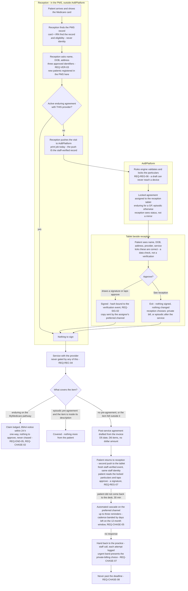

# To-do

Things agreed but not built. Not a backlog of ideas — everything here has been
decided, and is written down so it does not get re-decided.

Convention: each entry says what it is, WHY it was deferred rather than done,
and what it depends on. An entry with no "why deferred" is just an unfinished
task and belongs in the code as a TODO comment instead.

---

## Contact details on locations and departments

Asked 23 Aug 2026, while adding the practice page a practitioner sees. At least
`phone1`, `phone2`, `email1`, `email2` on **both** `practice_locations` and
`departments`, shown on that page under each site.

### Why two of each, and not one

A site has a number people ring and a number that is answered when the first is
not — reception and the back office, or the rooms and the after-hours service.
Modelling one and letting practices cram both into a single field produces
`"9555 1234 / 9555 5678 (after hours)"`, which nothing can dial, nothing can
validate, and every screen has to render as free text.

The same for addresses: the one the practice publishes, and the one that
actually reaches somebody.

### The decision to make first

**These are PUBLIC, like `practices.businessPhone` and `businessEmail`.** That
is the whole reason they are new columns rather than a reuse of something
existing — every address already on a location's practice belongs to a person
(`adminEmail` holds a credential) or to us (`groupEmail` is an internal notices
mailbox), and showing either to answer "how do I contact this site" publishes
somebody's personal details.

So they need the same treatment as the practice ones:

- [ ] Added to `reporting.outbound_messages`? **No.** They are contact details,
      not volumes, and the reporting surface stays free of anything that
      identifies a way to reach a person.
- [ ] Returned by `practice_places_for_practitioner`, which already exists and
      already carries the affiliation check.
- [ ] Shown on `/practitioner/practices/[id]` under each location, and later on
      the patient-facing equivalent.
- [ ] Editable by the practice on `/practice/locations`, with the same
      review-task treatment as other contact changes? **Probably not.** A
      location's phone number is not a credential and redirecting it does not
      let anybody receive a sign-in link — the review task on `adminEmail`
      exists because that address holds an account, and copying it here would
      be ceremony without a reason.

### Worth deciding at the same time

- **Should a department inherit its location's numbers when it has none?**
  Inheriting is friendlier and hides whether anybody actually set them. I would
  show the location's and say it is the location's, rather than silently
  presenting it as the department's own.
- **Validation.** An Australian number has a shape; an obviously malformed one
  should be refused at entry rather than discovered by a patient who cannot get
  through.

## A patient or carer terminating an agreement

Asked 23 Aug 2026. A practitioner can now end their own affiliation
unilaterally, and the reasoning applies at least as strongly one level down:
**the person who gave consent should be able to withdraw it without asking the
party who benefits from it.**

If a practice had to agree, a practice could keep an agreement alive after the
patient wanted it gone — which is the same shape as a practice keeping a
departed practitioner listed, and the same fraud.

### The blocker is the definition, not the mechanism

**Get the Health department's definition of a carer before building this.** Not
a detail to fill in later: it decides who may end somebody else's agreement,
and getting it wrong means either a carer who cannot act for the person they
care for, or a stranger who can.

The statutory ground already in play is reg 65CB(5) — an assignor acting for
another person, self-declared. Whether "carer" there is the same set as the
department's carer definition is exactly what needs establishing, and it is a
question for somebody who can read the instrument, not for us to infer.

### What is already decided by things we have built

- **Termination is a fact, not a negotiation.** Same as a practitioner leaving:
  recorded, the other side told, nobody asked.
- **It cannot be retroactive.** Consent captured before the withdrawal stands —
  the agreement ceases, it is not erased. `enduring.ts` already holds this for
  reg 65CA(8) cessation.
- **Evidence is retained in full.** Withdrawing consent does not delete the
  record that it was given; that record is what protects the practice against a
  later claim that it never was.

### What is genuinely open

- [ ] **Whose act is it when a carer does it?** Recorded as the carer's, on the
      patient's behalf — never as the patient's own. A record that cannot
      distinguish them cannot answer "did the patient know".
- [ ] **Is the patient told when a carer acts for them?** Almost certainly yes,
      and the exception (a patient who cannot be told) is the hard case.
- [ ] **Can a patient reverse a carer's termination, and vice versa?** Related to
      the assignor revocation question already open.
- [ ] **What reaches the practice, and how fast?** A terminated agreement changes
      what can be billed, so a practice learning late is a practice billing
      wrongly in the meantime.

**Blocked on the same relationship model as patient and assignor reporting.** An
assignor's authority is per-patient and expires; a role cannot say which patient
or until when, and neither can a termination endpoint that trusts a role.

## Family reporting

Asked 22 Aug 2026, flagged as a selling point rather than a requirement.

Once patient and assignor reporting exists, an assignor who acts for several
people — a parent, a carer, an adult child — should be able to see them
together rather than one at a time. "What has been assigned in my family this
year" is a question no practice can answer and we can.

**It cannot be built before the relationship model is settled.** An assignor's
authority is per-patient and must expire; a family view is that authority
plotted over time, so it inherits every question the relationship has and adds
one more — whether somebody may still see a period they were authorised for
AFTER the authority ends. Probably yes for what they could see at the time, and
certainly not for anything after it, but that is a decision rather than an
obvious answer.

Also worth stating plainly before anybody builds it: a family view makes one
person's records visible to another. That is a feature the patient must be able
to see and revoke, not a convenience granted by whoever set it up.

## Onboarding

### AI chat bot for application status
**Status:** not started.
**Decided:** 2026-08-22, Carl.

An applicant waiting on a decision should be able to ask "where is my
application" without ringing anyone. The acknowledgement email will offer three
routes — call us, check the status page, or ask the bot — and the third does not
exist yet.

**Why deferred:** the status page has to exist before a bot has anything to
answer from, and the bot's scope needs a boundary drawn before it is built. It
must be able to say what stage an application is at and what is outstanding. It
must NOT be able to say why a reviewer is hesitating, disclose whether an ABN is
already registered here (that turns a status query into a way to enumerate
customers — the same rule already enforced on rejection reasons), or give any
impression of deciding. A bot that sounds like it is approving something is
worse than no bot.

**Depends on:** the public status page.

### Public application-status page
**Status:** not started.
**Decided:** 2026-08-22, Carl.

`/status/<token>` — the same three-row gate ledger the applicant saw when they
submitted, showing where the application has got to.

**Why deferred:** needs a bearer token that is NOT the practice id. The id is a
primary key: it ends up in logs, referrer headers and support tickets, and a
primary key that doubles as a credential is a credential that leaks. A separate
random token, revocable independently, is a column and a migration.

**Depends on:** nothing else.

---

## Access

### ~~Platform-admin sign-in~~ — BUILT, 2026-08-22
**Status:** done. Passkey-only, via Keycloak, on the `console` client.

A platform administrator is minted by CLI invitation
(`infra/keycloak/invite-platform-admin.mjs`), enrols a passkey at a link, and
the reviewer screens take the name from the session. The typed-name fallback is
gone from those screens.

**What it cost, and what was learnt:** most of an afternoon and six wrong
theories, all of them recorded in PASSKEYS.md. Read that first next time; the
decision tree at the bottom is the useful part.

**Still open, and tracked in CRITICAL-ISSUES.md:**

- **§2 — the Windows Password Manager trap.** DECIDED 2026-08-22: leave the
  rules as they are, revisit later. `userVerification` stays `required`, no
  password fallback, and the enrolment-time AAGUID check is not being built
  yet. Reasonable while the affected population is two administrators who both
  know about it; **stops being reasonable the moment practitioner sign-in is
  built**, because Windows makes the wrong provider the default and every
  practitioner would meet it alone, at first sign-in, with nobody to ask.
- ~~**Nothing backs up the `keycloak` database.**~~ — `backup-keycloak.mjs`,
  2026-08-22. Dumps it, prunes to the last fourteen, and will restore-test the
  file into a throwaway database on request. The verify checks the USER count
  rather than whether the file loaded, because realms and clients come back
  from the realm import on every start — a backup holding only those looks
  healthy and contains nobody, which is exactly how the H2 store was lost.
  **Still to decide:** where the files go. On the same disk as the database
  they survive a mistake and not a disk, and they name every administrator.
- **`admin/admin` is still in `docker-compose.yml`,** and is now the most
  valuable credential in the system: it is the last resort for admin recovery.

### Practitioner sign-in, and what an acceptance is worth
**Status:** not started. **The affiliation flow is built and works without it.**
**Found:** 2026-08-22, while building the invitation.

A practitioner accepts an affiliation today by opening a link emailed to their
own address and typing a six-digit code from the same message. That is recorded
honestly — `acceptanceMethod = 'email_link_and_code'`, and the evidence says in
words that it proves access to an inbox and not who was at the keyboard.

**What it is good enough for.** The ordinary failure it prevents is not fraud:
it is a practice adding a doctor who never agreed, through haste or a locum
arrangement that fell through, and then capturing consent in that doctor's
name. It stops that completely.

**What it is not good enough for.** It is one factor, and the practice chose
which address to invite. A practice willing to commit fraud can invite an
address it controls — what makes that expensive is CONVENTIONS.md §8b (creating
a practitioner at all requires a validated practice), not this ceremony.

**The fix is the practitioner passkey (FR-1.9),** and the pieces are already
there: `Practitioner` carries `keycloakUserId`, `invitedAt` and
`passkeyEnrolledAt`, and the platform-admin work proved the ceremony on real
hardware. `ACCEPTANCE_STRENGTH` in the domain already ranks passkey above an
emailed code above the practice's own word, so both can coexist and stay
distinguishable in evidence for ever.

**Do NOT retrofit the strength of the old records when it lands.** An
affiliation accepted by email was accepted by email. Upgrading the label later
would be rewriting evidence.

**Depends on:** re-opening the §2 decision, which was deliberately deferred on
2026-08-22 on the grounds that only two administrators were affected. Building
practitioner sign-in is precisely the event that invalidates that reasoning, so
the two have to be picked up together.

---

## Capture

### Telehealth: the call IS the acceptance
**Status:** not started.
**Decided:** 2026-08-22, Carl.

For a telehealth consultation the practitioner calls the patient through the
app, the patient accepts the call, and that acceptance is the consent
ceremony — no separate link, no SMS, no second device.

**Why this is attractive:** it removes the weakest step in remote capture. A
link sent to a phone proves somebody holds that phone; a patient answering a
call they were expecting, in a consultation they booked, with a practitioner
they can see, is a materially stronger act — and it happens inside the
appointment rather than beside it.

**What has to be worked out before it is built,** because each of these
changes what the record means:

- **What exactly is captured.** Accepting a call is consent to the CALL. The
  s 65C data set and the assignment of benefit are a different agreement, and
  the ceremony has to present them, not assume them. A patient who thinks they
  answered the phone has not assigned a benefit.
- **What the evidence is.** A signature is an artefact; an accepted call is an
  event. The record needs something durable — the call metadata, the
  timestamps, what was displayed and read, and whether the patient was told
  what they were agreeing to. Whether that includes a recording is a separate
  decision with its own consent question.
- **Identity.** The call proves the patient answered, not who they are. The
  identifier check (FR-1.4, minimum three, never Medicare) still has to happen
  and probably has to happen visually, on the call.
- **Failure modes.** Dropped calls, the patient handing the phone to somebody
  else, a call accepted while the patient is driving. A ceremony that cannot
  be safely abandoned mid-way is not safe.

**Depends on:** the capture channel work, and a decision on whether telehealth
calls run in our app at all or through a PMS-provided channel.

---

## Testing

### ~~The e2e suite is flaky across suites~~ — SOLVED, and it was not flakiness
**Diagnosed 2026-08-22.**

`org-model.e2e-spec.ts` failed four tests in a full run and passed all
fifty-five alone, which read exactly like fixture interference. It was not.

**The cause: `localhost` resolves to `::1` first on Windows.** Docker Desktop
publishes a port on both stacks, but its IPv6 forwarding accepts the TCP
connection and then fails the protocol handshake. So:

- a raw socket test reports the port **OPEN**
- Prisma reports **"can't reach database server"**
- an SMTP send **hangs** until it times out rather than refusing

The intermittency came from whichever address the resolver returned first,
which is why it looked like a race between suites. It got dramatically worse
the moment registration started sending an acknowledgement email — a second
protocol, over a second port, with the same fault.

**The fix: 127.0.0.1 everywhere in `apps/core/.env`, never `localhost`.** All
150 e2e tests pass.

**The lesson worth keeping:** the symptom is the worst kind — everything looks
up, and only the things that speak a protocol fail. When a connection test
passes and a client says "cannot reach", suspect the address family before
suspecting the service.

---

## Identity

### ~~The two identity-strength dashboards~~ — BUILT, 2026-08-22
**Status:** done. `/review/identity`, platform-admin only, linked from the
review queue.

Two tabs, each answering one operational question, because a dashboard without
a question is a report nobody opens twice:

- **Practices** — which applications are stuck, and on what. Score, the checks
  behind it, time in queue, and the weakest link stated in words rather than
  left for the reader to infer from a number.
- **Practitioners** — whose verification is going stale, and who is moving
  unusually. Blocked first, then weakest, then stalest.

**Practitioner strength DECAYS**, which is the part that needed a new domain
module (`practitioner-strength.ts`). Practice identity is mostly stable facts;
a registration is a snapshot, and "Registered, verified in January" says very
little in December. Each row also shows what one fresh check would restore.

**The "would fail" count is the point of soft mode.** It is on the page: how
many real practices hard enforcement would be turning away today. That is the
number that decides when the threshold is safe to switch on, and it cannot be
seen once you are already enforcing it.

**Still open from §10 of the design**, unchanged and still needing Carl: the
PIE data-usage question, the §7 sign-off for the website fetch, the collection
notice, the retention conflict, and whether a sole trader can reach six points
at all.

---

## Rostering — a practitioner who works at more than one practice

Raised 22 Aug 2026: *"Some practitioners may work 2 days at practice A and 2
at practice B."* Recorded rather than built, per that instruction.

### What already works

**The identity and affiliation model already handles this**, and it was
designed to. A practitioner is one person on the platform; an affiliation is
per practice AND per location, and FR-1.8 refuses a second affiliation at the
same location rather than at the same practice. A provider number belongs to
a place, not a person, which is exactly the multi-site shape.

So Dr X at Practice A on Mondays and Practice B on Thursdays is already two
affiliations, each with its own provider number, each accepted by the
practitioner themselves.

### The one thing that is NOT solved

**Keycloak enforces one email address per realm.** We already hit this in the
e2e logs: the same person at a second practice cannot get a second account on
the same address. It needs either a different address or the existing account
linked rather than duplicated — and linking is the right answer, since it is
one person. Unresolved, and it is the real blocker, not rostering.

### The rostering idea

Also raised: build a simple roster — *"which Dr is working when"* — offered
free or at minimal fee as a sweetener for small practices.

**Worth taking seriously for a reason beyond goodwill.** A roster would let
the platform answer a question it currently cannot: *was this practitioner
actually at this location on the day that consent was captured?* Today an
affiliation says they work there in general. A roster says they were there on
the Tuesday. That is a genuine strengthening of the consent record, and it
would feed the same strength scoring as every other check.

**But note the risk before building it.** A roster is operational data that
changes constantly, and this platform is an evidence store where things are
append-only and retained for two years. If a roster becomes evidence, every
shift swap becomes a record we cannot delete. That is not a reason to refuse
— it is a reason to decide up front which it is:

| If the roster is… | Then |
|---|---|
| **A convenience feature** | Keep it out of the evidence chain entirely. Mutable, deletable, no vault events |
| **Evidence of presence** | Append-only like everything else, and a shift correction is a new record rather than an edit |

Deciding that late would be expensive, because the storage shape follows from
it. Deciding it early costs nothing.

### If it gets built

- [ ] Decide the question above FIRST — convenience or evidence
- [ ] Resolve the one-email-per-realm constraint; account linking, not a second account
- [ ] Roster entries per affiliation, not per practitioner — the affiliation is what carries the location
- [ ] A capture-time check: is this practitioner rostered here today? Warning, not a block, until it is trusted
- [ ] Keep it optional. A practice that does not roster must not be worse off
## Outbound queue — when to reach for a broker

Asked 22 Aug 2026: should we use BullMQ, RabbitMQ or Pulsar instead of the
Postgres queue?

### Decision: no external tracker (ServiceNow / Jira / Zammad) for review tasks

Asked 22 Aug 2026: at a 100-500/day spike, is there an open-source ServiceNow
or Jira we could hold outstanding tasks in, assign to different platform
users, and click through one at a time?

### Why we did not, and what would change that

They exist and they are good. Closest to ServiceNow: **iTop** or **GLPI**
(both ITSM, both GPL/AGPL). Closest to Jira: **Plane** or **Redmine**. For a
general operations desk any of them would beat writing our own.

Three things stop it being right HERE:

1. **The task carries the practice’s data.** A review task is not a pointer —
   it holds the before and after values of what changed, including admin
   contact details. Today that sits behind RLS and a practice can only ever be
   seen by somebody scoped to it. In every tracker listed, everyone with
   access to the project sees every ticket. That is not a configuration we
   would be tightening; it is the absence of a tenancy model.

2. **The resolution IS the evidence.** "A named person looked at this change
   and accepted it" is the compliance record — that is the whole reason the
   queue exists rather than the change just applying. It has to be in the
   vault chain and retained with everything else. Recorded in Zammad instead,
   our evidence chain has a hole at exactly the point a human decided.

3. **Two systems would disagree.** Closed there, open here; and our own
   automated checks resolve tasks from this side, so the sync is
   bidirectional, not a feed.

### The volume argument points the other way

If 500 tasks a day are reaching a person, the AI check has failed, and a
tracker would be organising work that should not exist. The mix matters:
`practice_amended` and `recertification_due` are low-stakes and already
`autoResolvable`. The other three — admin contact changed, address changed
after confirmation, acting-as occurred — are high-stakes and a person MUST
decide them. That is deliberate: they are the anti-fraud controls, and no
amount of queue tooling should make them cheaper to wave through.

So the lever against a spike is the checker, which nothing calls yet.

### What to build here instead (~1 day)

- [ ] Assign a task to a named platform user (claim already exists; this is
      claim-on-behalf, plus an "assigned to me" filter)
- [ ] Focus mode — one task at a time, decide, advance to the next in the
      filtered set. This is the click-through Carl described and it is a route,
      not a system.
- [ ] Accept-many for low-stakes kinds, with each decision still recorded
      individually against the person
- [ ] Age on the card, and oldest-first ordering

**Reconsider an external tracker when any of these becomes true:**

- [ ] Platform operations grows past ~8 people, or runs shifts needing handover
- [ ] Work arrives from sources we do not own (support email, phone) and needs
      to sit in one place with these
- [ ] Somebody needs SLA reporting we would otherwise build

**If it comes to that, mirror — do not move.** Push a task STUB out (id, kind,
practice name, age; no changed values) and treat the tracker as the worklist,
while the decision is still made and recorded here. That keeps both the
tenancy boundary and the evidence chain intact, and it is the same shape as
the outbox decision above.

## Why we did not, and what would change that

All three are out-of-process brokers, which means the enqueue cannot be in
the same transaction as the evidence write. That gives two failure modes we
cannot accept: a notice with no send, and a send with no notice. The standard
fix is a transactional outbox — so **we build this table either way**, and
the only real question is whether a broker is needed IN ADDITION.

At the modelled 750,000 notices/day (~21/second average) it is not. Verified:
two workers claiming concurrently through `FOR UPDATE SKIP LOCKED`, zero
overlap, no coordinator.

**Adopt RabbitMQ when any of these becomes true:**

- [ ] Sustained throughput above ~100/second, or peaks the database feels
- [ ] Cross-region fan-out, where a single Postgres is the wrong hub
- [ ] Non-Node consumers that would otherwise need their own claim logic
- [ ] A second product needs the same messages, and polling our table is worse than subscribing

**RabbitMQ over the other two, if it comes to that.** BullMQ needs Redis, and
Redis as a durability-critical store for "must not lose this" makes AOF and
fsync tuning a compliance question — the wrong shape for evidence. Pulsar’s
tenancy sounds like a fit and is not: our tenant boundary is Postgres RLS
(CONVENTIONS.md §6), and moving notice CONTENT into a broker takes it outside
that boundary and re-implements isolation in a second system.

**The migration is cheap because the outbox exists.** The relay changes
destination; nothing else moves. That is the point of building it this way,
not an accident.

## "What was sent to me" — a separate screen from the queue

Raised 22 Aug 2026 alongside the queue viewer: practitioners should see
notices for their practices, and patients/carers should see their own.

**Agreed on the need. Not from the queue table, though**, and the reason is
not fussiness:

| | Queue (`outbound_items`) | Evidence (`Notice`) |
|---|---|---|
| Retention | **Pruned after ~30 days** | Full statutory period |
| Question it answers | "Did this leave? Is it stuck?" | "What was sent, and what happened to it" |
| Audience | Operators, practice admins | Practitioners, patients, regulators |

A patient looking at the queue would watch their own records vanish. The
queue is transport and is deliberately disposable.

**And patients have no accounts, by design.** REQ-PORT-08: a patient signs
from a single-use link and must never need one. A patient-facing history
screen means building patient authentication — a large new surface, and one
that reverses an existing decision rather than extending it. Worth doing
deliberately if we want it, not as a side effect of a queue viewer.

### If it gets built

- [ ] Source it from `Notice` + `NoticeDeliveryEvent`, never `outbound_items`
- [ ] Decide the patient auth question FIRST — token-scoped view, or real accounts
- [ ] A practitioner spanning practices needs a deliberate cross-tenant read; RLS forbids it by default and every exception is individually justified (CONVENTIONS.md §6)
- [ ] A carer selecting a patient is an authority question, not a filter — who may act for whom has to be recorded before it can be offered
## View-only view of a practice, cascading

Carl: from `/practice` we may just want to LOOK at a practice and its
relationships without acting as it — the same seven-card hub, read-only, and the
read-only must cascade into practitioners, locations and everything below.

Worth doing, and the cascade is the hard half: a read-only hub that links to
editable children is worse than no read-only mode, because it looks safe and is
not.

- [ ] One flag carried in the URL is NOT enough — a page reached directly is
      then editable. The scope has to be decided per request, not per link
- [ ] Simplest honest shape: an operator with no acting-as session gets read-only
      by construction, because every mutating endpoint already needs a practice
      claim they do not have. The UI then reflects what the server would do
      rather than inventing a second rule
- [ ] Which means the work is mostly: let an operator READ a practice's pages,
      and hide every control that would fail. Not a new permission — a truthful
      rendering of one that exists
- [ ] Cascade by rendering from the same "may I act" answer on every page,
      sourced once (`effectivePractice.ts` is the natural home)
- [ ] A banner saying plainly: viewing, not acting. With the way to start acting
      if that is what they meant
- [ ] Nothing read-only may show provider numbers or anything else that must not
      cross a practice boundary — read-only is not a licence to read MORE

## Practitioners working a long way from the practice

Carl's question: if a practitioner is affiliated to a practice a long way from
where they appear to work, flag it quietly? Or does that read as big-brother?

**Both, and the resolution is in WHO it is shown to.**

The signal is real. A practice adding practitioners who have no plausible
connection to it is one of the clearest shapes of the fraud this platform
exists to stop — provider identities collected to bill under, rather than
people who actually see patients there. Ignoring geography throws away one of
the few signals available before anything is billed.

The fear is also real, and it is not paranoia. Australian practitioners
legitimately work across enormous distances: locums, fly-in-fly-out, telehealth,
rural outreach, a specialist rotating through four towns. A flag that treats
distance as suspicion insults exactly the people doing the hardest work, and it
would be **wrong far more often than it was right**.

### What makes it safe

**Never shown to the practice, and never named as suspicion.** A quiet flag that
the practice can see is not quiet — it teaches somebody committing fraud which
distance to stay under, and it accuses somebody innocent to their face.

**It is a REVIEW input, not a decision.** It changes nothing about whether the
affiliation works. Nobody is refused, nothing is blocked, no message is sent.
It moves a practice up a reviewer's list, and a human decides.

**It is only interesting in aggregate.** One practitioner 900 km away is a
locum. Six practitioners at one practice, all far away, none sharing a
location, added the same week, is a different object entirely — and the second
is the one worth a person's time. Alerting on the first would bury the second.

**Say it out loud in the collection notice.** "We look at how far affiliations
are from the practice" is a sentence people accept when they read it up front
and resent when they discover it. Quiet must mean "not shouted at the
practitioner", never "concealed from them".

### If it gets built

- [ ] Compute from POSTCODES only. Never a street address, never a coordinate
      for a person — HARD-03 territory in spirit: the least precise thing that
      answers the question
- [ ] Distance from the practice LOCATION they are affiliated to, not head office
- [ ] Bands, not metres: same area / same state / interstate / remote. A number
      invites a threshold, and a threshold is a thing to stay just under
- [ ] Raise a review task ONLY on the aggregate pattern, never on one person
- [ ] Absent from every practice-facing screen and from every message
- [ ] Never blocks an affiliation, an invitation or a capture
- [ ] In the collection notice before the first real applicant
- [ ] Test the honest cases explicitly: the locum, the FIFO doctor, the
      telehealth practitioner, the specialist across four towns. If the design
      flags those individually, it is the wrong design

**Recommendation:** worth building, and worth building last of the AI-checker
signals. On its own it is a bad predictor; alongside "added five practitioners
in a week", "none has ever captured consent" and "no register check recorded",
it is one column in a picture that a person then reads.

## groupEmail changes apply instantly, with no proof

Carl caught it directly: "group email changed - no email verification sent."

`groupEmail` is one of the plain `AMENDABLE_FIELDS` -- it changes on save like
a phone number, with no hold and no proof, unlike `adminEmail` (held pending
the new address answering a code) and unlike a practitioner's own address
(same, plus a backup-address warning). This was not an oversight so much as
never having been asked: the field's own schema comment says "NOTHING ENROLS
AGAINST THIS ADDRESS. It receives notices only" -- so an unverified groupEmail
cannot by itself be used to obtain a credential, which is a real and different
risk profile from adminEmail.

**It is not nothing, though.** `groupEmail` is the CO-WITNESS for an
`adminEmail` handover -- `pending-email.service.ts` warns both the old admin
address and `previousGroupEmail` when a handover is requested, specifically so
a second channel can object. An attacker who can amend the practice at all
(any practice-admin session) can repoint `groupEmail` to an address they
control, THEN request the adminEmail handover -- and the witness meant to
catch it is now them. Two steps, no proof required for either, and the second
step's protection depends on the first step being trustworthy.

- [ ] Decide whether `groupEmail` needs its own held/proof cycle -- a third
      copy of the `PendingEmailChange` shape (practice admin's is the model),
      or a lighter one, since nothing enrols against it and the stakes are
      narrower
- [ ] At minimum: warn the OLD groupEmail when a change is saved, mirroring
      the admin-email pattern, even before deciding whether to hold it
- [ ] `SENSITIVE_CONTACT_FIELDS` already names `groupEmail` alongside
      `adminEmail`/`adminPhone` (review-tasks.ts) -- so a groupEmail change
      already raises a review task at `admin_contact_changed` stakes. The gap
      is specifically that it takes effect BEFORE anybody reviews it, not that
      it goes unrecorded

## Can somebody read another practice by editing the URL?

Carl asked about `/platform/practices/<uuid>/practitioners`. Answered here
because the answer is not obvious and the obvious fix is the wrong one.

**No, and the reason is not the URL.** `auth.guard.ts` line 193:

    if (principal.practiceId) request.headers['x-practice-id'] = principal.practiceId;

A practice user's token claim **overwrites** whatever practice id the request
carried. So a practice administrator who edits the URL, or forges the header,
gets their OWN practice back — the id they typed is discarded before any query
runs. That is the control, and it is a good one: it cannot be forgotten at a
call site, because it happens once, above all of them.

A platform operator has no practice claim, so the header is not overwritten and
they can read any practice. That is the intent of these routes.

**Masking or encrypting the id would protect nothing.** It is security by
obscurity: anybody who has a real id — from a support email, a screenshot, a
previous session — defeats it, and it makes every log and bug report harder to
read. A UUIDv4 is 122 unguessable bits, so the list cannot be walked; what stops
a *known* id being misused is the guard, and it already does.

**What is genuinely open, and should be closed:**

- [ ] `AUTH_ENFORCE=false` in dev means a request with NO token passes and the
      `x-practice-id` header is trusted as sent. So in DEV, anybody who can
      reach the API can read any practice. That is the staging, deliberately —
      but it means the dev environment is not evidence that production is safe,
      and nobody should read it as such
- [ ] Verify each read endpoint under `AUTH_ENFORCE=true` before launch. The
      claim-overwrite protects everything that reads the header, but a query
      taking a practice id from a PARAM rather than the header would bypass it —
      audit for that shape specifically
- [ ] `assertPracticeScope` only checks that a claim EXISTS, not that it matches
      the request. Today that is sufficient because of the overwrite; if the
      overwrite is ever removed or made conditional, this becomes the hole. Add
      a test that pins the overwrite, so it cannot be deleted quietly
- [ ] Nothing on a read-only practice page may show a provider number. The
      guard `assertNoProviderNumber` exists; make sure these routes are covered

## TAUTALA — the assistant, and the reminders that come first

Full design in **tautala_ai.md**. `tautala` is Samoan for "to speak".

**Phase 0 first, and it needs no AI.** A practice approved and then stuck is the
commonest failure we have — Throwaway Verification Clinic is approved with a
signed-in administrator and no location; Sampletown has four locations and
NOBODY who can sign in. Neither is hard. Both are somebody not finishing a
four-concept task they will do once in their life.

- [ ] Reminder email to the administrator, the manager and the group address,
      naming the ONE thing outstanding and linking straight to it. The setup
      gaps already carry a label, a sentence and a destination, so the email
      writes itself
- [ ] A decaying schedule — day 3, day 10, day 30, then stop. A reminder that
      arrives forever is one nobody reads
- [ ] How to reach a person, in every one
- [ ] Measure completion. If this alone fixes it, TAUTALA is a convenience
      rather than a rescue — better known before building it than after

**Then TAUTALA, in the order that keeps it safe:**

- [ ] Phase 1, READ ONLY: what is missing, why, who works here, what happened to
      this affiliation. Write tools do not exist yet — absent, not disabled.
      Most of the value, almost none of the risk
- [ ] Phase 2, DRAFT: the model proposes a typed intent; the platform validates
      it with the SAME rules the forms use; the user sees exactly what will be
      created and presses a button; the server writes it as THEM, through the
      ordinary endpoint
- [ ] `createdVia: 'tautala'` on every record, so a reviewer can tell whether a
      human typed an address or a model parsed one

**Why this may act where the support chat may not:** the user is signed in and
scoped, and TAUTALA grants no authority the session did not already hold. It is
a faster path to something they can already do. That is the whole licence, and
everything in the design exists to keep it true.

**It can never accept an affiliation.** Only the practitioner can, from the
invitation sent to their own address. If TAUTALA could create AND accept, the
rule that a practice cannot accept on a practitioner's behalf collapses — and
that rule is load-bearing for the fraud model. Enforced by the tool not
existing, never by a prompt.

Never touches a provider number or a Medicare card number, never records a
register check (ours, not theirs), never approves a practice, never issues a
credential.

Needs Carl: an LLM in the request path (CLAUDE.md 7), transcript retention, and
whether TAUTALA is offered beyond practice staff — recommendation is not at
first.

## Support, lockouts and passkey recovery

Full design in **support.md**. The short of it:

- [ ] `/support` page, reachable signed in or out, listed in the menu for everybody
- [ ] Lane A (signed in) — chat immediately, ticket bound to the verified identity
- [ ] Lane B (signed out, no credential involved) — public, rate-limited, unverified contact
- [ ] Lane C (signed out, needs a credential) — **never resolved in chat**; a ticket
      plus an out-of-band challenge to the channels we already hold
- [ ] Ask what they typed, contact what we hold, store only whether the two matched
      (REQ-VER-04 / HARD-04: identifier types and outcomes, never values)
- [ ] Never confirm whether an account exists — the same answer either way, or the
      chat becomes a lookup service for valid practitioner identities
- [ ] `passkey_compromised` disables first and verifies after; it is an incident,
      not a request

**Before any of that, the cheap work that removes most of the need:**

- [ ] Prompt for a **second passkey** at enrolment; nag while somebody holds one
- [ ] **Verified mobile** on practitioners and practice admins — captured at
      enrolment, because one collected during an incident proves nothing.
      `practitioners` has no phone column today
- [ ] Self-service add / remove passkey, and self-service "my key was stolen"

**Resolution paths, which are stronger than any question a chat could ask:**

- [ ] A practice admin, signed in, requests re-enrolment for their affiliated
      practitioner — the introduction chain, run in reverse
- [ ] Two platform operators, different people, for a locked-out practice admin
- [ ] Cooling-off and old-channel notification on every reissue, reusing the
      pending-email-change pattern

Needs Carl: LLM in the request path (CLAUDE.md 7), a third-party bot check,
mobile numbers in the collection notice, and what to do about a practitioner
whose introducing practice no longer exists.

## Open questions

These block work and need Carl, not code.

- **REVIEW-REQUIRED.md** — two files still marked DRAFT, awaiting sign-off.
- **PIE licence** — $4,000 API install + $1,000/yr + $1/practitioner/yr. Alert
  is browser-only, so it cannot be automated. Decision needed before the
  entitlement check can be anything other than a phone call.
- **CLAUDE.md §7 sign-off** — fetching an applicant's website, and sending mail
  from a real domain, both need explicit approval before they leave the sandbox.
- **Collection notice** — not written. Required before any real applicant data
  is collected.
- **Retention conflict** — 7-year practitioner report vs 2-year stated
  retention. These cannot both be true; one has to give.
- **The Windows passkey provider trap** — every practitioner will hit it, and
  Windows defaults them into it. Three ways to go, recorded in full in
  CRITICAL-ISSUES.md §2; the recommendation is to detect the AAGUID at
  enrolment and refuse a non-UV provider there and then.
- **Can a sole trader reach 6 points?** If not, the identity threshold quietly
  excludes them, which is a policy decision and not a scoring detail.

## The MBS basic-service-description mapping (D6a)

Raised 25 Aug 2026 from CONSULTATION-CAPTURE-PLAN.md §2.4 / Part 6 Q2. A
pre-agreement needs a Basic Service Description from a versioned mapping, and
**no MBS item → description mapping exists anywhere in the repo** —
`basicServiceDescription` is a free-text DTO field and `mappingVersion` is
recorded against nothing. Until this is settled the containment check
("does the billed item fall inside the pre-agreement's description",
plan §3.1) cannot be built, and a pre-agreement + a differently-billed item is
treated as covered.

- [ ] Decide: source the real quarterly MBS mapping (versioned, from the
      Department's schedule) — or accept the practice-maintained interim list
      (plan §2.4) for the first practices?
- [ ] If interim: the list is a small versioned table per practice, and
      `mappingVersion` records ITS version honestly rather than pretending to
      be the MBS mapping.
- [ ] Either way: the containment check is deferred, and the deferral is
      stated in code with the REQ reference — never an implicit equality.

## Reminding the practice to do its part

Carl, 25 Aug 2026: "We need a solution to remind the PRACTICE to do this."
The print channel (plan Part 8) depends on a human pressing Print — the
morning appointment list and each invoice — and on the practice maintaining
its interim description list above. Nothing today notices when they stop.

- [ ] A daily "expected vs received" check per practice: appointments seen
      this morning but no invoices arrived by evening ⇒ a nudge to the
      practice's group address. Plan §8.6 limit 2 names this; it is not built.
- [ ] No morning appointment list received by (configurable) 9am on a working
      day ⇒ a nudge. Public-holiday aware — `public-holidays.ts` exists.
- [ ] Where the PMS supports auto-print rules ("print invoice on finalise"),
      the onboarding guide for that PMS says how to set them, so the reminder
      is the fallback and not the mechanism.
- [ ] The interim description list not reviewed in N days ⇒ a low-stakes
      review task, not an email — it is housekeeping, not a breach.
- [ ] Every nudge is Correspondence (plan §4.1) and follows CONVENTIONS.md §9d
      like every other message.

## A platform-wide view of messages — states, not bodies

Carl, 25 Aug 2026: "How does a platform-user see all messages — in queue /
sent and so on?" Today: one practice at a time, through the view-only twin
(`/platform/practices/[id]/queue` for transport state, and since 3 Sep 2026
`/platform/practices/[id]/correspondence` beside it — which passes the
`platform` audience, so it shows states and never bodies). There is deliberately no cross-practice
list of message CONTENT — `outbound.controller.ts` says why: a body search
"would let somebody trawl for a patient name across a practice", and across
every practice it is worse.

- [ ] Build the platform view as an OPERATIONS view: per practice, per lane /
      channel — queued, leased, sent, failed, dead, oldest age. Counts and
      states, never subject lines or bodies. `outbound_timeseries` and
      `/inbound/print-jobs/metrics` already give most of it.
- [ ] Drill-down into ONE practice for content goes through the existing
      view-only twin, and every read of a body is an `access.read` vault event
      (REQ-LOG-07) — a platform operator reading a patient's message is
      exactly the kind of read that has to be answerable later.
- [ ] Cross-practice reads are individually justified SECURITY DEFINER
      functions returning ids and counts (CONVENTIONS.md §6) — the same shape
      as `outbound_due_practices`, never a weakened policy.

## "Consultation" in the purpose labels, against the terminology rule

Carl, 3 Sep 2026, specifying the correspondence log's purpose column:
`Episodic-Agreement-Pre-Consultation`, `Episodic-Agreement-Post-Consultation`,
`Enduring-Agreement-Pre-Consultation`, `Episodic-Notice-Post-Consultation`, and
`-Reminder-1|2|3` on a reminder. Built exactly as asked.

### Why it is written down rather than silently changed

CLAUDE.md section 3 sets the terminology the domain model enforces:
**"service", not "consult"** (REQ-MP-01), alongside "provider" not "GP". The
labels above say Consultation, so they cut across a rule the rest of the
product follows. It was raised once and Carl's wording stands -- he knows the
regime, and the plan documents themselves talk about pre- and
post-consultation capture, so the rule may well be aimed at the billable
event rather than at the appointment.

This entry exists so that the decision is FINDABLE if a reviewer asks why one
screen says Consultation and everything else says service, rather than being
rediscovered as a bug.

### If it is ever reversed

- [ ] It is a one-word change: every label is composed in
      `apps/web/app/strings.ts` and nothing is inlined (REQ-LANG-01), so
      Pre-Consultation becomes Pre-Service in one place per label.
- [ ] The agreement TYPES do not change -- `episodic_pre` and `episodic_post`
      are the domain's own names and are not user-facing text.
- [ ] Check the patient's half of the log at the same time. The same labels
      render there, and a patient reading "Pre-Service" may need plainer
      words than a practice does; the two audiences share one string table.
- [ ] Nothing else needs touching: the label is composed from the agreement
      type carried on the row, never from a subject line.

## Is that address a home, or a shopping centre?

Carl, 3 Sep 2026, looking at the kiosk verification screen: "Need to be able to
validate the address is correct and not the address of say shopping center or
football stadium (checking for fraud)."

Address is one of the six approved identifiers (REQ-VER-02), so a plausible-
looking address that nobody lives at is a way to pass verification without
being the patient. Today the field is compared as text and never questioned.

- [ ] Decide what "valid" means here. Three different questions get bundled
      together and they have different answers: is it a REAL address (exists in
      a register), is it a RESIDENTIAL one (not a stadium, mall, airport or
      PO box), and is it THIS PATIENT'S (matches what the PMS holds). The
      third is the one verification actually asks; the first two are the fraud
      signal Carl is describing.
- [ ] **Decide before building: does a patient address leave the platform?**
      Validating against a national address register means sending a patient's
      home address to a third party, at the moment they are standing at a
      kiosk. That is a privacy decision and an ADR, not an implementation
      detail — CLAUDE.md requires asking before adding a runtime dependency
      that reaches the network. An offline dataset avoids the question
      entirely and may be the better answer.
- [ ] A non-residential address is a FLAG, never a refusal. Plenty of people
      legitimately give a workplace or a care address, and the platform never
      blocks care (REQ-REC-04). It belongs in the risk signal beside the
      agreement, for a human to weigh.
- [ ] Never tell the patient WHICH detail looked wrong — the mismatch copy
      stays generic (REQ-VER-04 keeps types and outcomes, never values).
- [ ] Whatever is used gets a version recorded on the agreement, like every
      other rule set and mapping (REQ-REG-03).

## Walk-ins: the kiosk as the front door

Carl, 3 Sep 2026. A patient with no appointment goes to the kiosk and enters
name, date of birth, mobile, email and address, and ticks whether they have
attended this practice before and how long ago. The kiosk then tells reception
a new patient has arrived, and looks up whether they already have an active
enduring agreement. Reception does the real checks in the PMS. If the patient
is known and their enduring agreement is valid, nothing further is asked of
them — reception simply queues them for the provider.

That is a good shape: it uses the tablet to collect what only the patient
knows, and leaves every judgement to a person.

- [ ] Notify reception that somebody has arrived — via the PMS interface where
      one exists, otherwise as an ordinary platform message.
- [ ] Look up an active enduring agreement for this patient and provider.
      Enduring is per practitioner x patient and GP-only (REQ-END-01/-01a), so
      the answer is per provider and not per practice.
- [ ] The patient is never told the answer. "You already have an agreement"
      confirms to a stranger that a named person attends this practice.
      Reception reads it; the kiosk says only that someone will be with them.
- [ ] Nothing here may gate being seen (REQ-REC-04). A walk-in who enters
      nothing at all still gets care.

### One part of this cannot be built as written

- [ ] **The Medicare card number and IRN, "only for validation, not stored".**
      This conflicts with hard rule 1, which CLAUDE.md calls "the single most
      likely design mistake in this product": the Medicare card number is NOT
      an identity identifier, the approved set is name, date of birth, gender,
      address, patient record number and IHI, and **the exclusion is
      non-configurable** (REQ-VER-02). Not storing it does not resolve this --
      the rule is about what may be USED to establish identity, not about what
      is retained. An ESLint rule fails the build on the field name, and there
      is a test named `medicare_number_rejected_as_identifier`.
      **Carl to resolve before anyone builds it.** The distinction that may
      rescue the idea: using the card to check MEDICARE ELIGIBILITY is a
      different act from using it to verify WHO SOMEBODY IS, and the
      requirement may only prohibit the second. That reading needs to come
      from the requirements or from Services Australia, not from us.

## Push-to-device capture: reception hands the patient a locked screen

Carl, 3 Sep 2026. Instead of the patient finding themselves on the kiosk,
reception pushes the request to the tablet. The patient sees their name, date
of birth, mobile and address, ticks a box beside each, and presses approve --
"a bit like a Tyro terminal", so that everything is fast.

The push is right and is a small delta on the kiosk, which already polls for
a waiting patient. Three parts of it are sound; one part cannot mean what it
looks like it means.

**Why the push is better than the pull, on the hard rule.** REQ-REG-06:
particulars complete and locked before the signature control enables. In a
push model the payload is assembled and validated on the server before any
device sees it, so a tablet structurally cannot hold a draft. That is stronger
than a device that assembles and then asks.

**Tap-to-approve is lawful.** REQ-REG-07: no cryptographic or certificate
requirement, the test is intention under the ETA 1999, and "a tick-box, an
APPROVE button, or a drawn signature all qualify". REQ-SIG-03 says do not
over-engineer. But REQ-SIG-01 records the decision as **drawn signature on
tablet**, tap-to-approve on the remote link -- chosen as the highest
evidentiary quality at near-zero cost. Switching the tablet to a tap reverses
a recorded decision to save about a second. Keep the stroke; take the speed
out of the steps before it.

**The ticks are not verification, and must not be written as one.** In
practice, verification is performed **by staff at check-in** against three
approved identifiers and recorded with the staff member's identity
(REQ-VER-03). The remote channel bans exactly this screen shape -- "input
fields, never an 'is this you? Y/N' confirmation screen" -- and the reason
does not change indoors: a displayed value confirmed by whoever holds the
tablet proves nothing about who is holding it. If reception has verified, the
ticks add no evidence; if it has not, they do not substitute.

The framing that keeps the flow fast and compliant: **the push IS the
verification record.** Reception cannot push until the staff-verified check is
recorded, and the push carries the staff identity (REQ-VER-04). Staff verify
at the counter the way they already do; the patient gets a screen with nothing
to fill in. The ticks survive as a data-accuracy confirmation -- "these
particulars are correct" -- which is part of the agreement ceremony, not a
verification event.

- [ ] **Mobile and email are contact details, not identifiers.** The set is
      name, DOB, gender, address, patient record number, IHI (REQ-VER-02).
      Show and confirm them; never count them toward the three or log them as
      an identifier type. The Medicare-number mistake, one step sideways.
- [ ] **Device pairing.** A tablet registered to a practice with its own
      credential -- the terminal-paired-to-a-merchant analogy, literally. No
      device identity exists today. It also makes the `deviceFingerprint`
      that REQ-SIG-02 already binds into every signature event meaningful
      rather than incidental, which is a real evidentiary gain.
- [ ] **Session handoff.** Reception assigns one validated, locked payload to
      one named device. The device renders that and nothing else; the push
      endpoint refuses a payload that has not passed the rules engine.
- [ ] **Screen hygiene** -- the work the pull model never had to do. A tablet
      in a waiting room showing somebody's DOB and address: blank when idle,
      clear on completion, abandon timeout, no back-navigation to the previous
      patient, and the exit-to-reception that every ceremony screen now has.
- [ ] **Degradation (REQ-REC-04).** Tablet flat, offline or occupied:
      reception carries on and capture falls back to the SMS link or the
      post-consultation cascade. A busy tablet never holds up a check-in.
- [ ] Touches the same screens as the kiosk MVP; do not start until that
      lands.

## The practice flow, end to end: one touch per visit

Carl, 3 Sep 2026, after seeing the kiosk: "too complex for a patient who is
sick and/or old ... we want everything to be quick and easy for the patient
and still satisfy the compliance rules." Three decisions were taken and are
recorded here; the flow they produce is drawn below and is the shape every
capture feature should be built to.

**The principle.** The patient never types. Typing name and address is only
required on the REMOTE link, where nobody has seen the person (REQ-VER-03).
In the practice, verification is staff's job at check-in, recorded with the
staff identity, and the tablet shows the details and asks only whether they
are right. Most of the complexity in the first kiosk build was the fallback
path shown as the main one.

### Decisions (Carl, 3 Sep 2026)

- [x] **(a) The name rule: family name + first given name.** The stated name
      must contain the held family name and the first given name; order and
      further given names are ignored. "Jamie Sampleton", "Sampleton Jamie" and
      "Jamie Lee Sampleton" all match Sampleton / Jamie Lee. Hyphens and
      apostrophes are spaces; multi-word family names must be whole. Built in
      `apps/core/src/verification/identifier-matching.ts` (`nameMatches`),
      named test `name_matches_on_family_and_first_given_in_any_order`.
- [x] **(b) REVERSED the same day -- no QR card.** Carl: "forget the QR code
      on the plastic." In most practices the patient comes back to reception
      after the consultation, so the post-service step is a SECOND PUSH to the
      reception tablet, not a self-service scan. Reception pushes the
      post-service agreement drafted from the invoice; the patient reads the
      locked particulars and taps approve. The QR idea is kept here only so
      nobody re-proposes it without seeing why it went: it solved a problem
      (the patient finding their own session) that the push already solves.
      **One correction to the framing.** "The patient can tick approve as they
      already signed on the pre step" -- the tap is not a confirmation of the
      earlier signature, it is a SIGNATURE in its own right (REQ-REG-07: a
      tick or APPROVE qualifies) on a NEW agreement for THIS service (D5 date,
      D6 items). The pre-step signature covers only what its description
      covered. What the pre-step DOES carry forward is that reception has
      already verified this person; the second push records a fresh
      staff-verified event with the same staff identity (REQ-VER-03), at zero
      cost to the patient -- the receptionist is handing the tablet to the
      person they checked in an hour ago.
- [x] **(c) The agreement gates the claim, never the consultation.** "If the
      patient approves then they can see the Dr" is reworded as routing at the
      desk: a patient who walks away from the tablet is still seen, and
      reception chooses a private bill or an episodic agreement after the
      service (REQ-REC-04, REQ-CHASE-07). Never a refusal at the door.

### What the flow settles

- **Steps 1-3 belong to the PMS.** The Medicare card finds the record and
  confirms eligibility; asking name, DOB and address IS the three-identifier
  check. The platform never sees the card (hard rule 1 holds without anyone
  thinking about it).
- **The push is the verification record** -- see the push-to-device item
  above. "Print to AoBPlatform" is the inbound print-job interface, the D-01
  workaround already built. Reception sees a STATUS (reading / signed / walked
  away), not a live mirror: cheaper, and less on screen.
- **One signature per episodic visit, not two.** If a pre-agreement exists and
  the billed item falls inside its Basic Service Description, the visit is
  covered and the patient does nothing at checkout (CONSULTATION-CAPTURE-PLAN
  3.1). Post-service checkout is only for visits with no pre-agreement, or an
  item that fell outside it.
- **Enduring: nothing post-service for the patient.** The 89AA notice fires on
  the CLAIM, within 24 hours, MyMedicare pathway only, one-way, never chased
  (REQ-END-05, REQ-CHASE-02, hard rule 7).
- **Reminders are the fallback, not the flow.** They run only when the
  patient did not come back to the desk (left another way, telehealth). The
  30-minute nudge is the first step of the automated cascade; the cadence after it is banded by days left on the twelve-month
  lodgement window, not elapsed time (REQ-CHASE-05); ladder to a human
  (REQ-CHASE-04); never past the deadline (REQ-CHASE-08). "Three digital, then
  the practice takes over" is the simplest instance and is the one to build.
  The chase-attempt log is its audit trail.
- **Preferred channel is per ASSIGNOR** (C7.2, D7), not per patient, because
  the signer is not always the patient.

### Still to build

- [ ] Remote-link address matching: canonicalise both sides through an address
      service (G-NAF / PAF) and compare number, street, postcode -- the same
      work as the fraud check above. Interim: tolerant compare on those three
      components, recorded as interim.
- [ ] Post-service push: reception pushes the post-service agreement (drafted
      from the invoice -- D5 date, D6 items, no dollar amount) to the tablet;
      patient reads, taps approve; a fresh staff-verified event recorded by
      the push. Same device pairing and screen hygiene as the pre-service push
      -- one mechanism, two moments. The 30-minute nudge into the cascade
      fires only if no post-service signature lands.
- [ ] Which agreement to offer at the pre-step is a practice setting: for a
      GP practice the strongest answer is ENDURING at first visit -- sign once,
      nothing post-service ever (the 89AA notice is one-way); episodic pre +
      post is for patients who decline enduring and for non-GP providers
      (REQ-END-01a). Default accordingly.
- [ ] Reception status view of the tablet -- states, not a mirror.
- [ ] Per-assignor channel preference on the `Assignor` record, honoured by
      every sender.

## Zero-footprint kiosk: nothing on the device

Carl, 3 Sep 2026: "As we could have 1000's of kiosks/tablets, ensure that
nothing gets written to the kiosk/tablet. Everything must be in the cloud. We
do not want any data or AoBPlatform app software on the device. We do not want
the scenario where a bug is released and all kiosks are not working and the
only way to fix it is to go to each device -- this will break the bank."

**Recorded as a design rule in CLAUDE.md section 7.** It is an architecture
decision, not a regulatory one, and it changes three things Carl's own
requirements currently say. Flagged here so they are amended deliberately and
not drift:

- **C2.2 (MUST) offline-first, local queue, validate on sync** -- dropped.
  The push model needs the server anyway; an offline kiosk cannot receive a
  push. Outage posture becomes: the kiosk shows "see reception", the patient is
  seen (REQ-REC-04), capture happens post-service or on paper.
- **C2.3 "nothing persisted beyond the encrypted sync queue"** -- becomes
  "nothing persisted, full stop", except the pairing credential.
- **C2.5 (MUST) RACF visiting-provider offline batch mode** -- the one real
  casualty. A visiting provider in an aged-care facility with no wifi cannot
  use a cloud-only kiosk. Options: the provider's own online device (4G), or
  the assignor-remote path (REQ-VUL-03) which RACFs need regardless.
  **Decided (Carl, 3 Sep 2026): C2.5 moves to roadmap (MAY).** C2.2 withdrawn
  and C2.3 tightened in `AoB_requirements.md` the same day; struck through
  rather than deleted so the history reads.
- **aob-tech-stack.md section 1 row "React Native (Expo)" and section 2
  "Tablet/kiosk app"** -- the Expo native shell was chosen FOR offline-first,
  kiosk lockdown and glass signature. Two of the three reasons remain valid
  and are met without a native app: kiosk lockdown is a device-management
  setting on the tablet's browser (the practice's or a managed service's, not
  our software), and signature-on-glass works on a canvas. Amend the stack doc.

### What is already true

Today's `apps/kiosk` never writes anything to the device: `session.ts` holds
the token in memory only (CONVENTIONS.md section 9b), and the offline engine
was never built. The web export we have been testing on port 4174 IS a
cloud-servable static build. So the decision costs nothing built; it removes
work (the offline engine, native builds, store distribution, MDM app
deployment) rather than adding it.

### To build

- [ ] Ship the kiosk as the web export only, served from the cloud under a
      practice-agnostic URL; no native build targets in CI.
- [ ] Root lint rule: no `AsyncStorage`, `SecureStore`, `localStorage`,
      `sessionStorage`, `indexedDB`, `expo-file-system`, `expo-sqlite` or
      service-worker registration anywhere in `apps/kiosk` except the pairing
      module. Named test `kiosk_persists_nothing_but_pairing`.
- [ ] Device pairing: the console registers a tablet and issues one opaque
      credential; the tablet stores only that; revoke/rotate from the console,
      never on the device. This is the same pairing the push-to-device item
      needs -- build once.
- [ ] Staged rollout per practice for the kiosk build, with instant rollback.
      A version banner readable by support ("kiosk build 2026.09.03-2") and a
      forced-reload signal from the server so a rollback reaches every open
      tab without anyone touching it.
- [ ] Outage screen: "Please see reception" with no retry loop that hammers
      the server; reconnects quietly.
- [x] **Decided (Carl, 3 Sep 2026): fold the kiosk into `apps/web`
      (Next.js).** One codebase, one theme, one string table, one lint config,
      one test runner. `apps/kiosk` (Expo) is retired once the port lands.
      Why it is faster to build and test: Next dev has hot reload (an edit is
      on screen in about a second, against a one-to-two-minute `expo export`
      per look); Vitest and Playwright already run the rest of the web app,
      against Jest with React Native mocks and the react-version pinning the
      kiosk needed; no Metro, no react-native-web, no picker dependency. What
      moves unchanged: the pure-TS rule modules (`src/rules/*` -- identifiers,
      assignor, verification, verify-fields, way-out) and their named
      hard-rule tests. What is rewritten: the six screens and the ceremony
      state machine as React components; the signature pad as a canvas
      (vector + raster, REQ-SIG-02 unchanged). Route: `/kiosk`, public
      audience, device-paired, no Keycloak session. Zero-footprint rule
      applies: no service worker, no storage but the pairing credential.
- [x] The port landed 3 Sep 2026: `apps/web/app/kiosk/*` at `/kiosk`, Expo
      retired (`d3dec8c`, `0b58dca`, `53ec007`). Vitest 29 (every hard-rule
      test name kept) + Playwright 3. Morgan Placeholder signed end to end on
      it the same evening. Root ESLint rule bans localStorage / sessionStorage
      / indexedDB / serviceWorker / document.cookie under `app/kiosk/**`;
      `kiosk_persists_nothing_but_pairing`; `PERSISTABLE_KEYS` is the empty
      allow-list device pairing will use. apps/web runs Vitest, not Jest
      (CONVENTIONS section 9).
- [ ] **Amend aob-tech-stack.md** section 1 "React Native (Expo)" row and
      section 2 "Tablet/kiosk app" -- still say Expo.
- [x] **Closed 3 Sep 2026: device pairing.** `NEXT_PUBLIC_KIOSK_PRACTICE_ID`
      is deleted; a global guard resolves `x-device-credential` -> device ->
      practice on `/kiosk/*` and strips any client practice header. Console
      `/practice/devices` (Tablets card on the setup hub): add, revoke, rotate,
      minimum kiosk build. Pairing code single-use, 10 min, rate-limited,
      hashed; credential hashed at rest; every pairing/revoke/rotate a vault
      event in the same transaction. The tablet persists exactly ONE key,
      `aob.kiosk.pairing`, and nothing else. Core e2e 13 new, domain 8, web
      Vitest 13. Dev-only `POST /dev/kiosk-device` for suites with no passkey
      session.
- [x] **Closed 3 Sep 2026: REQ-SIG-02 drawn-signature storage.** Vector +
      raster stored as `signature_vector` / `signature_raster` artefacts of
      the agreement, hashed; the signature event binds both hashes beside the
      rendered-agreement hash in one transaction; display re-verifies and
      refuses tampered bytes. Required for `drawn`, refused for every other
      method; caps on decoded bytes; PNG admitted by signature bytes. The same
      migration repaired `artefacts_purpose_known`, which had drifted from the
      domain list since August.
- [ ] Audit every DB constraint written as a literal list against its domain
      enum (the purpose constraint drifted silently for a month).
- [ ] Staged kiosk rollout needs a CI-set `NEXT_PUBLIC_BUILD_ID`; per-device
      build override; pairing rate limit is in-memory per process and wants
      Redis before core runs more than one Fargate task.
- [ ] Playwright drawing test (`the patient DRAWS a signature`) has not run
      live yet -- needs both servers, a paired device and staged patients.
- [ ] `relationshipsVersion` rides the vault event, not a column; if it is
      ever needed as current state it wants a migration on Assignor.
- [ ] **Decide: is "someone else" on the tablet dead code?** Who signs (D7) is
      a particular and is locked with the rest. In the push model reception
      locks before the tablet sees anything, so the tablet can never re-point.
      If the push model is the product, remove the tablet-side re-point and
      make "someone else" a hand-over; keep the server endpoint for the desk.

## Two rulings from pairing day (Carl, 4 Sep 2026)

- [x] Built 4 Sep (`e38a113`, `2986e24`): "Add a tablet" is a button at the
      top of `/practice/devices`; an unpaired row shows its pairing code large
      and copyable with expiry, "New code" re-issues via `POST
      /devices/:id/rotate` (works in any device state); every kiosk screen's
      footer names the tablet ("label · id[:8]" from `/kiosk/me`); the idle
      screen hides Begin over an empty queue using a server boolean
      `anyoneWaiting`, never a count.
- [ ] **Copy for the paired tablet, on the pairing-success and idle screens
      and in the console's device row:** "This tablet can be revoked from the
      practice console at any time. Nothing else is stored on it." Both halves
      are literally true (one credential, revocable, nothing else persisted) and
      that is why the sentence is allowed on a patient-facing surface.
- [ ] **Signability is checked BEFORE the patient does anything, and the
      hand-over names the patient.** Carl verified as Jamie, passed all three
      identifiers, and only then saw "One more detail is needed from reception"
      -- on a screen with no name on it. Wrong place twice over: the patient
      did work for nothing, and reception cannot tell who to fix. The waiting
      list must carry a per-row `signable` (server-computed: particulars
      present including D6a from the current mapping, nothing else blocking);
      the list marks unsignable rows "Please see reception"; tapping one shows
      the hand-over WITH the patient's name and no verification step. K-3 keeps
      its own check as the last line of defence, and when it fires it also
      names the patient.

## Two front doors: the walk-up kiosk stays; reception push is a second use case

Carl, 4 Sep 2026. What is at `/kiosk` is the WALK-UP kiosk: an unsupported
patient finds their name and types their details to prove it is them. It
stays as built. The reception-push flow is a SEPARATE use case on the same
paired tablet: reception has already checked the Medicare card, matched the
patient in the PMS and asked DOB / mobile / email / address, so the patient
never searches and never types -- they tick their details as correct, read,
and approve. Confirmation, approval and signature are identical in both.

Queued verbatim at Carl's request: "In the push model none of this arises --
reception pushes one locked payload to one tablet, and the screen shows
exactly one patient. Type-to-find is the pull-model fallback, and it should
stay that way."

**Reversed the same morning -- BUILT (`daa968c`, 4 Sep 2026):** `POST
/kiosk/claim` finds the one waiting row matching all three identifiers and
verifies through the real in-practice path; zero or many -> the generic
mismatch; three failures per device in ten minutes -> lockout; the waiting
list returns `hidden: true` and no count unless the device is flagged
`showsWaitingList` from the console (banner "TEST DEVICE -- names visible").
Core kiosk e2e 23, web 106. Left open by it: two `kiosk-ceremony` Playwright
tests were already red since `cc442d8` (an unlocked staged draft has no D6a so
it hands over before K-2) -- needs a dev seam to set D6a without a session, or
the signed-in fixture; the claim limiter is in-memory per process (Redis before
more than one Fargate task); `claim` writes `agreement.verificationEventId`
from the kiosk module on the `CaptureService.verifyLink` precedent -- both want
an `AgreementsService` method if module boundaries tighten.
**Original note (Carl, 4 Sep 2026):** "Remove the
'x people ready to sign' text -- this is a security feature. Then on the next
page do not show the list. Go straight to 'Confirm your details', match these
details to the list on AoBPlatform and then go to the next page. The list page
is only for testing purposes." Build in flight: no count on idle; Begin -> K-2;
`POST /kiosk/claim` finds the ONE waiting row matching all three identifiers
and verifies in the same step, generic failure for none-or-many, three
attempts per device; the list is returned only to a device flagged as a test
device from the console (never a tick-box on the tablet) and renders under a
"TEST DEVICE -- names visible" banner.

### Reception push -- the workflow (Carl)
1. Patient arrives, shows the Medicare card; reception asks which number on
   the card they are -- the name exactly as on the card. (PMS side; the
   platform never sees the card. Hard rule 1.)
2. Reception matches the name, asks DOB, mobile, email, home address; matches
   or registers the patient in the PMS. (This IS the three-identifier staff
   check, REQ-VER-03.)
3. No active enduring agreement -> reception sends the visit to the
   AoBPlatform queue (print to queue). The agreement appears on the tablet
   beside reception; reception sees the same on their own screen.
4. Reception asks the patient to tick their personal details as correct and
   to read and approve the agreement.

### Build (in flight from 4 Sep 2026)
- [x] **Built 4 Sep 2026 (`b3c689e`): core tablet sessions and the
      `/practice/tablet` console.** `POST /devices/:id/push`, `GET
      /tablet-sessions?active=true`, `GET /tablet-sessions/pushable` (states
      the push's own preconditions), `POST /tablet-sessions/:id/recall`;
      device side `GET /kiosk/session`, `confirm-details`, `state`. Payload
      type `packages/domain/src/tablet-session.ts`. Core e2e 24, domain 5,
      web 17. **Tablet side not yet built.**
- [ ] **ENDURING CANNOT BE PUSHED YET -- the s 65C rule set has no enduring
      path.** `apps/rules/src/rules/rule-set-2026-08.draft.ts`: `isPre`/`isPost`
      exclude enduring, so C6 passes trivially without D6a; C5 demands a single
      `serviceDate` a standing agreement has no honest value for; nothing
      asserts pathway, per-practitioner x patient, or GP-only (that lives in
      the domain at draft creation); `rule-set.contract.ts` has no enduring
      fixture. Render is content-agnostic and fine. The rules engine is
      human-authored: **Carl writes the enduring branch**; until then the push
      refuses with `enduring_not_supported` and the console says so. This is
      on the M1 critical path (GA-PLAN B5).
- [ ] Rebuild the vault container (`docker compose up -d --build vault`)
      whenever `VAULT_EVENT_TYPES` gains a literal -- the relay 400s silently
      otherwise. Better: a startup check in core that the vault accepts every
      type it knows, failing loudly.
- [ ] Reconcile the two device flags before either ships: `showsWaitingList`
      (test device, walk-up list visible) and the intended per-device MODE
      (walk-up enabled / push only). One setting, three values, is probably
      right: `push_only | walk_up | test_shows_list`.
- [ ] (superseded detail kept for the record) Core: tablet sessions -- `POST /devices/:id/push { agreementId }`
      (staff actor required; records the staff-verified verification event
      with the staff identity; validates and locks particulars first, so a
      draft never reaches a device -- REQ-REG-06); `GET /kiosk/session`
      (device-auth, the one pushed agreement or none); `POST
      /kiosk/session/confirm-details` (which details were ticked -- TYPES
      only, no values, a vault event); recall/cancel from the console; a
      device shows at most one session; session state visible to reception
      (pushed / reading / details confirmed / signed / walked away / recalled).
- [ ] Console `/practice/tablet` ("Send to the tablet"): today's drafts from
      the queue, who-is-signing set at the desk BEFORE the push (the
      set-assignor endpoint serves the desk -- this settles TODO's B14 for the
      push path), pick a paired tablet, push, watch the state, recall.
- [x] Built 4 Sep 2026 (`2988d15`): the pushed ceremony on the tablet --
      `useTabletSession` polls `GET /kiosk/session`; a session takes over idle;
      "Please check your details" (K-P1) with a tick per detail, types only
      sent back; then the existing K-3 -> K-4 -> done; "See reception" posts
      `walked_away` and changes nothing; recall returns the tablet to idle.
      Web Vitest 137. Playwright for the push signs in to the console and
      skips without `E2E_PRACTICE_USER`/`_PASSWORD` -- no dev seam for
      `POST /devices/:id/push` by design.
- [ ] (original) Tablet: a pushed session takes precedence over the walk-up idle screen.
      "Please check your details": name, DOB, address, mobile, email, each
      with a tick "This is correct" (a data check, never a verification;
      untickable -> "See reception"); all ticked -> K-3 (type-specific
      heading) -> K-4 -> done -> back to idle. Exit on every screen.
- [ ] Enduring on the tablet: the push flow's normal case is ENDURING (GP
      only, per practitioner x patient, REQ-END-01/-01a; offer Treatment Plan
      Assignment instead for non-GP). Core creates enduring drafts today; the
      agent must confirm the renderer and the rules engine handle the type --
      the rules engine is human-authored, so a gap there is reported, not
      filled.
- [ ] Per-device mode in the console: walk-up enabled / push only. A tablet
      beside reception should not offer the walk-up list.

## The administrator's stored email drifted from Keycloak

Found 4 Sep 2026 while Carl tried to sign in as XLEVELUP's administrator. The
staff row says `carl_6_xlevelup3@hillsempire.com`; Keycloak's account
(username `admin.821709fb`, passkey enrolled) says `carl_7_...`. The people
screen showed carl_7 because it derives the address; the database still holds
carl_6, so a sign-in with the stored address fails as "invalid username".
One source of truth is needed -- either the staff row is updated when the
administrator address is re-issued, or the screen reads Keycloak and the
column goes.

- [ ] Reconcile `staff_members.email` with the Keycloak account on re-issue;
      a named test that the two cannot differ after an admin re-issue.
- [ ] Sign-in copy: the administrator account signs in with the address shown
      on the people screen (or username `admin.<practice-id-prefix>`); say so
      where the account is described.

## The administrator audience was unreachable: no console_role claim existed

Found 4 Sep 2026. `audiencesOf` grants `practice_admin` only when the token
carries `console_role = admin`; the realm had mappers for `practice_id`,
`practitioner_id` and `principal_type` and NONE for `console_role`, and no
code ever set that attribute on a Keycloak user. So `/practice/users` and
`/practice/devices` have never been reachable by a signed-in administrator --
only through the platform's view-only twin. Fixed on the running realm (and in
`realm-export.json`) by adding a `console-role` attribute mapper to the `web`
and `console` clients and setting `console_role=admin` on XLEVELUP's
administrator account.

- [ ] Core must write `console_role` to the Keycloak user whenever a staff
      row's `consoleRole` is set or changed, and backfill existing admins; a
      named test `admin_token_carries_console_role`.
- [ ] Declare `console_role` in the declarative user-profile config in
      `transform-realm.mjs` (unmanaged attributes are disabled there -- see the
      21 Aug note about `practice_id` vanishing) so the attribute cannot be
      silently dropped.
- [ ] `npm run validate:realm` should assert every claim `audiencesOf` reads
      has a mapper.

## Tablets: make one inactive from the send-to-tablet page (Carl, 4 Sep 2026)

- [ ] On `/practice/tablet`, reception needs to take a tablet OUT OF USE
      (flat battery, gone for repair, wrong desk) without being the
      administrator. Distinguish: **inactive** (reception; no pushes go to it,
      its session is recalled, it shows "This tablet is out of use -- please
      see reception", reversible from the same page) from **revoke** (admin
      only, on `/practice/devices`; the credential dies). Device state gains
      `inactive`; the kiosk's poll shows the out-of-use screen; a vault event
      either way.

## Verification stays at three identifiers (DECISIONS.md D-2026-09-04-01)

- [ ] Named test `two_matching_identifiers_do_not_pass`: name + DOB matching
      with address failing must return the generic mismatch through both the
      link challenge and `POST /kiosk/claim`. The floor of three is enforced
      server-side today; the test pins it against a future "just this once".

## Return to the start when untouched, and Back -- BUILT (4 Sep 2026, `6ffbbde`, `a199718`)

Carl's ruling: per practice, default 5 minutes. `practices.kioskIdleTimeoutSeconds`
(60..1800), edited in minutes on `/practice/channels` through `PATCH
/practices/:id/config`, carried on `GET /kiosk/me`, vault event
`practice.kiosk_idle_timeout_set` on change. Tablet: `useInactivityReset` on
every screen but idle/pairing; pointer/touch/key re-arm; a 30 s "Still there?"
overlay; expiry posts `walked_away` for a pushed session and nothing for a
walk-up, then clears everything to idle. Back: K-2 -> idle (fields cleared),
pushed K-3 -> K-P1 (ticks kept), K-4 -> K-3. Blueprint / REQ-id panels now
render on test devices only. Domain 858, core e2e 46, web 158.

- [ ] A released session is skipped by id until the server answers
      `{ session: null }` -- closes a bounce after exit/Done; revisit if session
      states are reworked.
- [ ] `PATCH /practices/:id/config` still accepts an unattributed caller
      (predates SessionActor); tighten when AUTH_ENFORCE goes true.
- [ ] Carl to say whether K-4's "All particulars are complete and locked" banner
      and K-P1's "see reception" rail should also be test-device only; left
      because both read as patient copy and cite no requirement id.

## Check-your-details: tick or cross per row, and reception sees which (Carl, 4 Sep 2026)

"Make the big buttons to the right of the text (in case we are using small
tablets). We need a button with a tick and another with a cross. The
practice-reception-user is sitting behind the desk and should be able to see
the same screen and be told what the patient did not agree to. Then the
practice-reception-user will correct the incorrect detail and re-push."

**BUILT 4 Sep 2026 (`cf491c2`).** K-P1 tick/cross right of the text (stack
below 600px, >=56px targets, glyph + word + aria-pressed); `confirm-details`
takes `{ confirmed, disputed }` with a server-side coverage check; new live
state `details_disputed`; console shows "Patient says wrong: ...", inline
Correct with the caveat verbatim, and Re-send (recall + push). A locked
agreement whose particular (name/DOB/address) changed since the lock is
SUPERSEDED (`supersedesAgreementId`), old particulars and hash untouched, old
capture requests cancelled; mobile/email never supersede. `PATCH
/patients/:id/details` refuses any /medicare/i key from the RAW body. Core e2e
415, web 168, domain 858. Three things it surfaced for Carl:

- [ ] **Only `patientName` reaches the rendered artefact today** -- `prepareLock`
      assembles no DOB and no address, so correcting either changes no hashed
      byte as the renderer stands. The supersession rule still treats the full
      D-set as particulars (fails toward superseding); narrowing it to `name`
      is a decision, not a tidy-up. Better: the renderer should include the
      D-set it is supposed to (REQ-REG-01/-06 -- check what D1-D7 requires on
      the artefact) -- Carl to confirm which particulars must appear.
- [ ] **No `superseded` agreement status exists** -- the superseded row keeps
      `awaiting_signature` with its capture requests closed (the codebase's
      idiom). Add a real `superseded` status to `lifecycle.ts`.
- [ ] `detailsCorrectedAt` is a row timestamp PLUS a per-field JSON map; the
      D-01 write-back comparison depends on the map.
- [ ] Reception's list stays a status, not a mirror: disputed TYPES ride the
      3-second poll; VALUES are fetched only when Correct is opened.

- [x] K-P1 redesign: one row per detail -- label and value on the left, two
      large buttons on the right: tick ("That's right") and cross ("That's
      wrong"). Every row answered enables Continue; any cross disables it and
      shows "Please see reception -- they will fix this and send it again."
      Works on a small tablet: buttons stack under the value below ~600px.
- [x] Server: `confirm-details` takes `{ confirmed: [types], disputed: [types] }`
      (types only, never values); any dispute -> session state
      `details_disputed`, vault event carrying the disputed TYPES; the
      agreement is untouched.
- [x] Console `/practice/tablet`: the tablet's row shows "Patient says: address,
      mobile are wrong" live; reception corrects the detail (address / mobile /
      email / name / DOB) on the platform's patient record -- each correction a
      staff-attributed `patient.details_corrected` event with the TYPE, value in
      the encrypted store only -- then **Re-send**, which recalls the old session
      and pushes a fresh one with the corrected particulars. Until D-01 lands the
      correction is on our mirror; the PMS remains the source of truth and the
      write-back item carries it home.
- [x] Sequenced after the inactivity/Back build, which is editing the same
      screen.

**The caveat, kept verbatim at Carl's request (4 Sep 2026):** One thing to be
clear-eyed about. The PMS is the source of truth for patient details, and until
the Medtech write-back (D-01) exists, a correction made in our console lives on
our mirror. That's fine for the agreement being signed today -- the particulars
are right and locked -- but reception should still fix it in the PMS too, or the
next sync will bring the old address back. The write-back item is what
eventually carries our correction home.

- [ ] When D-01 lands: corrections made on the mirror are written back to the
      PMS (or flagged for reception if the mechanism cannot carry them), and
      the next sync must not silently overwrite a staff correction newer than
      the PMS value -- record the correction's timestamp and compare.
- [ ] Until then, the console's correction control says so on screen: "Also
      update this in your practice software -- the next sync will bring the old
      value back otherwise."
- [ ] **We will need to provide an API or report to the practice to reconcile
      against their PMS** (Carl, 4 Sep 2026). Every patient detail corrected on
      our mirror, every agreement stored, every write-back that did or did not
      land -- exportable per practice so they can compare with what the PMS
      holds and fix the differences. The three-way reconciliation deck
      (`.claude/docs/AoB-Three-Way-Reconciliation.pptx`) is the shape; the
      existing `/practice/reconciliation` screen and the retention-gap report
      (GA-PLAN D5) are the natural homes. API first (the practice's own tooling
      can pull it), report second (CSV/PDF from the same query).

## Shortcuts to the answer (design principle, Carl, 4 Sep 2026)

Carl pushed Jamie and got "Cannot be sent yet. This one cannot be sent yet.
Please see the practice queue." -- the console's generic fallback for a server
refusal it did not map (most likely the 409 "this tablet already has a live
session"; the list itself said Jamie was pushable). Two faults: the real reason
was hidden, and the user was sent to navigate a screen instead of to the fix.
Now a working rule in CLAUDE.md section 7.

- [ ] `/practice/tablet`: map every push refusal to its copy AND a destination:
      device busy -> "Carl browser tablet is still showing Alex Fictional" with a
      Recall control right there; D6a missing -> link to that agreement's row on
      `/practice/reconciliation`; enduring -> the rule-set explanation;
      confidential -> the patient's flag; not pushable -> the agreement page.
      The fallback shows the raw reason code. In flight 4 Sep.
- [ ] Audit every other "see X" message in the console for the same pattern
      (queue, reconciliation, correspondence, devices) and give each a link
      with the item id.

## Nothing on the patient surface is ever staff entry

Carl, 3 Sep 2026, on seeing K-3 ask for a "Basic description of the service --
staff entry" when a pre-agreement arrived without D6a: "The green box must be
sent by the PMS, not entered by the patient."

Rule: **the tablet never presents a field that a patient or a passer-by could
fill on the practice's behalf.** D6a comes from the PMS appointment/booking
type through the practice's versioned mapping (CONSULTATION-CAPTURE-PLAN
2.4). If a pre-agreement reaches the tablet without a valid particular, the
tablet hands over ("one more detail from reception") and makes no call; staff
fix it on a staff surface -- the practice queue / reconciliation -- where
their identity is recorded. Same for every other rule failure at K-3: state
it, hand over, never offer a field.

Second ruling the same test produced: **a verification mismatch stays on
K-2** with the entered values kept and the attempt count shown; only the
third failure leaves the screen. Sending the patient back to a blank form
after a typo was the single worst thing the first build did to a sick or
elderly patient.

- [x] **Built 3 Sep 2026: "Service description needed" on
      `/practice/reconciliation`.** A draft missing D6a shows a select of the
      exact descriptions (list version shown); "Set description" calls
      `POST /service-descriptions/agreements/:id`, which sets the particular
      WITHOUT locking (so the assignor can still be re-pointed), refuses any
      request with no signed-in staff actor, and commits the row plus an
      `agreement.service_description_set` vault event in one outbox
      transaction. The list is `packages/domain/content/service-descriptions.json`
      served by `GET /service-descriptions` -- apps/rules publishes version
      strings only, so a domain test fails if the two lists ever diverge. The
      view-only platform twin sees the state with the control inert.
      Practice default (`practices.defaultServiceDescription`, `PUT
      /service-descriptions/default`) is applied by the appointment sweep --
      core and tests only, **no console control yet**.
- [ ] Console control for the practice's default service description.
- [ ] Reconciliation is a stopgap host; when a real practice pre-agreement
      queue exists, move the section there and add its twin route.
- [ ] Console Playwright needs a signed-in-session fixture
      (`E2E_PRACTICE_USER` / `_PASSWORD` in env); the spec skips without it.
- [ ] Kiosk port: no staff-entry control on any ceremony screen (test
      `k3_never_offers_a_field_to_the_patient`); mismatch keeps values
      (`mismatch_keeps_entered_values_on_screen`).
- [ ] The dev mapping is a hand-typed stub whose own header says never to
      ship one; the quarterly MBS Online ingest with human-reviewed diff is the
      Phase-0/1 job (REQ-REG-03). Its D6a match is exact and case-sensitive by
      design -- keep it that way and stop asking anyone to type it.

## Where this product could go: v2 and v3

Carl, 3 Sep 2026: "Version two of AoBPlatform could morph from just a
compliance and governance tool to also a Practice-AoB-Management-Tool and
Version 3 could also add on features to make it a practice Front-Office,
including scheduling. If we do all this, then we can do a whole lot more
automation."

Recorded as direction, not scope. Nothing here is committed and none of it is
in the April 2027 GA.

- **v1, now.** Capture, verify, validate, store and prove consent, and write
  the evidence back. Deliberately narrow, because the statutory exposure is
  narrow and the deadline is real.
- **v2, practice AoB management.** The queue, chase and reconciliation
  surfaces already lean this way -- the practice is doing work in our screens
  because it does not get paid otherwise. Making that the product rather than
  a side effect is a small step from here.
- **v3, front office including scheduling.** A much larger step: it puts us in
  the path of the appointment book, which is where the PMS lives. Worth noting
  what it changes -- today an outage slows evidence and never service
  (REQ-REC-04). Own the schedule and an outage stops the practice. That is a
  different risk posture and a different support obligation, and it should be
  decided with eyes open rather than arrived at feature by feature.
- **The automation argument is the real prize** and is worth testing early:
  each step upstream means fewer things the platform has to ask a human to
  confirm.
- Out of scope for all of this, and permanently: clinical features of any kind
  (CLAUDE.md section 8).

## The message copy itself, in every channel

Carl, 3 Sep 2026, looking at the correspondence log: "The email and SMS content
itself will have to be updated."

The templates were written to prove the pipeline, not to be read by a patient.
Seen side by side on one screen -- which is what the correspondence log made
possible -- they are inconsistent in voice, and the SMS ones were written to a
length nobody checked against a real segment count.

- [ ] Every template reviewed as COPY, by channel: SMS, email, and the printed
      letter, which has different constraints again.
- [ ] SMS costs money per segment. Count segments and say so, rather than
      discovering it on a practice's bill (REQ-SMS-06 already puts spend on
      the console).
- [ ] The guardrail words stay out: never "certified", "approved",
      "accredited", "government-approved" (REQ-65C-05). A lint rule catches
      these in the string table; templates must obey it too.
- [ ] No benefit or dollar amount on anything about an agreement. The 89AA
      notice is the one place an amount belongs (REQ-REG-04).
- [ ] An 89AA notice never acquires approval semantics or a chase (REQ-END-05,
      REQ-CHASE-02) -- its copy says a service WAS billed, and asks nothing.
- [ ] Templates are versioned content like everything else here, and each
      stored message already records the version it was sent under. Changing
      copy must mint a new version rather than editing one in place.
- [ ] Plain English, and the reading level checked. The audience is every
      patient, not a confident one.

Depends on nothing; blocked by nobody. It is a writing task with a review, and
it should happen before a real practice sends any of them.

## From the Claude Design handoff (25 Aug 2026) — what was built, what was not, and why

`.claude/claude_design/AoBPlatform UI Design Request.zip` covers the kiosk
and console at high fidelity and seven surfaces at wireframe level. Carl's
rule: build only what it designs.

- [x] **Reconciliation queue** (wireframe `1d`, R-1 list + R-2 item detail) —
      BUILT as `/practice/reconciliation` and its view-only platform twin,
      using the app's existing components. The cascade's "why this patient
      was not asked" word sits beside each item (`service_records.captureSuppressedReason`).
- [x] **R-3 convert-or-forgo (FR-7.3)** — BUILT 25 Aug 2026: append-only decision record, `reconciliation.decided` vault event, `POST /reconciliation/:id/decide`, the R-3 panel in the item detail. (Was: drawn but had NO backend: no
      decision record, no vault event type, no endpoint. Needs a small domain
      item first — a `reconciliation.decided` event carrying the deciding
      person, the choice (private billing / forgo / keep chasing) and the
      reason. Then the screen.
- [~] **R-2's "Escalate to a person" / "Hand back"** — the BACKEND landed
      3 Sep 2026 (`1987d2f`): `chase_attempts` is append-only evidence of what
      a person at the practice actually did — rang, texted, emailed, spoke at
      the desk, posted — with the outcome, the acting person from the session,
      a `chase.attempted` vault event through the outbox, and human and
      automated attempts counted on ONE ladder via `attemptAllowed`. A chase
      against an 89AA notice is refused by the database as well as the service.
      Built because the practice is the party that does not get paid, so a
      practice that chased and still failed needs evidence that it tried.
      **The SCREEN is still to build.** `GET /chase-attempts/:subjectType/:subjectId`
      already returns everything R-2 needs: the trail, the band, the
      escalation, `attemptsMade` for "attempt 2 of 3", `nextStep` for the
      Escalate and Hand back buttons, and `attemptAllowed` to disable the
      record control. `CHASE_ATTEMPT_CHANNELS` and `CHASE_OUTCOMES_BY_CHANNEL`
      are exported so the form narrows outcomes by channel without a second
      copy of the rule; the labels themselves still need writing into
      `apps/web/app/strings.ts`.
- [ ] REQ-CHASE-10's cap raise is plumbed through the domain but nothing ever
      sets it — no `practiceRaisedCapTo` store exists yet.
- [x] **Practice correspondence screen (M-1)** — BUILT 3 Sep 2026 as
      `/practice/correspondence` and its view-only platform twin, off the
      existing `GET /correspondence`. The patient's half (P-1, Messages tab)
      was built with it at `/patient/messages/[token]`, off
      `GET /agree/:token/messages` — one query, one string table, one
      component (`apps/web/app/correspondence/MessageLog.tsx`), which the
      practitioner's own list now uses too. Purpose, chase-ability and
      audience rules are `packages/domain/src/correspondence-log.ts`
      (`eightynineAA_rows_have_no_chase_action`). Three parts of the drawing
      are NOT built, each for want of a source rather than for want of a
      screen:
      - **Per-message cost** (the M-1 Cost column and "$18.40 this week").
        Nothing records what a send cost — no rate card, no gateway price on
        the row. The column is absent and the page says so; a made-up figure
        would be worse. Needs REQ-SMS-06 pricing before it can be drawn.
      - **"Stop reminders"** (P-1). No cross-channel stop/opt-out mechanism
        exists anywhere — grep found no STOP handling in `outbound/`,
        `capture/` or `messaging/`. The control renders disabled with its
        reason. STOP must apply across every channel at once, so this is one
        item: a stop record on the patient, honoured by every sender.
      - **"Reminder 2 of 3"** — the ordinal is derived and shown ("Reminder
        2"); the *of 3* is the chase band's allowance and would need the band
        policy on this screen.
      M-1's two header buttons are also not built: **Export** (the log as a
      file) has no endpoint behind it, and **Message templates** is a settings
      screen of its own, not part of the log. Both are their own items.
      P-1's Agreements and Access tabs are not built: there is no patient
      portal session (REQ-PORT-08 — no account), so the Messages tab is
      reached by the same link the patient already holds.
- [ ] **A forbidden-word lint rule** for "certified", "approved",
      "accredited", "government-approved" in user-facing strings. The design
      handoff and CLAUDE.md rule 12 both assume it exists; `eslint.config.mjs`
      only carries the `medicareNumber` identifier rule. Needs a pass over
      `strings.ts` first — the patient's own approval copy uses "approve"
      legitimately, so the rule needs to be about our forms, not every use.
- [ ] **The Industry token set** (Barlow, `#5980a6`, square corners) — the
      handoff asks for it to be ported into the theme layer. That re-themes
      every screen and is a product decision, not a side effect of one page.
      Decide before the kiosk build, where the hi-fi screens depend on it.
